# Silvus

The default aircraft configuration uses a Silvus Streamcaster IP Radio. To configure settings, connect the radio to a computer using the primary cable (ethernet). Next, open a web browser and enter http://silvus-xxx.local to view the Silvus configuration tool.


The device ID section of the URL (XXX) is based on a unique Sapphire ID for each aircraft. Refer to the [Default IP Address Section](appendix-ip.md) if you are having trouble finding the correct IP address.
 


This is appendix is intended as a supplemental guide only. Refer to the official Silvus Streamcaster manual before operating.


# Contents

- [Local Radio Configuration](#)
 - [RF Basics](#rf-basic)
 - [LAN Settings](#lan-settings)
 - [QoS Settings](#qos-settings)
 - [Serial/USB Settings](#serial/usb-settings)
- [Network Management](#)
 - [Network Topology](#network-topology)
 - [Mapping](#mapping)
 - [Table View](#table-view)
 - [Network-Wide Setup](#network-wide-setup)
 - [Per-Node Setup](#per-node-setup)
- [Spectrum Dominance](#spectrum-dominance)
 - [MAN-SA](#man-sa)
 - [MAN-IA](#man-ia)
- [Security](#security)
 - [Encryption Configuration](#encryption-configuration)
 - [SSH and HTTPS Certificates](#ssh-and-https-certicates)
 - [White and Black List](#white-and-black-list)
 - [GUI and Login Authentication](#gui-and-login-authentication)
 - [SSH Service](#ssh-service)
- [Tools and Diagnostics](#tools-and-diagnostics)
- [Troubleshooting](#troubleshooting)

# RF Basics

Navigate to `Local Radio Configuration` ⇨ `RF` ⇨ `Basic` to adjust basic RF parameters such as center frequency, bandwidth, network ID, and link distance. 


Center frequency, bandwidth, network ID, and link distance must match for all radios. The Local Radio Configuration exclusively affects the radio being configured. Modifying one radio's settings independently, like frequency, disrupts communication with other radios on the network. In this case, other radios will need to be reconfigured to match. Alternatively, adjust settings under the [Network-Wide Setup](#network-wide-setup) to configure every radio on the network simultaneously. 


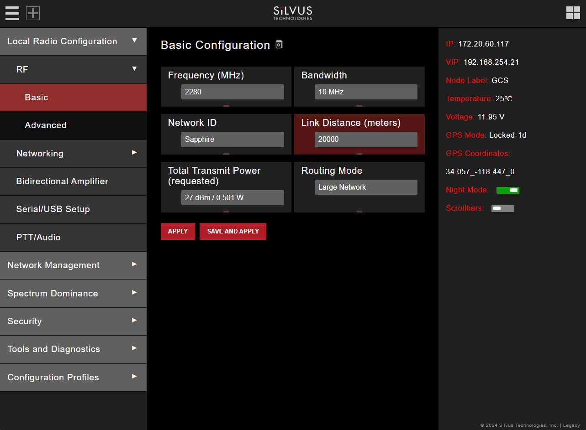

- Frequency: This defines the frequency of the signal. The drop-down box allows users to select from a number of predefined frequencies. Custom frequencies can be created by clicking on the red bar directly below. Please refer to the Custom Frequency Plan section for instructions. SpektreWorks default: 2280 MHz  
- Bandwidth: Defines the RF bandwidth of the signal. A higher bandwidth will allow more throughput while a narrower bandwidth will be less susceptible to noise. SpektreWorks default: 10 MHz  
- Network ID: Network ID allows for clusters of radios to operate in the same channel but remain independent. A radio with a given Network ID will only communicate with other radio with the same Network ID. SpektreWorks default: Sapphire  
- Link Distance: Set to an approximate maximum distance between any two nodes in meters. It is important to set the link distance to allow enough time for the packets to propagate over the air. Failing to set the link distance appropriately can cause over the air collisions and degraded performance. SpektreWorks default: 10000 meters  
- Total Transmit Power: Defines the total power of the signal. It is recommended to set this to ‘Enable Max Power’ which will allow the radio to push to the highest TX power it can support. SpektreWorks default: Enable Max Power  
- Routing Mode: Recommended to leave set to Large Network. NOTE: radios on Legacy and Large Network will NOT interoperate. SpektreWorks default: Large Network
-Apply: Apply the new values. Values will change back to default setting after reboot.
- Save and Apply: Apply the new values and set new values as the default.
- Apply Network: Apply the new values to all nodes currently on the network.
- Save and apply network: Apply the new values and set the new values as the default to all nodes currently on the network.   

# LAN Settings

Navigate to `Local Radio Configuration` ⇨ `Networking` ⇨ `LAN Settings` to configure a secondary IP address for the radio. This section will only cover IPv4 settings.

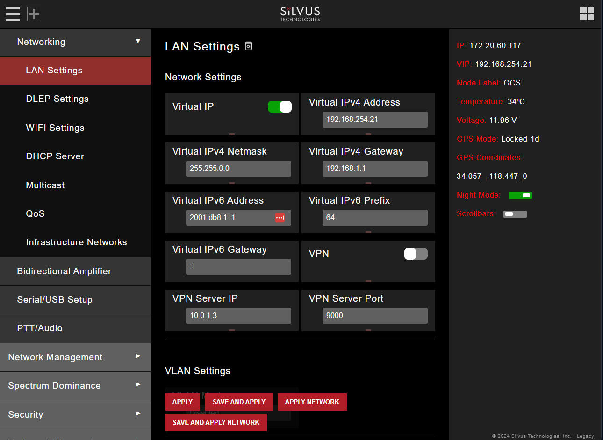

- Virtual IP: Enable or Disable the secondary IP address for the radio. SpektreWorks default: Enable
- Virtual IPv4 Address: Set the secondary IP address for the radio. Once set the user can access the radio web page using either the native IP address or the secondary IP address. Refer to the [Default IP Address Section](appendix-ip.md) if you are having trouble finding the correct IP address.
- Virtual IPv4 Netmask: Netmask for the secondary IP address, e.g. 255.255.255.0. Note that the secondary IP address should NOT be on the 172.20.xx.xx subnet. SpektreWorks default: 255.255.0.0
- Virtual IPv4 Gateway: Gateway for local network to allow radio to connect to the internet. The air radio default is 192.168.XXX.1 and the ground radio is 192.168.254.1.

# QoS Settings

Navigate to `Local Radio Configuration` ⇨ `Networking` ⇨ `Qos` to make distinctions between three priority levels for managing traffic. The three levels are normal, high, and critical.

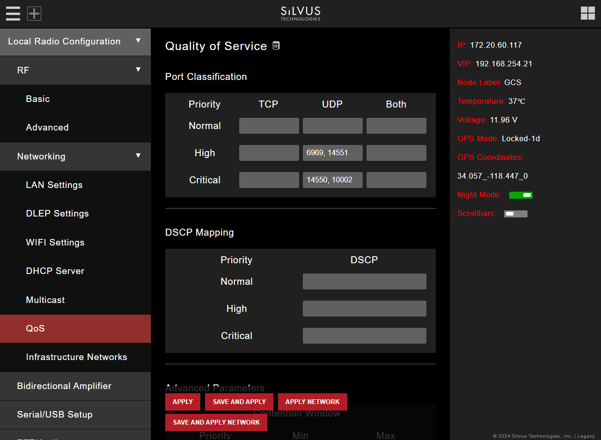

- Port Classification: To specify priority traffic, the user needs to input the port the traffic will be arriving on. Multiple ports of the same priority can be added by adding a comma between them i.e (5000, 6000). A range of ports can be specified with a - (i.e. 5000-6000, 7000-7002). Unspecified traffic is treated as normal. SpektreWorks default: UDP High: 6969, 14551 UDP Critical: 14550, 10002.

# Serial/USB Settings

Navigate to `Local Radio Configuration` ⇨ `Serial/USB Setup` to select one of four available modes for the serial port: GPS, RS232, Debug, and Disabled. This guide only covers setting up the radios with GPS via an external module or over ethernet.  

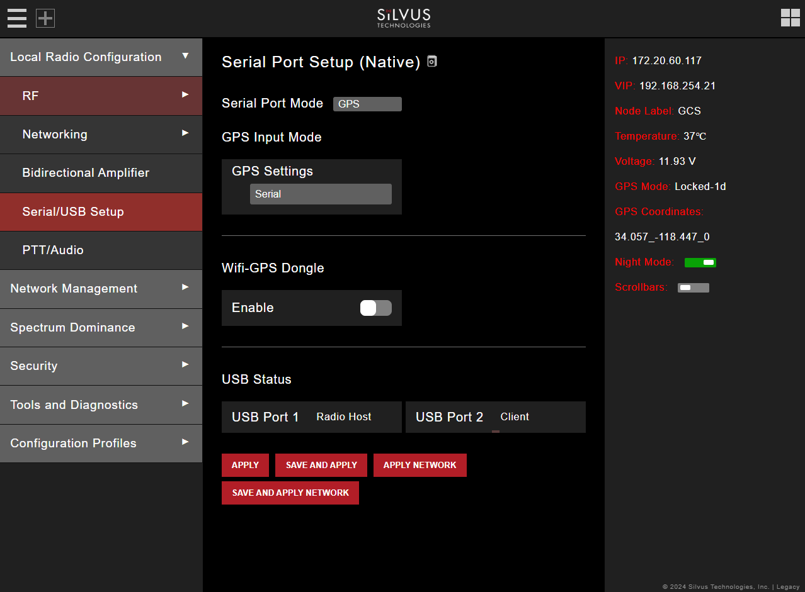

Serial Port Modes:

- GPS: An external GPS module can be connected and powered from the serial port of the radio.
- RS232: RS232 mode provides a wireless serial connection between any two serial devices connected to radios on the network.
- Debug: Debug mode is used to gain terminal access to the radio for debug or interface purposes.
- Disabled: This mode completely disables the serial terminal of the radio.

GPS Settings: The user can select from three options from the drop-down menu: Serial, ethernet, and Remote. 

- Serial should be selected when an external GPS module is fixed to the radio. 
- Ethernet should be selected when GPS data is being fed over the network (i.e the aircraft's GPS module outputs a NEMA stream on the network). The user will have to specify an input port number in the GPS Input Port box when the ethernet option is selected. 
- Remote
 
#### Defaults

Aircraft Defaults: 
- Serial Port Mode - GPS 
- GPS Input Mode/GPS Setting - ethernet 
- GPS Input Mode/GPS Input Port - 15000 

Default for ground radios with external GPS modules: 
- Serial Port Mode - GPS
- GPS Input Mode/GPS Settings - Serial

# Network Topology

Navigate to `Network Management` ⇨ `Network Topology` to monitor the status of the Silvus mesh network in real-time. 

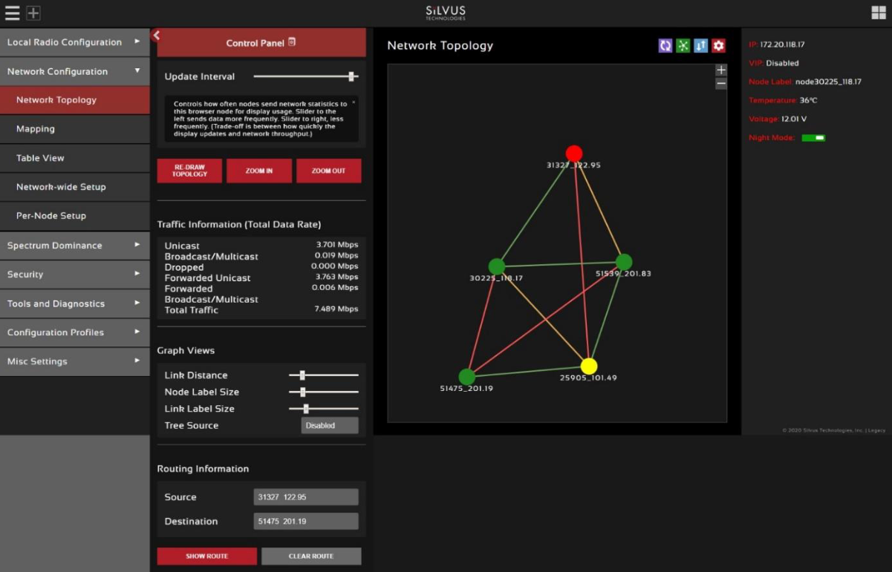

- Color Coded Link Health: Every link within the network is color coded based on the SNR of the link. This allows the user to quickly identify weak links within the network. The link between two nodes will transition from green to yellow to red as the link degrades.
- Route Health: Every node within the network is color coded based on the number of packets in the queue. This allows the user to quickly identify nodes where too many packets are being routed through. The nodes will transition from green to yellow to red as the packet queue increases. 

|Node Color|Link|Packets|
|-|-|-|
|Green|>20dB|<10 Packets in Queue|
|Yellow|10-20dB|10-100 Packets in Queue|
|Red|<10dB|>100 Packets in Queue|

#### Node Characteristics

A user can view key operating characteristics of a node by double clicking on any node in the network. 

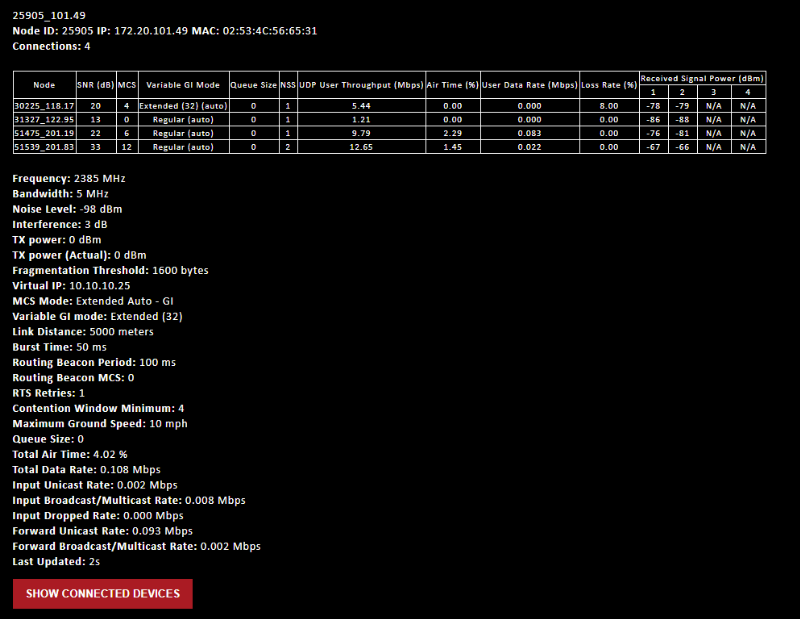

The following characteristics are shown:
 - Node ID: A unique node ID assigned to each node at time of manufacture. This cannot be changed.
 - IP: IP address of the node.
 - MAC: MAC address of the node
 - Connections: Number of direct connections to the node. Each directly connected node is listed in the following format: `<Node Name> <RX SNR> <TX MCS> <Variable GI Mode><Pkts in TX Queue> <Num. of Spatial Streams><UDP User Throughput (Mbps)><Air Time %><Data Rate (Mbps)><Loss Rate %><RSSI Ch1> <RSSI Ch2> <RSSI Ch3> <RSSI Ch4>`

- The ‘Air Time’ specifies the percentage of time the radio is transmitting.  
- Data rate shown is actual user data rate in Mbps. 
- MCS or NSS of N/A signifies that no data has been sent to that radio yet.

 - Frequency: RF center frequency of the node.
 - Bandwidth: RF bandwidth of the node. 
 - Noise Level: Received noise level of the node. 
 - Interference: Approximate in-band interference level. 
 - TX Power: Total target transmit power of node. 
 - TX Power (Actual): Actual transmit power of node. This value may differ from the target 
transmit due to temperature variation or inability to transmit a clean signal with the 
selected MCS at the target power.  
 - Fragmentation Threshold: Chosen fragmentation threshold. 
 - Virtual IP: Secondary IP address of node (0 if none set). 
 - MCS Mode: Transmit MCS of node. 
 - Variable GI mode: The variable GI mode setting for this node. 
 - Link Distance: Link distance setting of node. 
 - Burst Time: Burst time setting of node. 
 - Routing Beacon Period: Routing Beacon Period setting of node. 
 - Routing Beacon MCS: This is the MCS setting that the routing beacons will use. 
 - RTS Retries: RTS Retry setting of radio. 
 - Contention Window Minimum: Low Priority Contention Window Minimum setting of 
node. 
 - Maximum Ground Speed: Maximum Ground Speed setting of node. 
 - Queue Size: Number of packets currently waiting to be transmitted. 
 - Total Air Time: Total percentage of air time being used by this radio. 
 - Total Data Rate: Total data rate in Mbps being transmitted from this radio. 
 - Input Unicast Rate: Total data rate pushed into the radio as Unicast 
 - Input Broadcast/Multicast Rate: Total data pushed into the radio as Multicast 
 - Input Dropped Rate: Total data rate dropped by the radio 
 - Forwarded Unicast Rate: Total data rate forwarded by the radio as Unicast 
 - Forwarded Broadcast/Multicast Rate: Total data rate forwarded by the radio as Multicast 
 - Last Updated: Duration that has passed in seconds since last update.

#### Link Characteristics

A user can quickly view key operating characteristics of individual links by double clicking on any link in the network. 

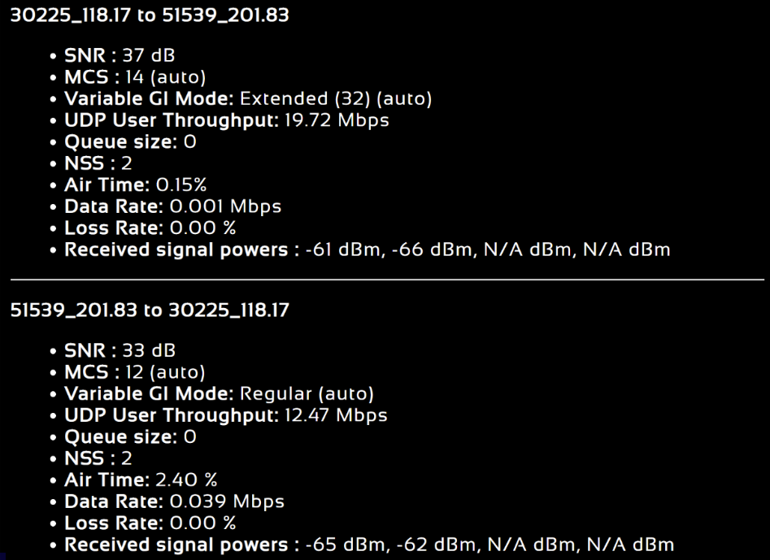

The following characteristics are shown:
- SNR: The SNR of the link in each direction. 
- MCS: The MCS used to transfer data in each direction.
- Variable GI Mode: The variable GI mode used for the transmitting node. 
- UDP User Throughput: The estimated UDP User Throughput available for each direction 
of the link. This is estimated based on the current MCS used for transmission.
- Queue Size: Number of packets in TX Queue in each direction. 
- NSS: Number of Spatial Streams in each direction. 
- Air Time: Percentage of air time used in each direction
- Data Rate: Data rate in each direction 
- Data Loss Rate: Percentage of data lost during transmission
- Received Signal Powers: Received signal power for each antenna in each direction. 

#### Control Panel

A user can open the Control Panel by clicking on the red box with a gear icon on it.

- Update Interval: Controls how often nodes send network statistics to this browser node for display usage. Move the slider to the left sends data more frequently. Move the slider to the right, less frequently. (Trade-off is between how quickly the display updates and network throughput required to send the updates.) 
- Traffic Information: The traffic information is shown in table form in the control panel as well. It contains all the current network traffic information of the entire network.
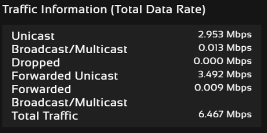
- Graph Views: The graph views section allows you to edit the graph to the preference of the network administrator.  You can extend the distance between nodes by dragging the link distance bar to the right.  Sliding the node label size or link label size to the right will use a larger font for the labels of the node or link respectively.  Tree source is suggested for dense networks when the structure of the network is not immediately apparent from the regular view (tree source disabled).  By selecting a specific node to be the tree source, the network topology will show you how each radio is routed to that node.  Tree source views will only display the link colors and not the SNR.  
- Routing Information: The user can view the routing path between any 2 nodes within a network by simply specifying the source and destination node in the Control Panel.  The path will turn bold. In the control panel section it will also list the routing path used between these two nodes, and the routing path available link capacity in UDP.
- Update Node Labels: Naming each node in the network is as simple as double-clicking on the node name and typing in a new name in the update node label section of the control panel. Once this is done, the user will need to hit enter to keep the node name. Otherwise it will change back to what it was. This feature enables quick identification of nodes in the field and is especially useful in mission critical situations with many mobile assets. The user can click on `Save Labels in Flash` to store the node names to the radio’s flash memory. This will store the names on the radio even after the radio is powered off. The saved labels can also be cleared back to the defaults by clicking ‘Clear Labels in Flash’. The node labels set in one radio can also be broadcasted to other radios in the network by clicking `Broadcast Node Labels`. 
- Node Position: You can customize the node positions in the network topology page by clicking and dragging the node dot.  If you would like to save the custom node positions, you can save these positions to the flash memory on the radio.  You can also broadcast and save these node positioning to all other radios on the network. 

# Mapping 

Navigate to `Network Management` ⇨ `Mapping` for a real-time easy-to-use method of tracking the locations of nodes. Only nodes configured with GPS will be tracked on the map. The network topology will be displayed on the right-hand side of the page for the user to conveniently view network characteristics in instances where nodes are physically close to one another and difficult to distinguish on the map overlay. 

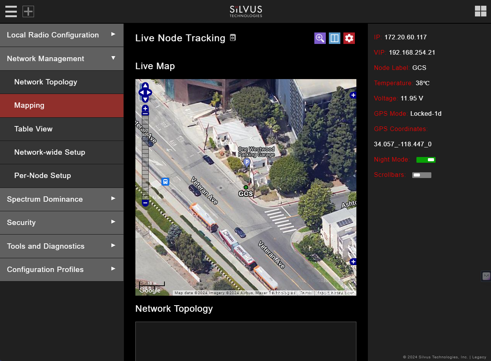

There are 3 map options currently available in the Map Overlay view:

- The default map is OpenStreet Maps. OpenStreet Maps Silvus can be saved to the radio’s internal memory for offline use. For instructions to Download  OpenStreet  Maps  into  the  radio,  see  section  Downloading  Maps.  OpenStreet  Maps  Silvus  is  a version of OpenStreet maps which is hosted on Silvus’ servers in case of an interruption in service with OpenStreet Maps. 
- The Silvus maps is currently only guaranteed to cover the United States.  However it should have some international maps as well. 
- In Addition, Google Maps and Google Satellite are also available. This can be changed by clicking the ‘+’ symbol at the top right of the map. Note  that  Google  Maps  and  Google  Satellite  require  an  active  internet  connection  on  the  viewing computer. These maps cannot be saved for offline use.

#### Map Control Panel

The Map Control Panel can be opened by clicking on the red box with a gear icon near the top of the page. The first section of the Map Control Panel will allow you to input a lat/long coordinate.  After entering the lat/long coordinates you can have the map overlay zoom to these coordinates.

- The Zoom in Here function does not consider the radius parameter.  It will simply zoom to that location.  The ‘Radius’ is used when you want to cache (Seed) the map.  The radio will download the map area based on the coordinates and radius as well as the zoom levels specified. The zoom level corresponds to the different zoom levels available on the map (from 0-14).  This is used to determine what zoom levels of the map you want to ‘Seed’ Zoom in Here. 
- Set Default Location: This is referring to setting the default location of a radio when that radio doesn’t have GPS  lock.   You  can  do  this  by  right clicking on  the  map  in  the location  that  you  want  to  place the radio, and that will pop-up a menu where you can choose which radio to set there.  That radio will default to that location when no GPS data is present.  If the radio gets a GPS lock, it will use the real GPS data instead. 
- Seed  the  Map:  This  is  when  you  download  or  cache  the  map.    This  function  allows  you  to  store  map imagery into the radio for offline use.  You can only cache the ‘OpenStreet Maps’ option.  To download map imagery, you should set the lat/long of the center point, input a desired radius, specify desired zoom levels, then click ‘Seed the Map’.  This will then download the map imagery within those parameters.  Note that the radio needs to have access to the internet for this function to work. 
- Download Cached Map: allows you to download all map imagery stored in the radio into a file that can then be uploaded to another radio. 
Copy Maps from Radio to USB Drive: This will copy all of the stored maps in the radio to a file on a USB drive which can then be plugged into another radio and uploaded.  This is so you don’t need to repeat the caching steps each time.
- Cache Settings: Allows the user to clear cached map data, and upload maps saved previously.
- Cursor on Target:  is an exchange standard that is used to share information about targets.  This is a messaging format often used in blue force tracking applications such as ATAK.  CoT is a multicast type of traffic that will follow the multicast method configured on the default setting under Multicast tab.
 - CoT: Enable/disable cursor on target 
 - CoT IP Address/Port: IP address/port for the communication to establish 
 - Time to Live: Each time the data packets pass through a router, it will decrement this number.  
 - Once it reaches 0, the data packets will no longer continue. 
 - CoT Message Interval (Seconds): How often to send CoT messages 
 - CoT Current Date (UTC): Time stamp of the date. If Set AS Current Date/Time is selected, it will be set as the current time displayed on your computer 
 - CoT Current Time (UTC): Time stamp of the time
 - CoT Stale Time (Seconds): Data outside of this time window becomes invalid 
 - CoT Type: The event type of the target
- Select Nodes to Display on Map: Allows the user to select or deselect nodes to be displayed on the map.
- Map Routing Panel: Displays route path information between two radios in the network, including link capacity and ground distance.
- Address: allows the user to zoom the map to a specific address without knowing the lat/long coordinates. This is a useful tool that can search for locations by just the name of it.
- Offline Map Image: in addition to the to the preset map option, a user can also upload a custom image or blueprint in place of the map.  The recommended image size is 800 x 600 pixels. The user will then need to provide the image bounds. These bounds will be the latitude of the left and right bounds of the image and longitude of the top and bottom bounds of the image. Once entered, click upload and there will now be a 4th option when clicking the ‘+’ at the top left of the map overlay. 

#### Downloading Maps

 An  internet  connection  is  required  to  obtain  map  data;  however,  users  can  cache  map  data  on  a  node beforehand. For map caching follow these steps: 

- Attach the radio to a laptop and open the Networking/LAN settings. 
- Set the Virtual IP address, netmask, and gateway to values appropriate for your local network. 
- Your local network should be able to access the internet. 
- Attach the radio to your local network and open the Map Overlay tab. 
- Input the address of the location you wish to download 
- You now have two options for caching map data: 
 - Zoom/pan around the area you are interested in at the zoom level you will be using. This will automatically cache the map data at this zoom level. 
 - Fill in the radius field (in meters), set the Min/Max zoom levels and click on ‘Seed the Map’. This is a beta feature and will attempt to cache the entire area for all appropriate  zoom  levels.  Users  should  be  careful  in  using  this  feature  since  it  may take some time and will use up the radio’s available memory. For reference, a radius of ~3000m will use approximately 5 percent of the total memory.

#### Manual GPS for Nodes

If there are nodes within the mesh that do not have a GPS module  connected or are located in an area with no GPS connectivity, the user can easily place the node on the map by right clicking on the desired location  on  the  map  and  choosing  which  node  to  place  there.  These  values  will  be  ignored  if  GPS coordinates are available via a GPS module.

# Table View

Navigate to `Network Management` ⇨ `Table View` to show all the statistics and setting profiles in table view. Users can select what is being displayed  in  the  table  view  by  clicking  the  blue  filter  icon to  the  top  right  of  each  table. You  can deselect or select various parameters in this filter selection to display in the table view.

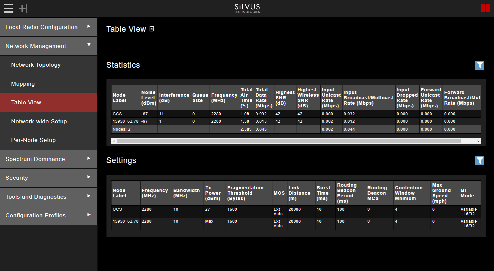

# Network-Wide Setup

Navigate to `Network Management` ⇨ `Network-Wide Setup` to configure key parameters of every node in the network with just one click. Users simply need to check off the parameters they wish to be updated across the network and click on Apply to apply but not write new values to flash or Save and Apply to apply and save values to flash. The Broadcast Update Interval field determines how often, in seconds, the new parameters will be broadcast to the entire network. A list of all nodes will appear on the right with a check box next to each node. This box will be checked off as each node receives the update. 

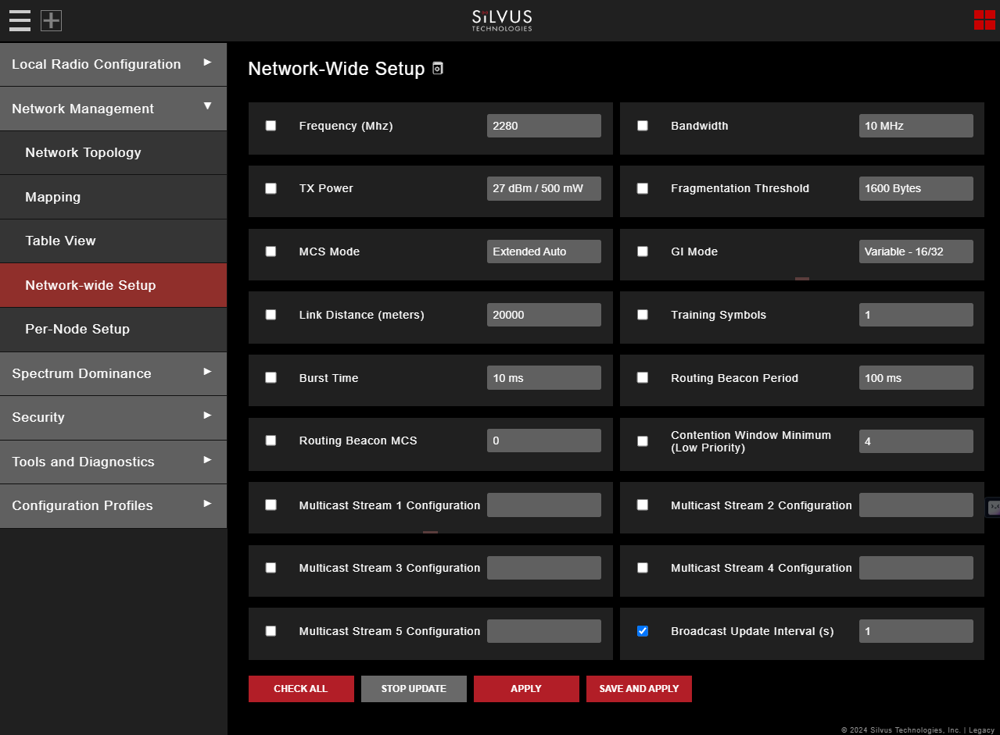

# Per-Node Setup

Navigate to `Network Management` ⇨ `Per-Node Setup` to modify  key  parameters  of  individual  nodes  within  the  network.  Users will see a list of all nodes available within the network. The directly  connected  node  is  listed  first  with  the  rest  ordered  lexically.  From  here,  users  can  click  on  an individual  node  and  modify  its  parameters.  Any  parameters  changed  from  this  interface  can  either  be applied or saved and applied.

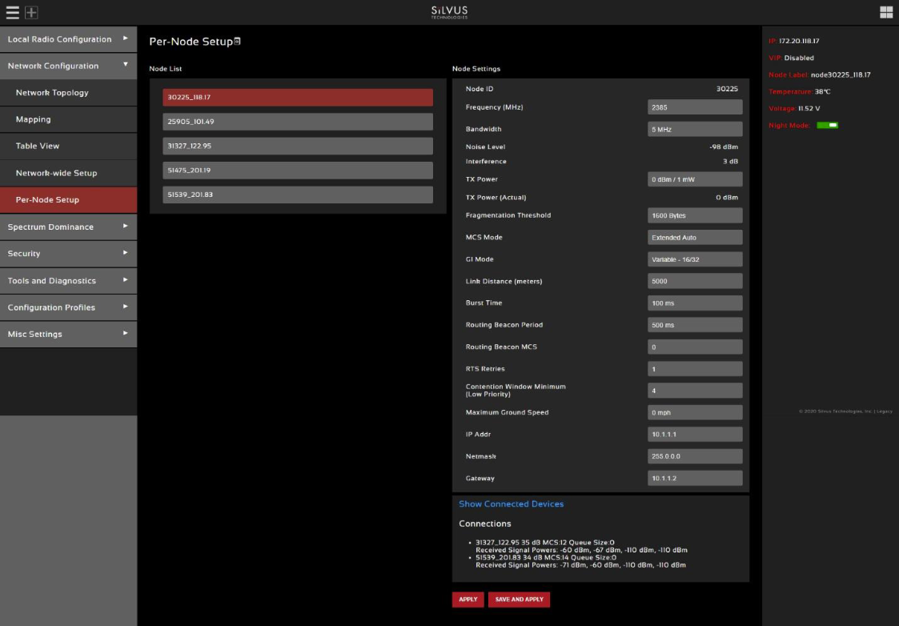

# Spectrum Dominance

Navigate to `Spectrum Dominance` to turn the networked radios into a distributed spectrum analyzer. 

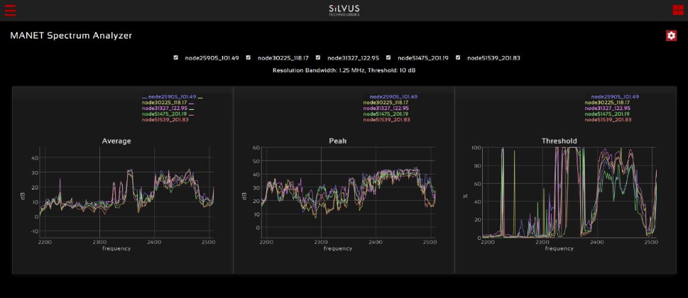

#### MAN-SA

MAN-SA is a spectrum scan feature that turns the networked radios into a distributed spectrum analyzer. When a scan is performed, each selected radio in the network will go offline, perform the scan and report back.

Spectrum Scan Settings: 
- Node List: Any nodes currently connected to the network will be displayed here.  Any nodes selected will be used in the spectrum scan. Nodes that are left unchecked will remain operational. NOTE: unchecked nodes will continue transmitting in the frequency channel it is operating in and its transmission  will show up in the scan’s results.
- Mode: There are two available options: Spectrum Scan or Zero Span. Spectrum Scan mode provides plots of signal strength over frequency. Zero Span provides a plot of power over time in a 20MHz Bandwidth. For the purpose of this guide, only Spectrum Scan will be covered. 

Spectrum Scan Mode:
- Center Frequency: Specify the center frequency of the scan. 
- Span:  Specify  the  span  of  the  scan,  centered  on  the  center  frequency.  (e.g.  Center  freq  of 2350MHz  and  span  of  280MHz  will  scan  2100-2590MHz).  A  large  span  will  take  longer  to complete. 
- Antenna Mask: Choose which antenna on the radio to use for scanning. If there are 2 antenna radios in the network antenna 1 or 2 must be chosen. 
- Resolution Bandwidth: Specify the RBW for the scan. A smaller RBW will provide a more detailed plot, but will take longer to complete the scan. 625KHz is a good balance between scan detail and time of scan. 
- Threshold: Specify the threshold for measurement of the duty cycle of interference. SpektreWorks default: 10dB.
- Duration:  Duration  of  each  scan.  A  longer  duration  will  provide  better  accuracy  but  will  take longer to complete. SpektreWorks default: 2 seconds.
- Approximate  time  for  scan:  Approximate  time  that  the  network  will  be  down  for  the  scan  to complete. 

Spectrum Scan Results:
- Average – Displays the average power over the time duration specified in the settings. 
- Peak – Displays the peak power seen at any point during the scan for each frequency. This is the equivalent of the ‘Max Hold’ feature on common spectrum analyzers. 
- Threshold – Displays the duty cycle of interference stronger than the user specified ‘Threshold’ power. For  example,  if the threshold  was  set  to  5dB.  The  plot  would  show  the  percentage  of  time  that  the measured power is more than 5dB above the radio’s noise floor. 

#### MAN-IA

MAN-IA (MANET Interference Monitoring) is a feature that has been developed to help live monitor the interference levels on several frequencies. When monitoring these frequencies, you can decide whether the network would benefit from changing channels to a less congested frequency. When enabling MAN-IM you will automatically disable Tx beamforming.

Configuring MAN-IM:

- MAN-IM: The first parameter in the menu allows enabling or disabling the MAN-IM feature. All radios within a network should have this enabled in order to operate properly. 
- Operating Frequency: You can quickly jump between operating frequencies that are listed in the MAN-IM frequency list.  Select the operating frequency from the drop down menu and click apply or save and apply to change the operating frequency. 
- Number of Valid Frequencies: This configuration is the number of channels that the MAN-IM feature will monitor. All radios within a network should have this configured the same in order to operate properly. 
- Bandwidth: This is the bandwidth of the channels.  All radios within a network should have this configured the same in order to operate properly. This setting will override the bandwidth setting on the ‘Basic’ page. 
- Frequencies: These are the center frequencies of the channels to be monitored.  Frequency 1 will override the Frequency setting on the ‘Basic’ page. All radios within a network should have the same frequency set in order to operate properly. Configuration changes can be propagated to the entire network by clicking ‘Apply to Network’ or ‘Save and Apply to Network’. Note that this update will take around 1-2 minutes to take effect. 

MAN-IM Metrics:
- Once configured, the MAN-IM functionality of the network can be monitored in real-time. The bar graph is a visual representation of the interference on each channel at each node.  It will show the reported noise level measured by each radio in the network, in each channel being monitored.   The ‘Age’ field indicates the time since the last update received from each node in the network. The frequency with the lowest reported amount of interference will be highlighted in green.  NOTE: transition time will get longer if the number of hops in the network increases and as traffic increases.

# Security

Navigate to `Security` to enable/disable encryption, upgrade radio, and load license files for enabling features such as AES encryption.

#### Encryption Configuration

- Encryption: Enable or disable encryption
- FIPS Mode: Enabling FIPS mode is the first step to making the radio FIPS compliant. Enabling/disabling will require a reboot and will erase all setting profiles, reset the encryption key, both SSH keys, the HTTPS certificate, and the login passwords to their factory default. Enabling will also turn on HTTPS and Login Authentication. After reboot, the operator must perform the following steps to complete the FIPS compliant process.  There is also a broadcast FIPS mode button that will enable FIPS mode on every radio on the network, and then force a reboot with all passwords set to default. 
 - Update the web login password to something other than “HelloWorld” 
 - Create new SSH keys and HTTPS certificate. 
 - Update encryption key or click “Generate Encryption Key” and save.
- Encryption Key: Set an encryption key if encryption is enabled.  This needs to match on all radios that want to join the same network.  If AES-GCM 256 is selected a key for unicast traffic as well as broadcast packets will need to be set.  The generate random key button will generate a random key that could be used.  The view button will display the key. 
- API key: The API key is used by the radio for all "Apply/Save to Network" operations on the GUI to authenticate the local radio to other radios in the network.  If login is disabled, this key is not used. 
- Encryption Key Volatile: If volatile is enabled, key will be reset on radio reboot, and encryption will be disabled. 
- Encryption Profile: Choose between various encryption profiles. Available options are: 
 - DES 56 bit: DES encryption using 56 bit keys. This mode is backwards compatible with legacy SC3500/3800 radios. 
 - AES 128/256: AES encryption using 128/256 bit keys. This mode is backwards compatible with legacy SC3500/3800 radios. 
 - AES-GCM  256  ECDH-KAS: FIPS  compliant  AES  encryption  in  GCM  mode  with authentication and ECDHE based re-keying. This is the recommended mode on the 4K series as it is the most secure and provides the highest throughput under varied conditions.  FIPS certification for the 4C42/44 radio models.  
- HTTP Secure (HTTPS): Enable or disable HTTPS access to StreamScape. 
- Quick Zeroize: When enabled, the radio Zeroize process will commence after the Zeroize Delay when the multi-position switch is in the 'Z' position.  When disabled, the radio multi-position switch must be turned from the off position to 'Z' during the boot sequence to initialize zeroize.

#### SSH/HTTPS Certificates

This tab is used to manage the radio’s SSH login keys, SSH host key, and HTTPS Certificates. All key pairs used are elliptic curves.

- SSH Login Keys: In order to SSH into the radio, you must first generate a key pair and upload the public key onto the radio. A common way this is done on a computer is  through the command `ssh-keygen -t ecdsa -b 521`. You will need to do this for each machine that wants to SSH into the radio, or you can share a single key pair amongst machines.  
- SSH Host Key: This key is used for authenticating the radio to all machines that want to connect to  it  via  SSH.  A  common  way  this  key  is  generated  on  a  computer  is  ‘openssl ecparam -name secp521r  -genkey  -noout  -out  yourfilename.  You  may  either  upload  your  own  key  or  generate one on the radio. Once you upload/generate a new key, the previous one is gone. You can get the original key by Factory Reset -> Zeroize. (Note that the generated text from the above command will encode both a private and public key in the text). 
- HTTPS  Certificate:  This  certificate  is  used  to  establish  a  HTTPS  connection.  If  you  are  using  a factory default or radio generated certificate and haven’t added an exception of this certificate to your browser, you will see a message like below from your browser. This is because the certificate is  signed  by  the  radio  and  not  a  trusted  Certificate  Authority.  You  can  bypass  this  by  clicking “ADVANCED” in chrome, (or adding an exception in Firefox). The simplest way to generate a new certificate is to click “Generate Certificate and Save” button. If you are on HTTPS when you do this, you must also refresh the page. If you want to generate your own certificate, you must first generate  a  key  pair  (secp256r1,  secp384r1,  or  secp521r1).  Then  create  a  X.509  certificate  and append your private key to it. Copy the certificate text to the “Add a HTTPS Certificate” section, then click “Add Certificate and Save.”  

#### White/Black List

This tab is used to add a level of security in the network. It will only allow the radio to communicate with radios on the white list, or to never communicate with radios on the black list. NOTE: You can not use both lists at the same time. When you select a list type, it will automatically populate all radios that are currently connected. You can also add radios that are not currently connected to the network by adding the last two octets of the IP address of those radios. 

#### GUI/Login Authentication

- Admin: The  Admin  page  provides  the  option  of  password  protecting  access  to  Streamscape.  There  are  several parameters that can enforce various security measures in regards with the Login Authentication. There are three levels of login authentication, Basic, Advanced, and Admin, each with increasing privileges on the GUI and backend API. The basic login would give access to local radio configs, network management, and tools and diagnostics.  The Advanced login will give you everything in Basic plus spectrum dominance and configuration profiles (everything except security).  The admin gives you full access to the GUI. 
 - Login Authentication: This will enable the requirement to enter a password in order to access the radio GUI. 
 - Password Complexity: This will enforce the password to have at least 1 lowercase, 1 uppercase, 1 digit, and 1 special character.  It also applies configured minimum password length and minimum password  change  settings  to  new  passwords.  Note,  this  only  applies  to  new  passwords,  not existing ones.  
 - Max Login Attempts: After failing to login via HTTP cookie (or GUI) or serial console Max-Login-Attempt times, you will be locked out from logging in for X seconds. 
 - Lockout  Period:  The  amount  of  time  that  the  radio  login  will  be  locked  out  if  the  max  login attempts are reached. 
 - Idle Timeout: Serial login will logout after X seconds of inactivity. 
 - GUI Idle Timeout: If login is enabled, the web interface will logout after X minutes of inactivity. 
 - Display Notice of Use on Serial: If enabled, will display notice of use message on serial interface. 
 - Disable Concurrent Sessions: Enable this to prevent concurrent GUI/API sessions. 
 - Minimum Password Length: This configures the minimum length required for the password. 
 - Minimum  Password  Change:  This  configures  at  least  in  how  many  positions  the  new  password should differ from the old password. 
 - User Management: This section allows you to reset the password for various user profiles.   
 - Create  user:  This  section  allows  you  to  create  new  users  and  configure  their  role/permission levels. 

To enable, set the Login Authentication to Enable  and  click  apply  or  save  and  apply.  Once  Login Authentication is enabled, access to Streamscape will require a username and password as shown below. To change the password, click “Change Password,” then select the username whose password will change, type the Admin password, then type the new password.

If a user forgets the password, click “Forgot Password.” They can reset the password using a USB flash drive and a password reset key provided by Silvus. On the USB, the password reset key file must be called 
reset_pass.txt.signed. Note that since the SC3500 and SC3800 do not have USB ports, you will not be able 
to set a password for these radios. 
This will set login passwords and all security keys to their defaults. This includes the Encryption Key, SSH 
Login  Key,  SSH  Host  Key,  HTTPS  Certificate,  and  Encryption  Key  Volatile.    It  will  also  erase  all  settings profiles. Also, if FIPS mode is off, it will turn off HTTPS and login mode. The current FIPS mode will not be changed. 

#### SSH Service

This setting will enable/disable the SSH service on the radio. When enabled, SSH server will run on TCP port 22. When disabled, TCP port 22 will be closed/inaccessible.

# Tools and Diagnostics

Navigate to `Tools and Diagnostics` to view firmware, licenses, faults, indicators, logs, perform a factory reset, and configure languages.

# Troubleshooting

- Intermittent Link: In a long range scenario if SNR is good but link drops unexpectedly check link distance parameter and make sure that the link distance is set the same on all radios and sufficiently large enough. Check interference levels as strong interference can result in an intermittent link.

