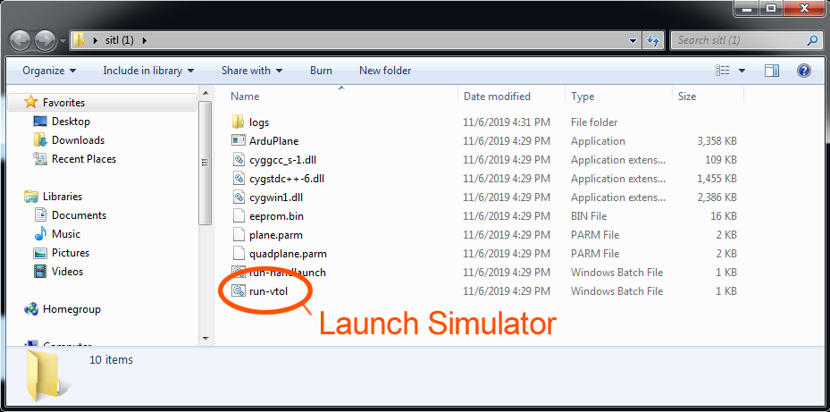
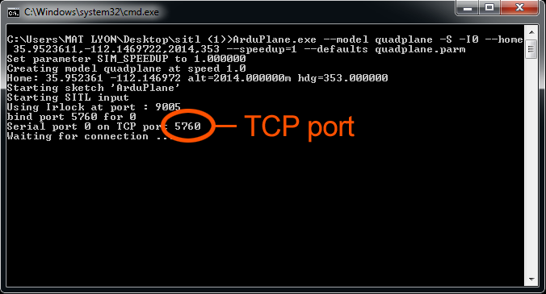
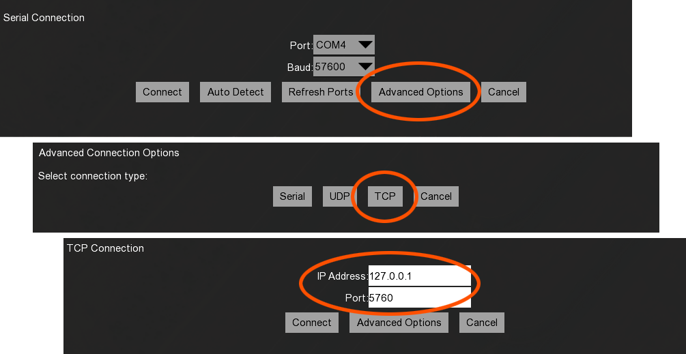

# Simulator

The GCS includes a simulator for training, planning, and familiarization purposes. It offers high accuracy but differs from the real aircraft in terms of tuning and performance specs. Some features like the wind estimator and ADS-B targets may not behave realistically in the simulator.

# Running the Simulator

1. Download the simulator [here](https://swiftgcs.com/sitl.zip). 
1. Extract and open the folder. 
1. Located and run "run-vtol"

1. This will launch the simulator command prompt window. Note the TCP port.

1. Open Swift GCS. 
1. Go to the `Checklist Tab` ⇨ `Connect`. 
1. Select `TCP` ⇨ `Connect`. Use the local IP address of 127.0.0.1 and the port listed in the command prompt window.

1. Once connected you will need to plan a mission (add a takeoff, rally point, and landing at a minimum to pass the arming checks).
1. Set the flight mode to Auto using `Mission` ⇨ `Change mode to auto` on the right-hand side of the GCS.
1. Go to the `Checklist Tab` ⇨ `Arm` 
1. Once armed, the aircraft will takeoff vertically and transition to forward flight. 