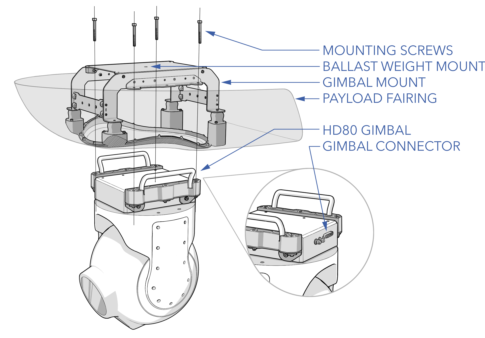

# Trillium

# HD80 Special Considerations

- The gimbal connector should face the avionics stack for cable routing.
- Avionics serial should be set to TTL, not RS-232. The standard is TTL, but there is a removable jumper in the avionics to convert to convert to RS-232.
- It is advised to not travel with the gimbal installed within the aircraft. Doing so may damage the gimbal or the vibration isolation mount.

# HD80 Specs