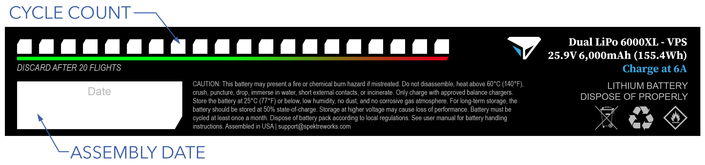

# Battery Care

Sapphire uses three batteries to fly, a single avionics battery and two VPS batteries. Proper care of your batteries is important to prevent damage to your aircraft and to maximize performance. Environmental factors, altitude, number of cycles, battery age, storage procedures, takeoff weight, and payload requirements all affect how the batteries will perform.


Batteries may present a fire or chemical burn hazard if mistreated. Do not charge or discharge unattended. Do not disassemble, heat above 60°C (140°F), crush, puncture, drop, immerse in water, short external contacts, or incinerate. Only charge with approved balance chargers. Store the battery in a flammables cabinet at 25°C (77°F) or below, low humidity, and no dust. For long-term storage, the battery should be stored at 50% state-of-charge. Storage at higher voltage may cause loss of performance. Battery must be cycled at least once a month. Dispose of battery pack according to local regulations.



In the event of a hard landing or crash, remove the battery, place it in a safe, open area away from combustible materials, and monitor for swelling for a minimum of 15 minutes. If swelling is present after 15 minutes, do not use pack again. Do not attempt any action on a damaged or swollen battery without appropriate personal protective equipment. Explosion and fire may cause injury and property damage.


# Contents

- [Service Lifespan](#service-lifespan)
- [Cold Weather](#cold-weather)
- [Battery Specs](#battery-specs)
- [Battery Charger](#battery-charger)
 - [Battery Charger Specs](#battery-charger-specs)
 - [Charger Profiles](#charger-profiles)
 - [Charging](#charging)
- [Storage](#storage)
 - [Storing](#storing)
 - [Cycling](#cycling)
- [Disposal](#disposal)

# Service Lifespan 

Each battery has a limited service lifespan counted in cycles and an expiration date. The battery must be replaced after the cycle count is reached or past the expiration date, whichever comes first. The expiration date assumes [Ideal Storage Conditions](battery.md#storage), and is based on the date printed on each pack.

A cycle is defined as a completed flight. Counting cycles is required for each battery according to the [Maintenance Schedule](maint-schedule.md), **although this is especially critical for the VPS batteries.** Takeoffs and landings put significant demands on the VPS batteries. The cycle count for these batteries is intentionally kept much lower than that of avionics batteries to ensure the VPS delivers sufficient thrust for vertical flight.

Each VPS battery is labeled with the assembly date and includes a section to track the number of cycles. If you received a battery without a date, use the day you received the battery.  

# Cold Weather

Batteries perform better in warmer temperatures and are adversely impacted by cold weather. Although VPS batteries have built-in heaters that activate when plugged in, it is advisable to store them in a heated vehicle or trailer before flying. This stops the batteries from "cold soaking" before flight, thereby requiring significant time to warm-up during the preflight.


In cold weather, the heated VPS batteries attempt to stay between 80-86°F (27-30°C).


# Battery Specs

|Parameter|Avionics|VPS|
|-|-|-|
|Type|Lithium Polymer|Lithium Polymer|
|Quantity|1|2|
|Circuit|n/a|Parallel|
|Voltage|7S|14S|
|Capacity|3,250mAh|6,000mAh|
|Fully Charged|29.4V|58.8V|
|Low Voltage|25.2|47.0V|
|Charge Current|3.2A (1C)|6A (1C)|
|Heater|No|Yes|
|Service Lifespan|100 cycles|20 cycles|
|Expiration Date|2 years|1 year|

# Battery Charger

The dual-channel charger is used for both the avionics and VPS batteries and supports preset [battery profiles](#charger-profiles). The charger has two separate channels that operate independently; the left side 
screen/ports/buttons are for channel 1 and the right side is for channel 2. The split screen displays Channel 1 on the left side and Channel 2 on the right side. Either battery and any function can be performed on both sides.

#### Battery Charger Specs

|Parameter |Specification|
|----|---------------|
|Charger|ISDT X16|
|Channels|2|
|Input Voltage|100 - 240VAC|
|Supported Batteries|2-16S LiFe, LiPo|
|Charge Current|1 - 20A x2|
|Max Charge Power|800W x2 (110VAC), 1100W x2 (220VAC)|
|Discharge Power|50W x2|
|Rated Ambient|32 - 104°F / 0 - 40°C| 
|Transport Case|SKB iSeries 2015-7|

#### Charger Profiles 

|Profile|Task|Battery|
|-|-|-|
|1|Charge 7S LiPo @ 3.3A |Avionics|
|2|Charge 14S LiPo @ 6.0A|VPS|
|3|Storage 7S LiPo @ 3.3A|Avionics|
|4|Storage 14S LiPo @ 6.0A|VPS|
|5|Discharge 7S LiPo @ 3.0A|Avionics|
|6|Discharge 14S LiPo @ 3.0A|VPS|

#### Charging

1. Connect the power cord to the back of the charger.
1. Plug the cord into a 100~240VAC outlet.
1. Short-press the power button to turn on the charger.
1. Connect the balance cable and charger lead to the charger.
1. Connect the battery to the charger. Ensure both the balance and lead connection are on the same channel.
1. Press and hold the enter button on the side of the charger you are using to access the task menu.
1. Select [charge profile](#charger-profiles) 1 or 2 with the up/down arrows.
1. Short-press the enter button to start charging.
1. The charger will charge and balance the battery and stop when complete. The charger beeps when a task is complete.
1. To stop charging early, first select the correct channel by long-pressing the channel's enter button and then short-press the enter button to stop.
1. Long-press the power button to turn off the charger.


Do not exceed the battery charge current.



Do not leave batteries unattended while charging.



Do not fly an unbalanced battery.


# Storage

The batteries should be stored at room temperature, low humidity, no dust, no corrosive gas atmosphere, no salt air, and no ultraviolet light exposure. 

Do not leave batteries fully charged or fully discharged for longer than a week. Doing so can harm their longevity and reduce performance. Instead, use the charger's storage function to discharge the pack to around 50% capacity. 

For long-term battery storage without flying, the batteries need to be cycled them monthly. To do this, charge the battery, discharge using the charger, and then use the storage function to bring it to 50% capacity. Note, cycling batteries while in storage does not add towards the cycle count limit, but time in storage does count towards the expiration date. 

#### Storing

1. Starting with the charger assembled, on, and battery plugged in.
1. Press and hold the enter button on the side of the charger you are using to access the task menu.
1. Navigate to [storage profile](#charger-profiles) 3 or 4 with the up/down arrows.
1. Short-press the enter button to start storing.
1. The charger will either charge or discharge the battery, depending on the starting voltage, and finish when 50% full.

#### Cycling

1. Starting with the charger assembled, on, and battery plugged in.
1. Press and hold the enter button on the side of the charger you are using to access the task menu.
1. Select [charge profile](#charger-profiles) 1 or 2 with the up/down arrows.
1. Short-press the enter button to start charging.
1. The charger will charge and balance the battery and stop when complete.
1. Long press the enter button to enter the task menu again.
1. Select [charge profile](#charger-profiles) 5 or 6 with the up/down arrows.
1. Short-press the enter button to start discharging.
1. The charger will discharge the battery to a set voltage.
1. Long press the enter button to enter the task menu again.
1. Select [charge profile](#charger-profiles) 3 or 4 with the up/down arrows.
1. Short-press the enter button to start storing.
1. The charger will either charge or discharge the battery, depending on the starting voltage, and finish when 50% full.

# Disposal

Dispose of battery packs according to local regulations. 