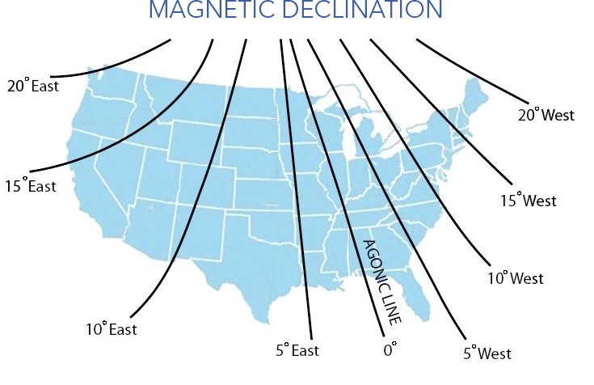

# Calibration

# Contents

- [Compass Calibration](#compass-calibration)
- [Accelerometer Calibration](#accelerometer-calibration)

# Compass Calibration

A compass calibration may be required if the heading of the aircraft shown in the GCS differs by roughly five degrees or more. This discrepancy may be due to changing payloads, environmental factors, proximity to vehicles and building, landing pad material, or compass hardware issues.

To perform a compass calibration:

1. Aircraft - Disarm
1. Ensure all batteries and payloads are installed and powered-on.
1. Avoid calibrating near a magnetic field such as inside a metal structure, vehicles, high power transmission lines, etc.
1. To start, go to the `Settings Tab` ⇨ `Compass` in the GCS.
1. Select `Start Calibration`.
1. Using a compass, enter the true heading.
1. Reboot or power-cycle the aircraft.


To get the True Heading, you need to first read the magnetic compass, then either add an easterly or subtract a westerly magnetic declination based on your location. Magnetic declination changes over time and with location.


# Accelerometer Calibration

An accelerometer calibration may be required if the aircraft is refusing to arm due to an accelerometer error.

To perform an accelerometer calibration:

1. Aircraft - Disarm
1. VPS Switch - Off
1. FPS Switch - Off
1. Aircraft Power - Off
1. Batteries - Disconnect
1. Aircraft - Defuel
1. Aircraft - Disassemble 
1. Avionics Battery - Connect
1. Autopilot - Connect
1. In the GCS, go to the `Settings Tab` ⇨ `Accelerometer Calibration` ⇨ `Start Accelerometer Calibration`.
1. The GCS will walk you through the required steps.
1. Reboot or reassemble as needed.

