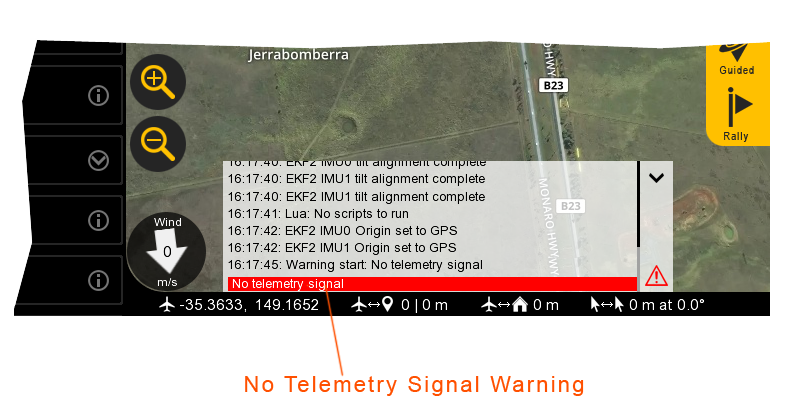
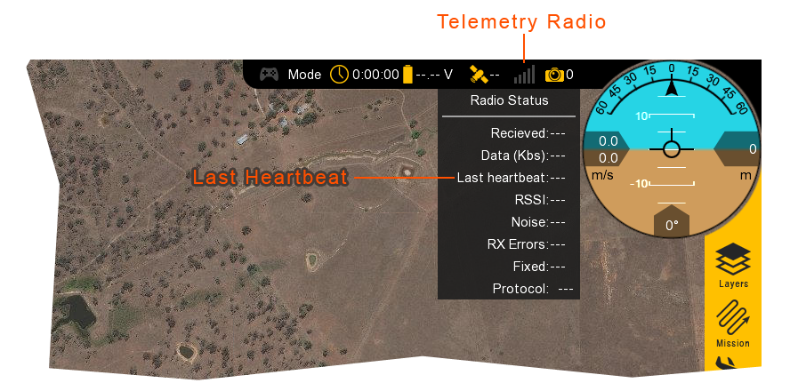

# Data Links

The standard aircraft configuration uses a single IP radio link for telemetry, video, and the hand controller. 

#### Telemetry

You may occasionally lose the connection between Swift GCS and your aircraft while flying. If there is a loss in uplink or downlink communication, you will continue flying your mission and either regain link as the aircraft flies closer or trigger the telemetry failsafe. Your mission should be planned such that the aircraft regains link before the failsafe activates.

After one second of no telemetry link with the aircraft, the GCS will display a “No telemetry signal” warning in the message panel.
If the failsafe timeout occurs, the GCS may additionally show the “Failsafe active” warning.
You can determine how long you have been without link by noting the timestamp above the warning, next to “Warning start: No telemetry signal.”

If you lose link the telemetry link, the aircraft’s position, HUD, and other flight information will stop updating.
The flight timer and time since last radio heartbeat continue counting.
When you regain link, everything will unfreeze and update to the aircraft’s current position.
The aircraft trail will draw a straight line from where you lost link to where you regained link.

Radio range can be affected by many external factors such as antenna height, antenna position, terrain, obstacles, and/or radio interference.
A loose connection between the radio and antennas or the radio and computer (USB)
will also negatively affect the link quality between you and the aircraft.

#### Failsafe Behavior

The duration of the failsafe timeout can be reconfigured in Swift GCS under the `Settings` tab ⇨ `Failsafe`. The longer the failsafe, the longer the aircraft will continue flying its mission before changing modes to Rally (unless link is regained first).
 

#### Improving Link

Use the following tips to improve the reliability of your connection in the field: 
* Place the ground IP radio as high as practical.
* Ensure at least one antenna is polarized vertically.
* Ensure the radio has clear line-of-sight (LOS) with the aircraft.
* Avoid planning missions that exceed the RF range of your aircraft configuration.