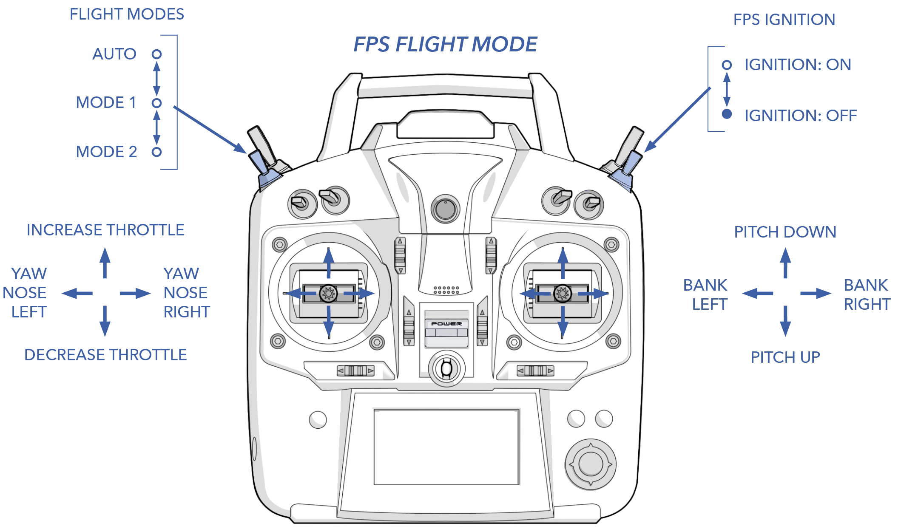
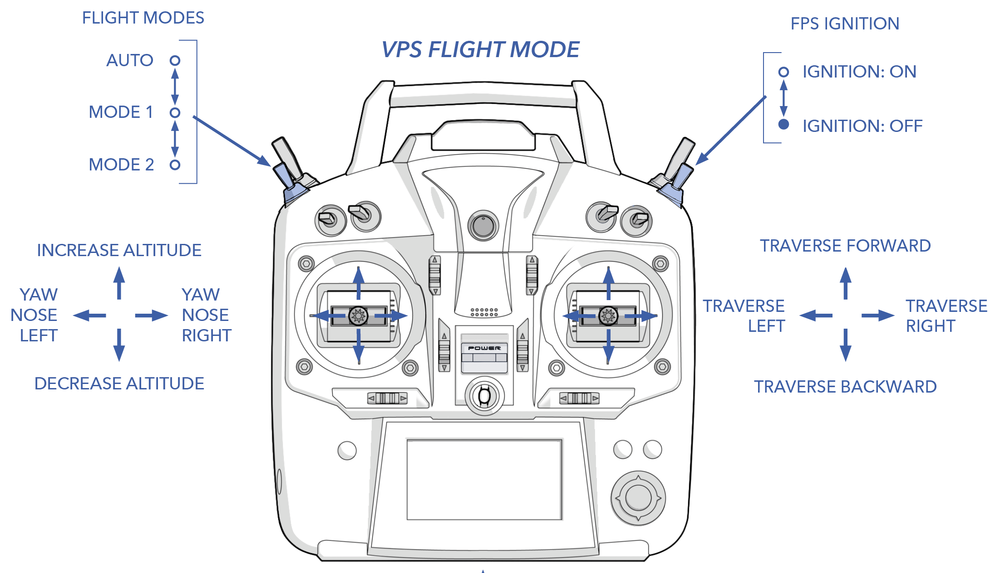

# Available Modes

Flight modes are categorized into three types: auto, forward flight, and vertical flight. Typically, the aircraft operates in auto mode for most of the flight, including takeoff and landing. The remaining modes are specifically designed for either forward or vertical flight.

# Contents

* [Auto](#auto)
* [Forward Flight Modes](#forward-flight-modes)
 * [Rally](#rally)
 * [Guided](#guided)
 * [Fly-by-Wire B](#fly-by-wire-b)
 * [Manual](#manual)
 * [Forward Flight Mode Comparison](#forward-flight-mode-comparison)
 * [Forward Flight Hand Controller](#forward-flight-hand-controller)
* [Vertical Flight Modes](#vertical-flight-modes)
 * [QLoiter](#qloiter)
 * [QLand](#qland)
 * [QStabilize](#qstabilize)
 * [Vertical Flight Mode Comparison](#vertical-flight-mode-comparison)
 * [Vertical Flight Hand Controller Layout](#vertical-flight-hand-controller-layout)
* [Weathervaning & Forward Assist](#weathervaning--forward-assist)

# Auto 

In auto mode the aircraft will follow your planned mission (a set of waypoints and other commands) that gets uploaded to the autopilot during the preflight checklist. If desired, the entire mission can be done in auto, including takeoff and landing. If the mission ends without a landing planned, the aircraft will change modes to rally.

When re-entering auto after a flight mode change, the aircraft will continue from whatever mission item it was last doing, unless you have chosen a specific waypoint.

To enter auto, select `Mission` in Swift GCS. From here you can either change back into auto, restart the mission, or select an individual waypoint to fly to.

# Forward Flight Modes

In forward flight, the aircraft uses the FPS and control surfaces on the wings and tail to fly as an airplane.

#### Rally

The aircraft will automatically change to rally if certain [failsafes](failsafes.md) activate such as loss of link, if you command rally, or if a mission is completed without a landing planned. Once in rally, the aircraft will fly to the nearest rally point and loiter. If no rally point was planned, the aircraft will fly home. The home location is where the aircraft took off from (technically where the aircraft was armed).

To enter rally, select `Rally` in Swift GCS. The rally point locations are chosen when you plan your mission.

#### Guided

Guided is essentially a point-and-click loiter for impromptu navigation. In flight, you can click a point on the map and the aircraft will fly to that location and circle.

To enter guided, select `Guided` in Swift GCS and click the map where you want to fly. The GCS will ask you to confirm the altitude and direction of rotation (clockwise or counter clockwise). The guided location on the map is moved by dragging the point on the map. Once in place, the altitude and direction can be adjusted by clicking `Guided` again.

#### Fly-by-Wire B

FBWB is an autopilot-stabilized mode where the safety pilot controls the aircraft gently with the hand controller. The autopilot translates the pilot's stick inputs into restricted bank and pitch angles, ensuring the aircraft stays within preset limits. Hands-off, the aircraft will level itself. While in this mode the aircraft will fly its cruise speed, regardless of the throttle stick position.

You can map FBWB to the flight mode switch on the hand controller.


Although fly-by-wire is a stabilized mode, the safety pilot is still in control and assumes responsibility for the safety of the aircraft. 


#### Manual 

Manual gives the safety pilot full manual control of the aircraft. This bypasses all forms of autopilot stabilization. This gives the safety pilot the most control for select emergency scenarios, allowing rapid alteration of the flight path, but requires expert skill. Compared to FBWB, manual will feel extremely agile and be very sensitive to your stick inputs. Do not use this mode if you are unprepared to fly the aircraft with zero autopilot stabilization. In most cases, FBWB is a better alternative for safety pilot intervention.


The safety pilot assumes all responsibility for the aircraft if flying in manual. Be aware that they can get the aircraft into a state in which the autopilot cannot recover from.


#### Forward Flight Mode Comparison

|Mode|Control|Autonomous|Stabilized|Requires GPS|
|-|-|-|-|-|
|Auto|Mission|✓|n/a|✓|
|Rally|Rally Point|✓|n/a|✓|
|Guided|Guided Point|✓|n/a|✓|
|FBWB|Hand Controller| |✓| |
|Manual|Hand Controller| | | ||

#### Forward Flight Hand Controller Layout

# Vertical Flight Modes

In vertical flight, the aircraft uses the VPS to maneuver the aircraft like a quadcopter.


All vertical flight modes start with 'Q'.


#### QLoiter

QLoiter is an autopilot-stabilized mode that allows the safety pilot to hover the aircraft in a gentle manner. Much like FBWB, the autopilot translates the pilot's stick inputs into restricted roll and pitch angles. Hands-off, the aircraft will hold its position and climb or descend at a rate dependent on the throttle stick position. With the throttle centered, the aircraft will hold altitude. 

You can map QLoiter to the flight mode switch on the hand controller.


The aircraft has limited battery capacity for vertical flight. Vertical flight is only intended for taking off and landing, not extended hovering.


#### QLand

QLand will land vertically wherever the aircraft currently is

In QLand, the aircraft will land vertically from where the aircraft currently is at a fixed descent rate. While in QLand, the safety pilot can make position adjustments by "nudging" the sticks but they will not have control of the descent rate. While nudging, the aircraft has attitude limits similar to QLoiter mode.

You can add QLand to the flight mode switch on the hand controller, or you can enter QLand by selecting `Land` ⇨ `Emergency Land` in the GCS. 

**The aircraft will also automatically change to QLand during certain [failsafes](failsafes.md) to perform an emergency landing.**


Switching to QLand from altitudes higher than 400 ft (120 m) may exhaust the VPS batteries before the aircraft has landed, resulting in a crash.


#### QStabilize 

QStabilize is an autopilot-stabilized mode that allows the safety pilot to hover the aircraft in a more aggressive manner than QLoiter, although it is still limited. Whereas QLoiter translates the throttle stick position into a climb or descent rate, QStabilize treats the throttle stick as purely throttle.  QLoiter does not hold position or altitude and as such does not require GPS. 

You can map QStabilize to the flight mode switch on the hand controller.

#### Vertical Flight Mode Comparison

|Mode|Control|Stabilized|Position Hold|Requires GPS|Nudging|
|-|-|-|-|-|-|
|QLoiter|Hand Controller|✓|✓|✓||
|QLand|Hand Controller or Emergency Land|✓||✓|✓|
|QStab|Hand Controller|✓|||||

#### Vertical Flight Hand Controller Layout

# Weathervaning & Forward Assist

With the exception of QStabilize, anytime the aircraft is in a vertical flight mode it will weathervane and use forward assist. Both attempt to reduce strain on the VPS motors in windy conditions. Weathervaning will try to point the nose of the aircraft into the wind, thus gaining lift from the wings. Forward assist uses the FPS thrust to oppose the wind, preventing the aircraft from drifting backwards.


Weathervaning will try to point the nose of the aircraft into the wind, but you should always point the aircraft into the wind prior to takeoff to increase performance.


