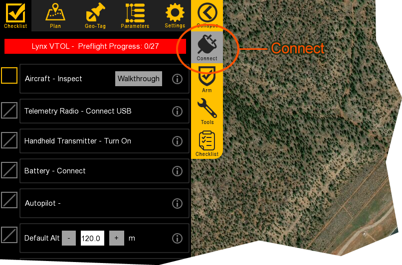
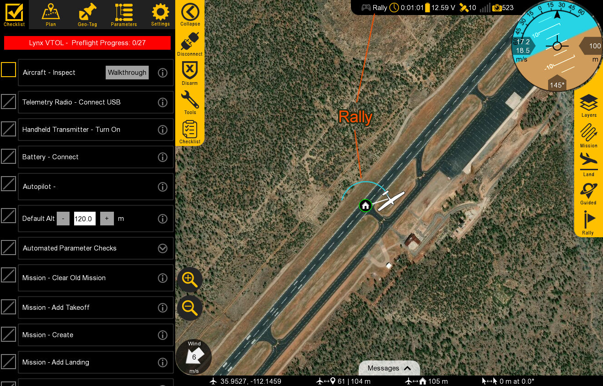
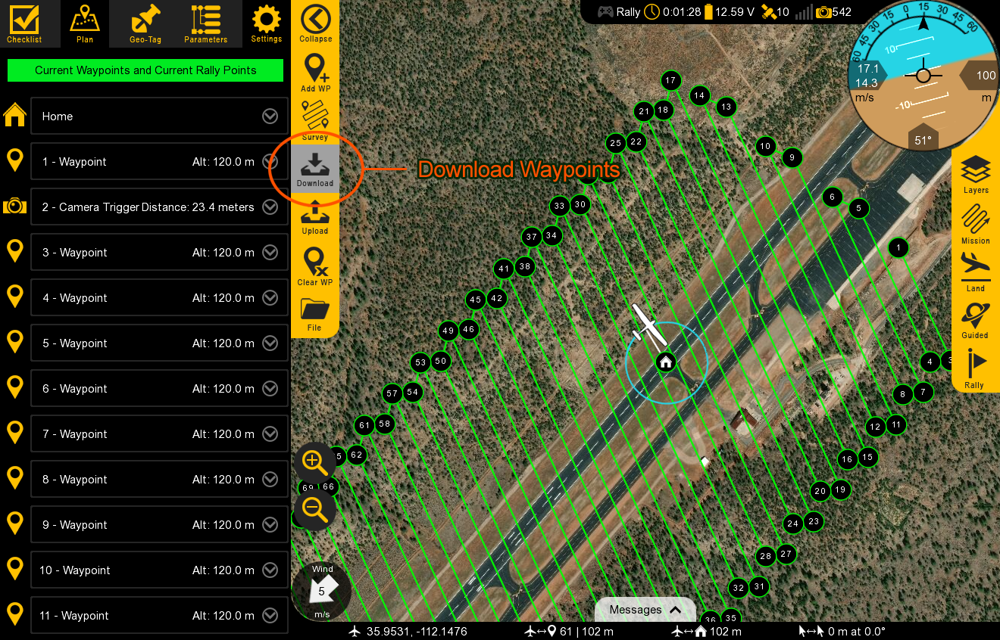
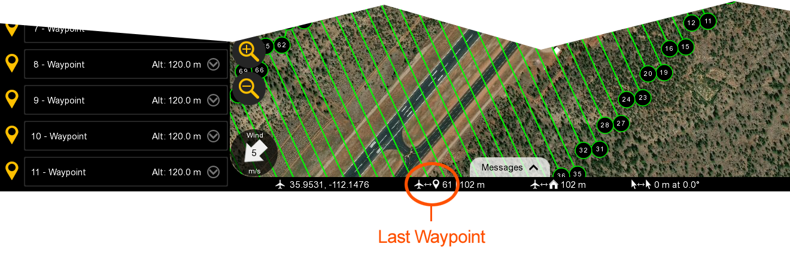
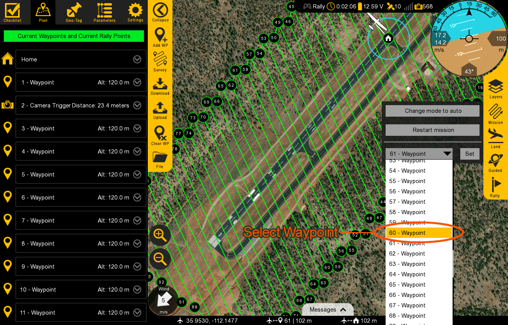

#Reconnecting in Flight

The following procedure outlines how to reconnect to an aircraft already in flight following a GCS crash or computer issue.

  1. Reboot your computer and/or restart Swift GCS
  
  2. Go to `Checklist Tab` ⇨ `Connect` to reconnect to the aircraft
  
  
  
  3. Assuming you have tripped your telemetry failsafe timeout, the aircraft will be circling a nearby Rally point
  
  
  
  4. Go to `Plan Tab` ⇨ `Download` to visualize your waypoints. 
  
  
  
  5. Note the last waypoint the aircraft was going to prior to rallying.
  
  
  
  6. If mapping, repeat the last flight leg to ensure adequate image overlap. To do so, expand the list of waypoints under `Mission` and select the waypoint preceding the waypoint mentioned in step 5.
  
  
  