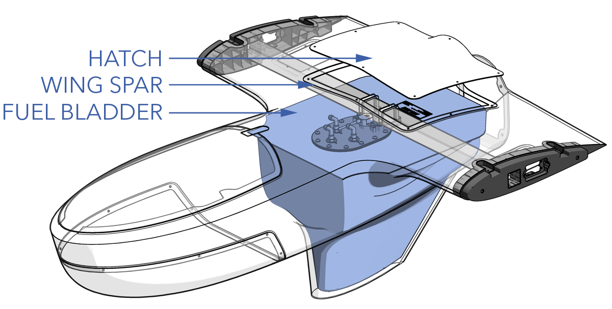
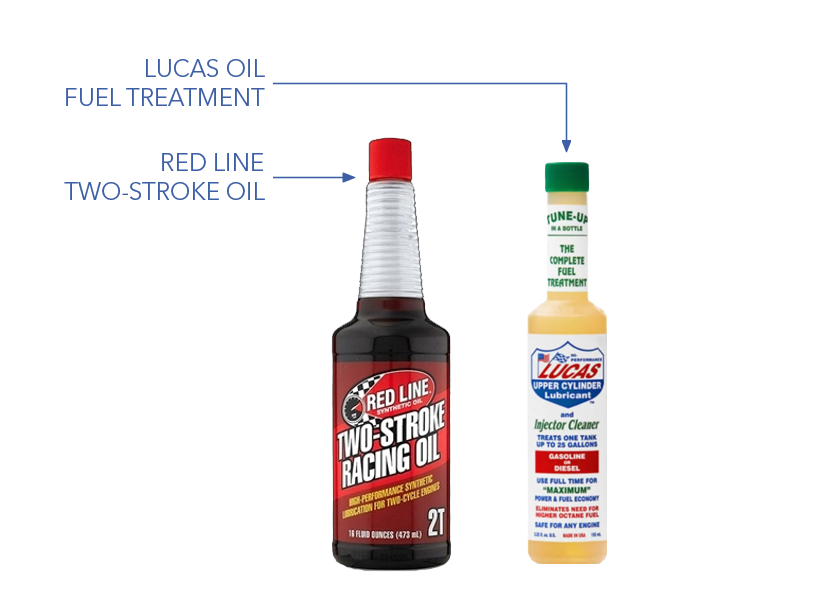
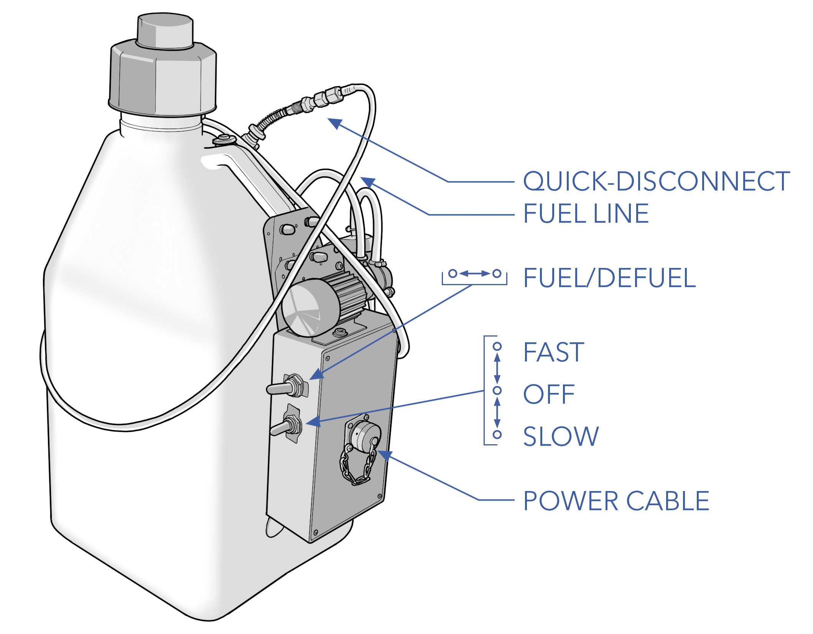

# Fueling


Gasoline is an extremely flammable liquid and vapor. Causes skin irritation. May cause drowsiness or dizziness. Store in approved containers.


# Fuel Bladder

Fuel for the FPS is held in a five gallon bladder located within the fuselage. The bladder is equipped with anti-slosh foam and an internal fuel level sensor.

# Fuel & Additives

The FPS Engine is compatible with 91 to 93 octane non-leaded pump gasoline and VP Racing C10 racing fuel. However, on hot days (≥ 100°F / 37°C), it is recommended to use VP Racing Fuel C10 to prevent vapor lock. 

Non-leaded fuel is highly recommended. Using leaded fuels will required shorter time between overhauls (TBO) as a result of lead oxide coking on the cylinder and exhaust ports. Leaded fuels will require cylinder, piston, and port, dressing and inspection every 50 to 100 hours (depending on use case).

Regardless of the specific fuel, it needs to be mixed 40:1 with Red Line Two-Stroke Racing Oil. Five gallons of fuel can be mixed with one 16 ounce (473 ml) bottle of Red Line oil to easily achieve the 40:1 ratio. If Red Line oil is not available, an equivalent two stroke oil (2T) may be used.

Additionally, to reduce carbon build-up on the engine components, it is recommended that Lucas Oil Fuel Treatment. Five gallons (19 liters) of gas can be mixed with one ounce (30 ml) of the Lucas Oil Fuel Treatment.


Vapor lock occurs when fuel vaporizes in the fuel lines due to being heated by the engine, climate, or high altitudes. This disrupts the operation of the fuel pump and makes restarting the engine difficult.


#### Fuel & Additives Specs 

|Parameter |Specification|
|----|---------------|
|Aircraft Capacity by Volume|~5 gal / 18.9 L|
|Aircraft Capacity by Weight|~30 lbs / 13.6 kg|
|Aircraft Fuel Consumption|2.5 lbs / 1.13 kg per hour|
|Fueler Capacity|5 gal / 18.9 L|
|Fuel Type|91 - 93 octane or C10|
|Two Stroke Oil|Red Line Two-Stroke Racing Oil|
|Two Stroke Oil Mix|40:1 (gas to oil)|
|Fuel Treatment|Lucas Oil Fuel Treatment|
|Fuel Treatment Mix|1 oz per 5 gal / 30 ml per 19 L|


Gasoline weighs about six pounds per gallon, or about 0.72 kilograms per liter.


# Fueling

The fueler is used to fuel and defuel the aircraft. The fueler connects to a quick disconnect port positioned on the side of the aircraft's fuselage. Powering the fueler's electric pump is the APS. A battery-powered scale is used to meter gasoline during fueling and defueling operations.


The last 1 lb (0.45 kg) of fuel is below the fuel sensor and not reported.


1. Mix gasoline with two stroke oil and fuel treatment. 
1. Determine the amount of fuel, by weight, required for the flight duration plus an additional one hour reserve of gas (2.5 lbs or 1.13 kg).
1. Place the fueler on a scale, on flat ground, next to the aircraft.
1. Turn on the APS power switch located under the lid and verify that the APS battery is sufficiently charged.
1. Connect the APS DC power cable to the fueler.

Do not power the fueler while the APS is plugged-in and charging.

1. Connect the fueler to the aircraft fuel port. 
1. Turn on the scale and note the starting weight of the fueler.

Most weight scales have an auto-off feature that will turn off the scale while fueling. Disable the auto-off feature when possible. To avoid losing your measurement, always note your starting weight.

1. On the fueler, toggle the switch to begin fueling. 
1. Dispense fuel until the scale reads the starting weight minus the desired weight of fuel. If the fuel bladder is filled completely, fuel will begin dripping from the overflow vent located on the bottom of the fuselage. If this happens, drain a small amount of fuel from the 
aircraft until the vent stops dripping.
1. Turn off the fueler.
1. Disconnect from the aircraft and secure the fuel line.

# Defueling

1. Place the fueler on a scale, on flat ground, within reach of the aircraft.
1. Connect the power cable between the APS and fueler.
1. Connect the fuel line from the fueler to the aircraft fuel port. 
1. Turn on the scale and note the starting weight of the fueler.
1. On the fueler, toggle the switch to begin defueling. 
1. As the tank nears empty, the fueler will begin to draw air bubbles through the pump. Keep draining until the fuel line is mostly air.

Never leave the fueler unattended while fueling or defueling. Continuously drawing air through the fuel pump from an empty tank can lead to overheating and eventual seizure of the pump.

1. Turn off the fueler.
1. Disconnect from the aircraft and secure the fuel line.
1. Record the weight of fuel removed from the aircraft.

