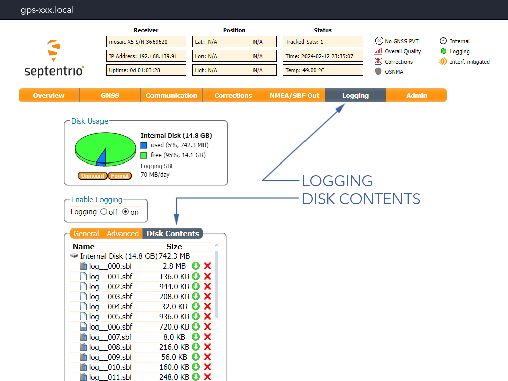

# Getting Logs

If you have an incident with the aircraft please provide all the relevant log files. These logs are needed to assess what went wrong, and providing them allows support to resolve problems quickly.

# Swift GCS Logs
Swift GCS automatically keeps two forms of logs. An internal log, and a telemetry log (TLOG). Both logs should be provided together. The logs can be found in the following locations:

|Operating System|Log Directory|
|----------------|-------------|
|Windows |%userprofile%/.swiftgcs/logs|
|Linux |~/.swiftgcs/logs|


There is a `View Logs` button in Swift GCS that can be found under the `Settings Tab` ⇨ `GCS` which will open the file browser to the folder where logs can be found.


The GCS log will be named by the date with a .log extension. The TLOG will have a longer time stamp and have a .tlog extension. A new TLOG is created every time the GCS connects to an aircraft.

# Autopilot Logs

The autopilot automatically records and stores many parameters of the flight. Autopilot logs have a .bin extension. This log file is essential for determining what the autopilot was doing and why. Typically, the log you would be looking for is the most recent log file, which will be the highest number. Otherwise look at the size and date created to determine which one you need. You can also open LASTLOG.TXT to find the number of the most recent log file. 

# GPS Logs

The GPS receiver saves logs that may be necessary for incident review, threat assessments, or mapping. To download GPS logs:

1. IP Radio - On (or connect with ethernet)
1. Avionics Battery - Connect 
1. Aircraft Power Switch - On
1. Open a web browser on the GCS computer and enter `gps-xxx.local` to load the Septentrio GPS configuration page.
1. Go to the `Logging Tab` ⇨ `Disk Contents`

1. Download the applicable logs. Septentrio logs end with .sbf

