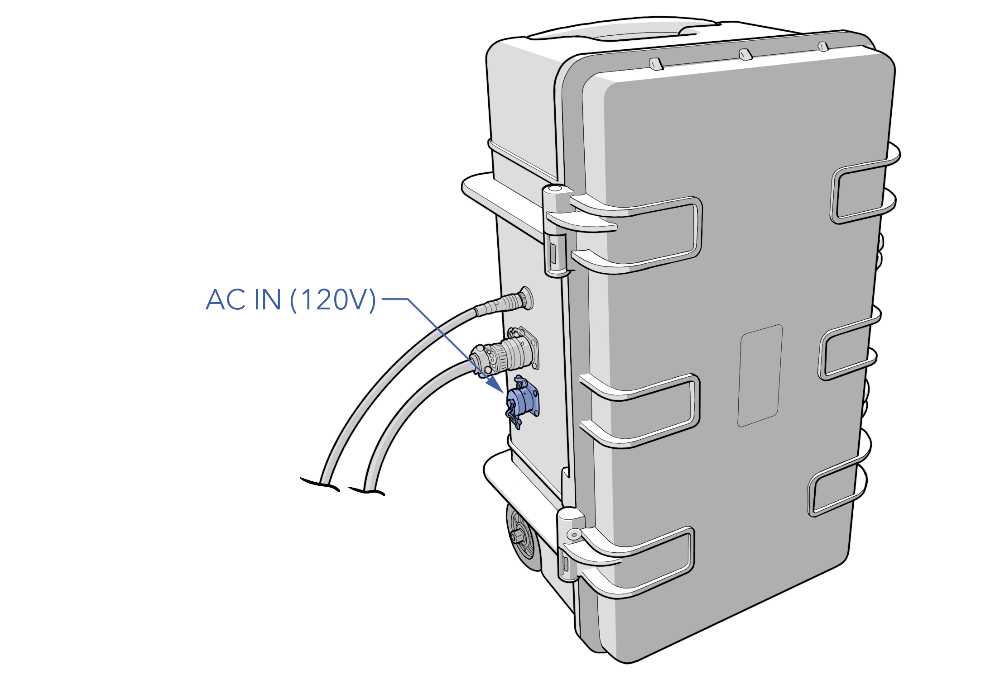
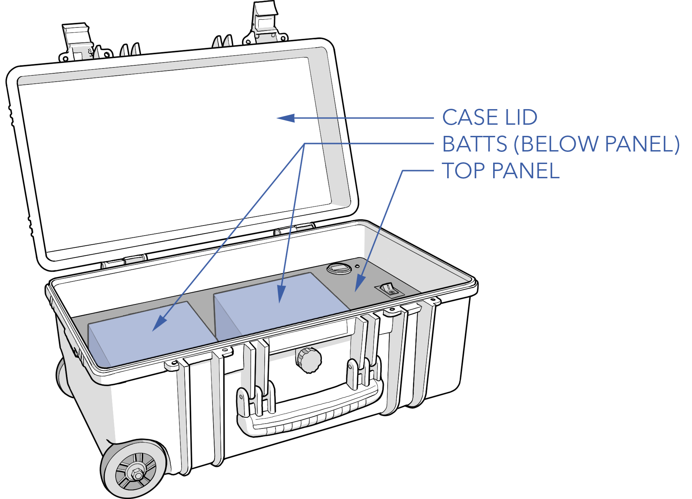

# APS Maintenance

The APS is a rechargeable battery pack that provides 24VDC for ground equipment and shore power to the aircraft. The APS maintenance procedures are performed according to the [Maintenance Schedule](maint-schedule.md) or as needed. These procedures include:

# Contents

* [Charging the APS](#charging-the-aps)
* [Changing AC Input Voltage](#changing-ac-input-voltage)
* [Replacing APS Batteries](#replacing-aps-batteries)

# Charging the APS

The APS is charged by connecting it to a standard wall outlet. The APS input voltage (mains) is set to either 120VAC or 220VAC, not both. If operating from a country with a different mains voltage, you must reconfigure the APS or use a voltage converter.


Do not operate the APS while it is charging.


# Changing AC Input Voltage

1. Open the APS case lid.
1. Remove the top panel.
1. Locate the input voltage selector switch on the side of the power supply.
1. Switch to the appropriate input voltage.
1. Reinstall the top panel.
1. Close the case lid.
1. Charge the APS overnight before using.

# Replacing APS Batteries

Replace the two lead acid battery packs inside the APS every two years, or as necessary. Early replacement may be necessary if there is a noticeable decline in performance.

1. Open the APS case lid.
1. Remove the top panel.
1. Note how the batteries are connected.
1. Disconnect the old batteries.
1. Connect the replacement batteries with the same series connection.
1. Reinstall the top panel.
1. Close the case lid.
1. Charge the APS overnight before using.

#### APS Battery Specs

|Parameter |Specification|
|----|---------------|
|Battery|12V 18Ah Lead acid|
|Model|ML18-12 or equivalent|
|Dimensions|7.13 x 3.03 x 6.57" (181 x 77 x 167 mm)|
|Quantity|2|
|Circuit|Series|
|Voltage Range|24 - 27.6V|