# Avionics Maintenance

The avionics is comprised of the autopilot, onboard computer (OBC), power supplies, network switch, GPS receiver, serial device server, and air data system. The stack is integrated as a single replaceable module, located within the fuselage, called the avionics stack.

The avionics is inspected as part of the preflight checklist. Optional procedures are available to configure the aircraft for specific requirements, including networking and streaming settings.

# Contents

- [Updating Autopilot Firmware](#updating-autopilot-firmware)
- [Removing the Avionics Stack](#removing-the-avionics-stack)
- [TTL vs. RS-232](#ttl-vs-rs-232)
- [GPS Settings](#gps-settings)
 - [Changing the GPS IP Address](#changing-the-gps-ip-address)
 - [Configuring a GPS IP Stream](#configuring-a-gps-ip-stream)
 - [Upgrading GPS Firmware](#upgrading-gps-firmware)
- [Network Switch Settings](#network-switch-settings)
 - [Changing the Switch IP Address](#changing-the-switch-ip-address)
- [Pilot Camera Settings](#pilot-camera-settings)
 - [Changing the Pilot Camera IP Address](#changing-the-camera-ip-address)
 - [Changing the Video Settings](#changing-the-video-settings)
- [Lantronix Settings](#lantronix-settings)
 - [Changing the Lantronix IP Address](#changing-the-lantronix-ip-address)
 - [Restoring Lantronix Settings](#restoring-lantronix-settings)
- [Onboard Computer Settings](#onboard-computer-settings)
 - [Changing the OBC IP Address](#changing-the-obc-ip-address)

# Updating Autopilot Firmware

An update for the autopilot firmware will be periodically shipped with a new build of Swift GCS. Whenever the GCS connects to the aircraft, it will automatically check if the autopilot is running the expected firmware version. If not, the operator will be prompted to update.


The GCS will not stop you from flying with the incorrect firmware. However, firmware updates are strongly recommended as they may address errors in the flight code, add new features, and improve the performance of the aircraft.


Tools needed: GCS computer, USB-C cable.

1. Launch Swift GCS
1. IP Radio - On (or connect over ethernet)
1. Avionics Battery - Connect
1. Aircraft Power Switch - On
1. Autopilot - Connect
1. On the `Settings Tab` ⇨ `Firmware` ⇨ `Upload Firmware`. This will open a dialog box that walks you through the upload process.
1. Press the `Upload` button to begin scanning for the autopilot.
1. Plug in the USB-C cable into the front of the avionics enclosure.
1. The GCS will detect the autopilot, erase the old firmware, and upload new firmware.
1. When the firmware upload has been completed, a dialog box will open and the autopilot will automatically reboot. Press `Close` to proceed.
1. The GCS will then ask if you want to automatically update any autopilot parameters that changed with the new firmware. Select `Update Parameters` to automatically scan for and connect to the autopilot.
1. Once the GCS finds the autopilot, it will download and then upload a new set of parameters.
1. When the process has been completed a dialog will open. Select `Close` to finish.
1. Power cycle the aircraft before flying.


Under rare scenarios, the GCS computer can develop a problem communicating with the autopilot over USB. If no progress is made during the firmware upload for more than 30 seconds, unplug the USB cable and restart the firmware upload.


# Removing the Avionics Stack

The avionics stack is a removable module located within the fuselage.

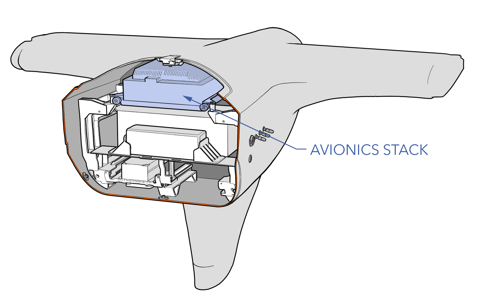

#### Removal

Tools needed: 8 mm wrench, hex key

1. Ensure the aircraft is powered off and all batteries are disconnected.
1. Unscrew the two thumbscrews securing the avionics stack to the avionics tray.
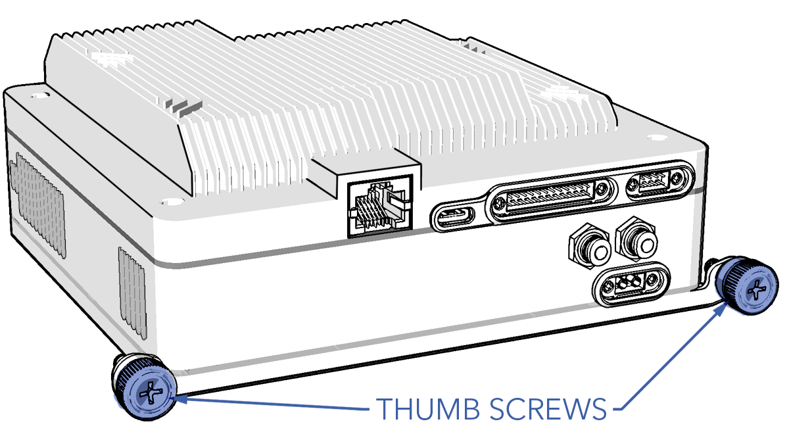
1. Disconnect the avionics power, pilot camera, and payload harness from the front of the stack by loosening the quarter-turn fasteners located on each connector.
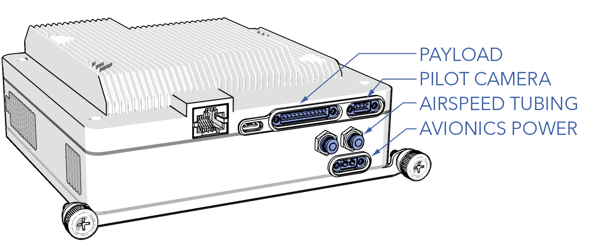
1. Detach the airspeed tubing from the two push-in fittings by holding down the blue release ring and then carefully removing the tubing.
1. Gently slide out the avionics stack until the rear connectors are exposed. Prevent cable strain by sliding out the avionics stack just enough to disconnect the cables.

Do not kink or bend RF cables tighter than a one inch radius (25 mm). Excessive bending may cause signal degradation or damage to the cable.

1. Unscrew the GPS antenna cable.
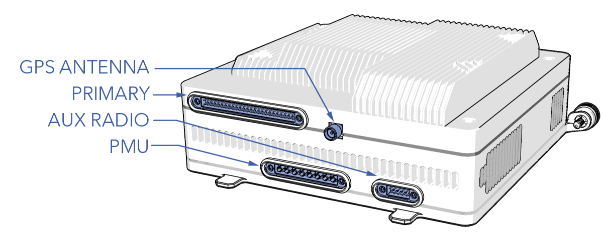
1. Disconnect the primary, PMU, and aux radio (if used) harness from the rear of the stack by loosening the quarter-turn fasteners located on each connector.
1. The avionics stack is now free to remove.

#### Installation

Tools needed: SMA torque wrench, hex key, 2.0 mm hex key

1. Ensure the aircraft is powered off and all batteries are disconnected.
1. Remove the tertiary payload bay hatch.
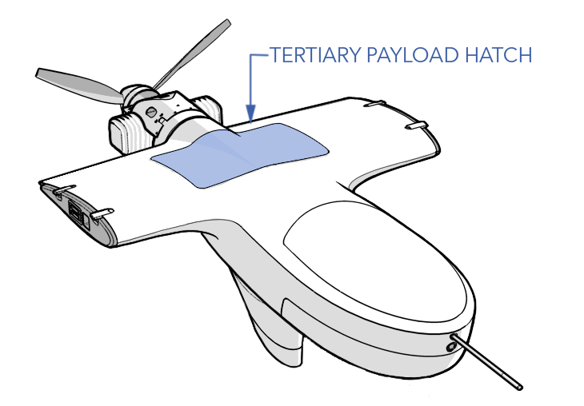
1. Connect the primary, PMU, and aux radio (if used) harness to the rear of the stack and tighten the quarter-turn fasteners located on each connector.
1. Connect the GPS antenna cable and tighten using an SMA torque wrench.
1. Slide the avionics stack back into the tray while guiding the cables out of the way by reaching through the tertiary payload bay. Ensure the cables are not kinked or pinched between the avionics stack and the tray.

Do not kink or bend RF cables tighter than a one inch radius (25 mm). Excessive bending may cause signal degradation or damage to the cable.

1. Continue sliding the avionics back until the holding tabs lock in place. 
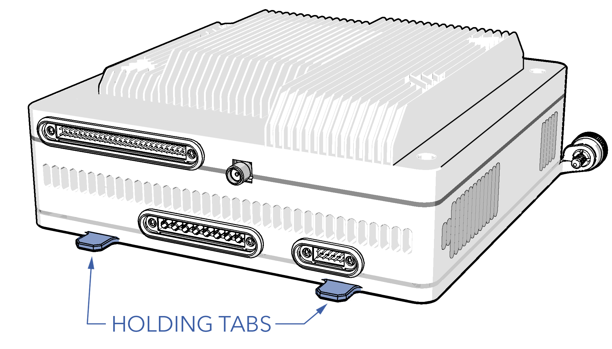
1. Secure the avionics with the two thumbscrews and tighten until they are finger-tight.
1. Push the airspeed tubing into the push-in fittings. The order of the tubing does not matter.
1. Connect the avionics power, pilot camera, and payload harness to the front of the stack and tighten the quarter-turn fasteners located on each connector.
1. Reinstall the tertiary payload hatch, tighten the screws until they are finger-tight. Do not apply thread locker.

# TTL vs. RS-232 

The avionics stack defaults to TTL serial. There is a removable pin jumper on serial 4 and 5 to convert either to RS-232. The pin jumpers are located on the upper board of the avionics stack. Consequentially, the enclosure lid must be removed to access the jumpers.

#### Converting to RS-232

Tools needed: SMA torque wrench, hex key, 2.0 mm hex key, 1.5 mm hex key, plastic pry tool

1. Remove the avionics stack. Refer to [Replacing the Avionics Stack](maint-avionics.md#replacing-the-avionics-stack).
1. Remove the four M2.5 x 8 enclosure top screws.
1. There are three thermal pads between the enclosure top and the upper board. Carefully pry the enclosure apart. Keep the thermal pads clean.
1. Remove the pin jumper(s).
1. Reinstall the enclosure top.
1. Secure the top with the four M2.5 x 8 screws. Apply a drop of Loctite 242 on each screw and finger-tighten. 
1. Install the avionics stack. Refer to [Replacing the Avionics Stack](maint-avionics.md#replacing-the-avionics-stack).

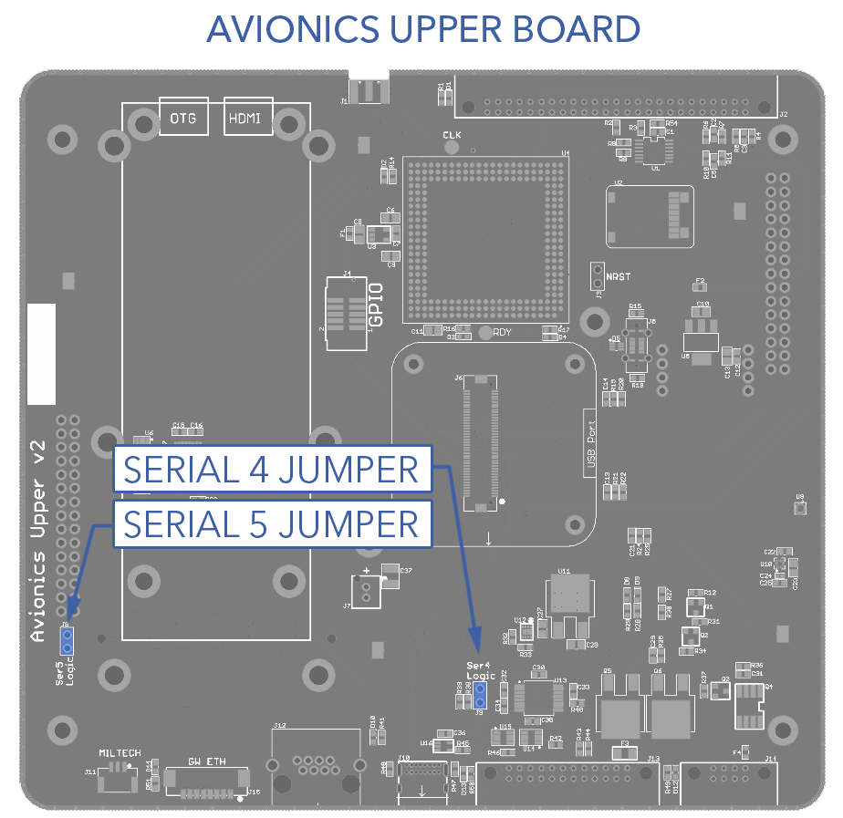

# GPS Settings

The GPS receiver uses a web based GUI that is accessible when you are connected to the aircraft. To access it, open a web browser and enter gps-xxx.local.

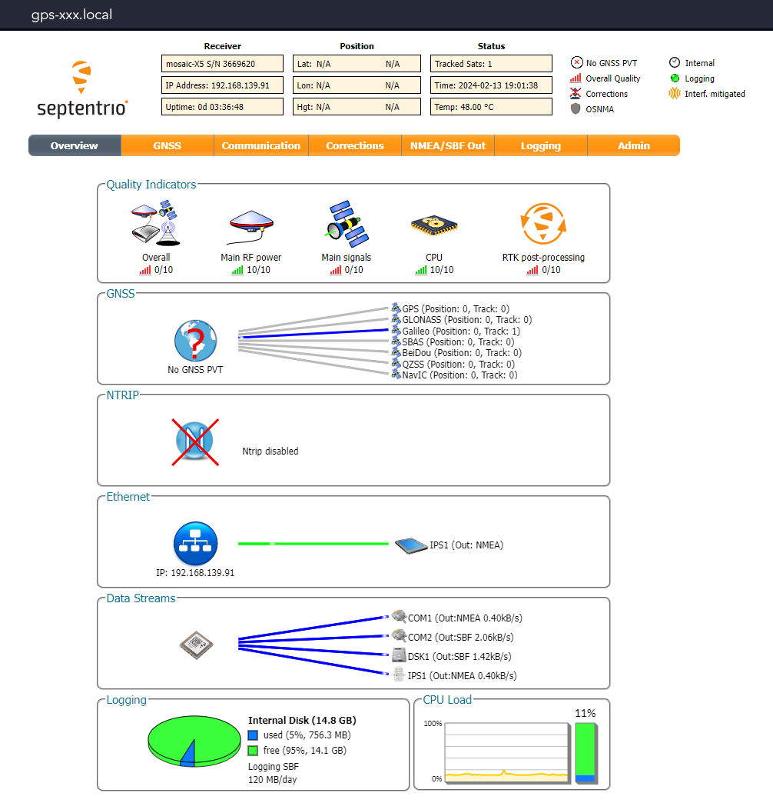

#### Changing the GPS IP Address

1. Aircraft - Connect
1. Open gps-xxx.local in a web broswer
1. Go to the `Communication Tab` ⇨ `Ethernet`
1. Ensure the mode is set to `Static`
1. Enter the new IP Address
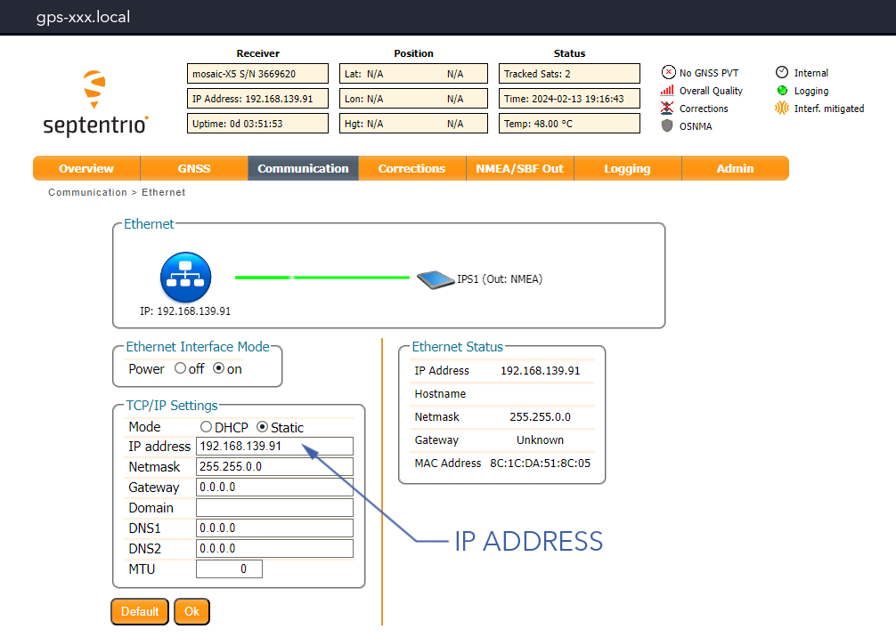
1. Press `Ok`
1. Go to the `Admin Tab` ⇨ `Configuration` ⇨ `Configuration File Target` ⇨ `Boot` ⇨ `Ok`
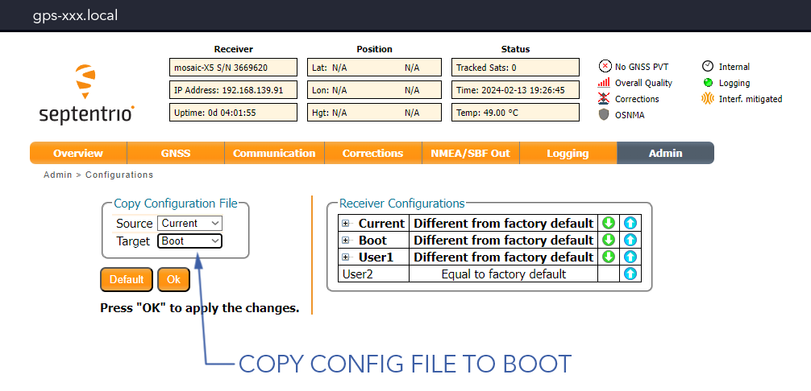

#### Configuring a GPS IP Stream

1. Aircraft - Connect
1. Open gps-xxx.local in a web broswer
1. Go to the `Communication Tab` ⇨ `IP Ports`
1. Under IP Server Settings, select `New IP Server` ⇨ `Ok`
1. Go to the `NMEA/SBF Out Tab` ⇨ `Configuration` 
1. Under NMEA/SBF Output Streams, select either a new NMEA or SBF stream and configure as needed
1. Press `Ok`
1. Go to the `Admin Tab` ⇨ `Configuration` ⇨ `Configuration File Target` ⇨ `Boot` ⇨ `Ok`

#### Upgrading GPS Firmware

1. Aircraft - Connect
1. Open gps-xxx.local in a web broswer
1. Go to the `Admin Tab` ⇨ `Upgrade` ⇨ `Choose File` ⇨ `Start Upgrade` 
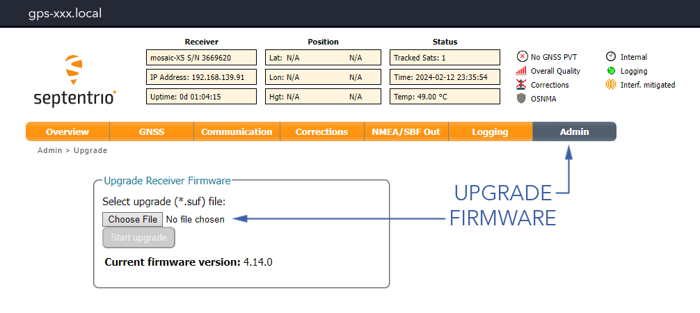

# Network Switch Settings

The switch uses a web based GUI that is accessible when you are connected to the aircraft. To access it, open a web browser and enter switch-xxx.local. The default login username is admin, no password.

#### Changing the Switch IP Address

1. Aircraft - Connect
1. Open switch-xxx.local in a web browser
1. Go to `Configuration` ⇨ `System` ⇨ `IP`
1. Enter the new IP Address and press `Save`
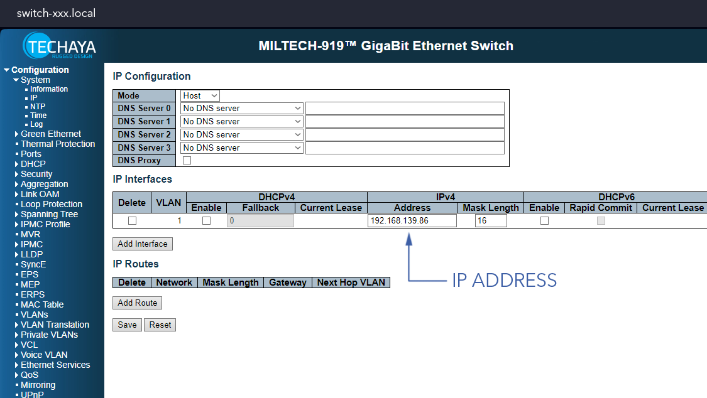

# Pilot Camera Settings

The pilot camera uses a web based GUI that is accessible when you are connected to the aircraft. To access it, open a web browser and enter pilotcam-xxx.local. The default login username and password is admin.

#### Changing the Camera IP Address

1. Aircraft - Connect
1. Open pilotcam-xxx.local in a web broswer
1. Go to `Network` and enter the new IP Address
1. Press `Submit`

#### Changing the Video Settings

The pilot camera settings can be adjusted to suit operator preferences or address radio bandwidth considerations.

1. Aircraft - Connect
1. Open pilotcam-xxx.local in a web broswer
1. Go to `Basic` ⇨ `Codec` to view and adjust video settings
1. Enter the new settings and press `Submit`
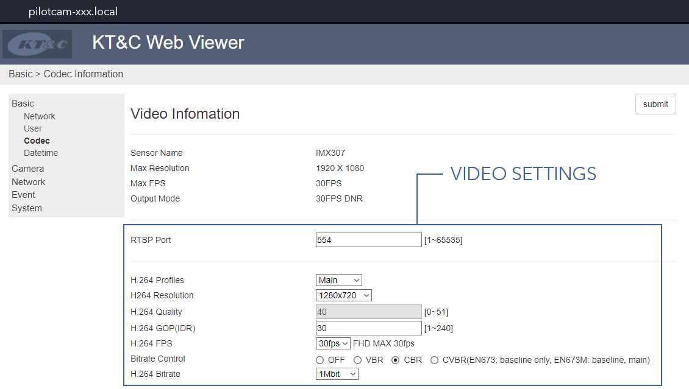

# Lantronix Settings

Lantronix is a serial device server. One is located in the hand controller, the other is in the avionics stack. Lantronix device in the avionics stack convert the IP commands sent from the hand controller back to serial for the autopilot. 

Lantronix uses a web based GUI that is accessible when you are connected to the aircraft. When prompted for a username and password, just press Ok.

This section covers the aircraft Lantronix. Refer to [Hand Controller Maintenance](maint-controller.md) when configuring the other Lantronix.

#### Changing the Lantronix IP Address

1. Connect to the aircraft
1. Open primary-xxx.local in a web broswer
1. Go to `Network` ⇨ `Use the following IP configuration` and enter the new IP Address

1. Press `Ok` ⇨ `Apply Settings` (not defaults!)

#### Restoring Lantronix Settings

Use the following steps to revert back to the original Lantronix settings after accidentally clicking 'Apply Defaults' or misconfiguring the Lantronix. Unfortunately reverting back to defaults also changes the device IP address, so you will need to find the new address using the Lantronix DeviceInstaller.

1. Visit the [Lantronix Website](https://www.lantronix.com/products/deviceinstaller/) to download and install DeviceInstaller

1. Open Lantronix DeviceInstaller 
1. Connect to the avionics stack over ethernet
1. In DeviceInstaller, go to `Device` ⇨ `Search`. The Lantronix model will show up as 'xPico110' with its IP address next to it.

1. In a web browser, enter the IP address found in DeviceInstaller to open the Lantronix settings page. From here, enter the original settings found below:
 1. Lantronix IP - Set 192.168.xxx.92/16 
 1. Lantronix Gateway - Set 192.168.xxx.1
 1. Ch1 Serial - Set Baud 230400
 1. Ch1 Serial Flow Control - Set CTS/RTS
 1. Ch1 Connection Protocol - Set UDP
 1. Ch1 Connection Datagram type - Set 01
 1. Ch1 Connection Local Port - Set 14550
 1. Ch2 Serial - Set Baud 115200
 1. Ch2 Serial Flow Control - Set none
 1. Ch2 Connection Protocol - Set UDP
 1. Ch2 Connection Datagram type - Set 01
 1. Ch2 Connection Local Port - Set 10002
1. Press `Apply Settings` (not defaults!)

# Onboard Computer Settings

Accessing the Gateworks onboard computer (OBC) is done using a command line through Secure Shell Protocol (SSH).

#### Changing the OBC IP Address

