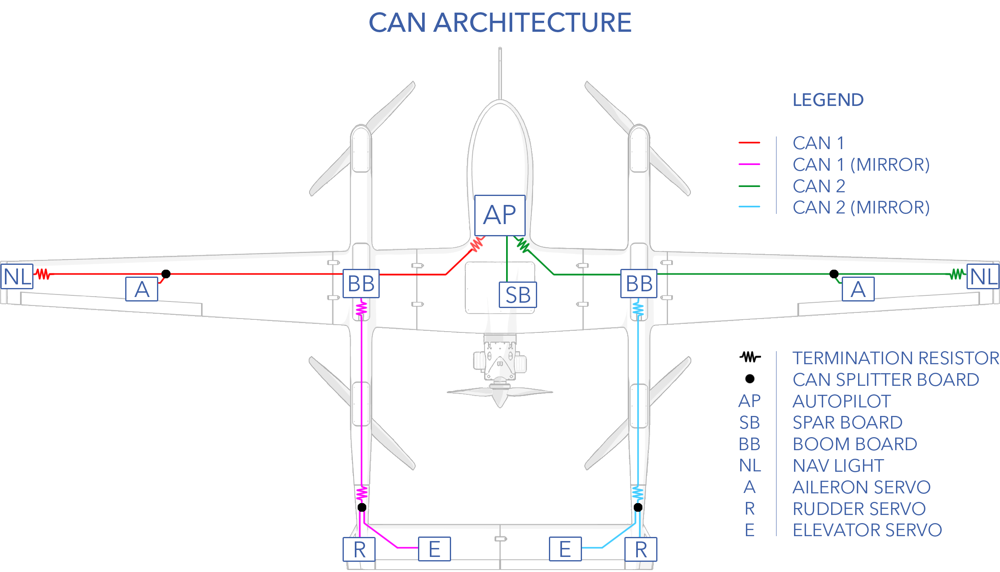
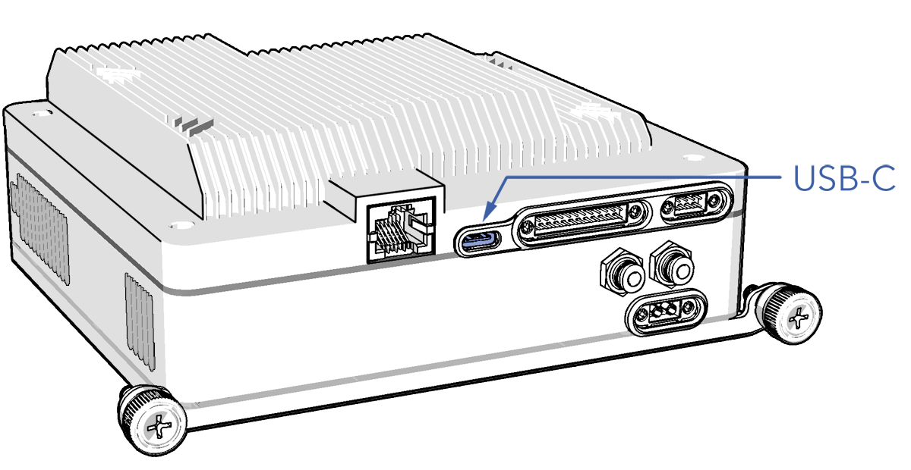
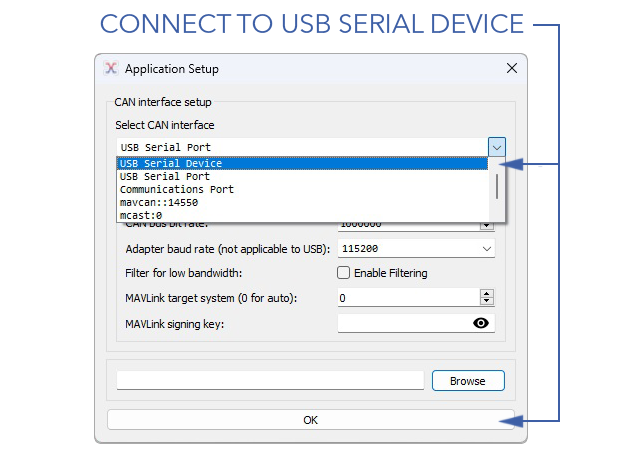
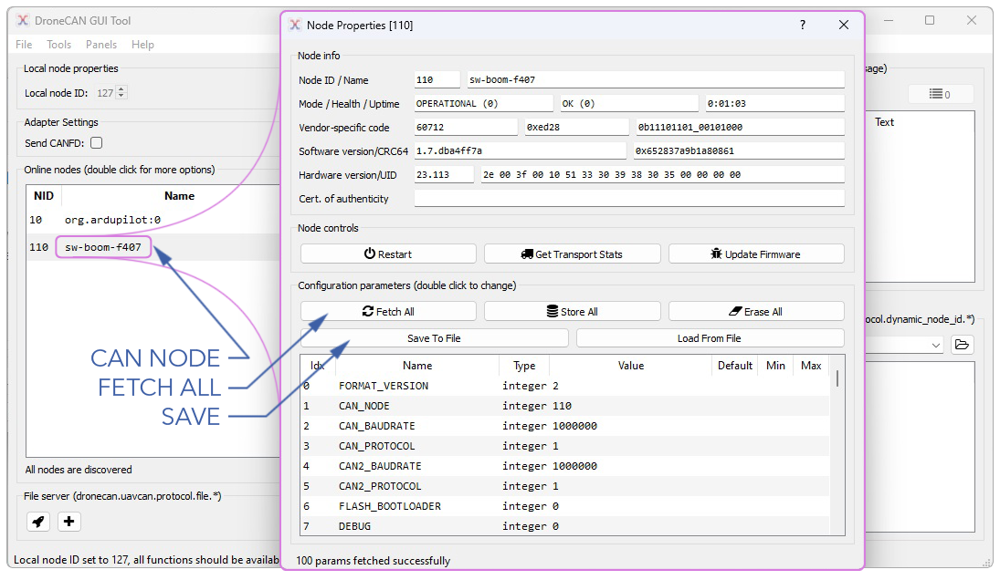
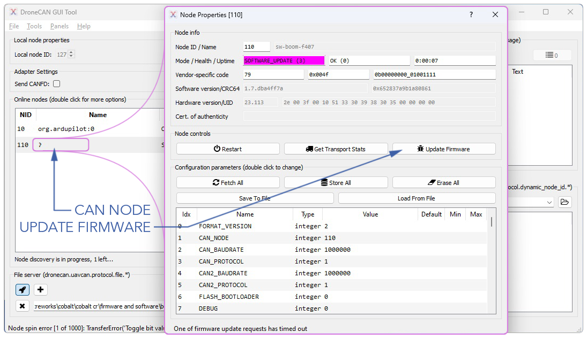

# CAN Bus

DroneCAN is a vehicle bus protocol that enables communication between the autopilot and different hardware on the aircraft. CAN allows multiple nodes to communicate with each other over a single bus. Nodes refer to the individual devices or modules connected to the CAN bus network, each capable of sending and receiving data. These nodes can include components such as sensors, actuators, controllers, and other electronic devices.

# Contents

- [CAN Architecture](#can-architecture)
- [AP_Periph](#ap_periph)  
- [DroneCAN GUI Tool](#dronecan-gui-tool) 
 - [Connecting](#connecting) 
- [Node ID Allocation](#node-id-allocation) 
- [Node ID Conflicts](#node-id-conflicts) 
- [Updating CAN Node Parameters](#updating-can-node-parameters)
- [Updating CAN Node Firmware](#updating-can-node-firmware)  

# CAN Architecture

The aircraft is divided into left and right halves corresponding to CAN 1 and CAN 2 bus, respectively. 

# AP_Periph

AP_Periph is an abbreviation for ArduPilot Peripheral, ie. an ArduPilot peripheral device based on the autopilot code. It takes peripheral device driver libraries of ArduPilot and adapts them to run on stand-alone peripheral devices. In doing so, AP_Periph enables several devices to communicate over DroneCAN that do not natively support it.

|AP Periph Node|Translated Devices|
|-|-|
|Spar Board|Fuel Sensor (analog), Lidar (serial), Throttle Servo (PWM), ECU (serial), AUX Serial Port, AUX I2C Port|
|Left Boom Board|ESC 2 & 3 Control (PWM) and Telemetry (serial), VPS battery Heater and Monitors|
|Right Boom Board|ESC 1 & 4 Control (PWM) and Telemetry (serial), VPS battery Heater and Monitors|
|Left Nav Light|Nav Light, Compass|
|Right Nav Light|Nav Light, Compass|

# DroneCAN GUI Tool

DroneCAN GUI Tool is a free, cross-platform open-source application for CAN bus management and diagnostics and is required for certain maintenance procedures. It runs on Windows, Linux, and OSX. Visit the [DroneCan website](https://dronecan.github.io/GUI_Tool/Overview/) to download.

#### Connecting 

1. Download and install DroneCAN GUI Tool.
1. Connect the avionics battery. Do not connect the VPS batteries.
1. Power on the aircraft by flipping the main power switch on.
1. Launch DroneCAN GUI Tool
1. Connect to the avionics stack using the USB-C port.

1. Select from the drop-down menu `USB Serial Device` ⇨ `Ok`

1. If connected successfully, you should see a list of CAN Node ID's.

After connecting, DroneCAN GUI Tool will default to showing bus 1. You must select bus 2 manually. Refer to [CAN Architecture](maint-can.md#can-architecture) 

1. Set the 'Local Node ID' to 127 (or something not already allocated). The local ID must not conflict with any ID on the aircraft.

# Node ID Allocation

|Node ID|Device|
|-|-|
|10|Autopilot|
|109|Left Boom Board|
|110|Right Boom Board|
|111|Left Nav Light|
|112|Right Nav Light|
|116|Spar Board|
|121|Left Aileron|
|122|Right Aileron|
|123|Left Elevator|
|124|Right Elevator|
|125|Left Rudder|
|126|Right Rudder|

	
Odd node numbers signify a device located on the left side of the aircraft, while even nodes denote the right side.


#### Node ID Conflicts

When a device is attached and recognized, it’s node ID and hardware ID are entered into a database which is stored between power cycles. If multiple devices with the same node ID and different hardware IDs are used (swapping servos for maintenance, for example) a conflict will arise in the database. This will require the use of the CAN_D1_UC_OPTION parameter for bus 1, or CAN_D2_UC_OPTION for bus 2 to allow the database to be reset on the next boot.

# Updating CAN Node Parameters

1. [Connect using DroneCAN GUI TOOL](maint-can.md#connecting)
1. Double-click on the desired CAN Node.

1. Select `Fetch All` to view the existing parameters.
1. From here you may update individual parameters or choose `Load from File` to load an existing parameter file.
1. Select `Store All` to save all changes on the CAN Node.
1. Select `Save to File` to save the updated parameters as a file.

# Updating CAN Node Firmware

Use the following steps to update [CAN Device](maint-can.md#node-id-allocation) firmware.

1. [Connect using DroneCAN GUI TOOL](maint-can.md#connecting)
1. Double-click on the desired CAN Node.

1. Select `Update Firmware`. For AP_Periph devices, the firmware file extension is .apj 

