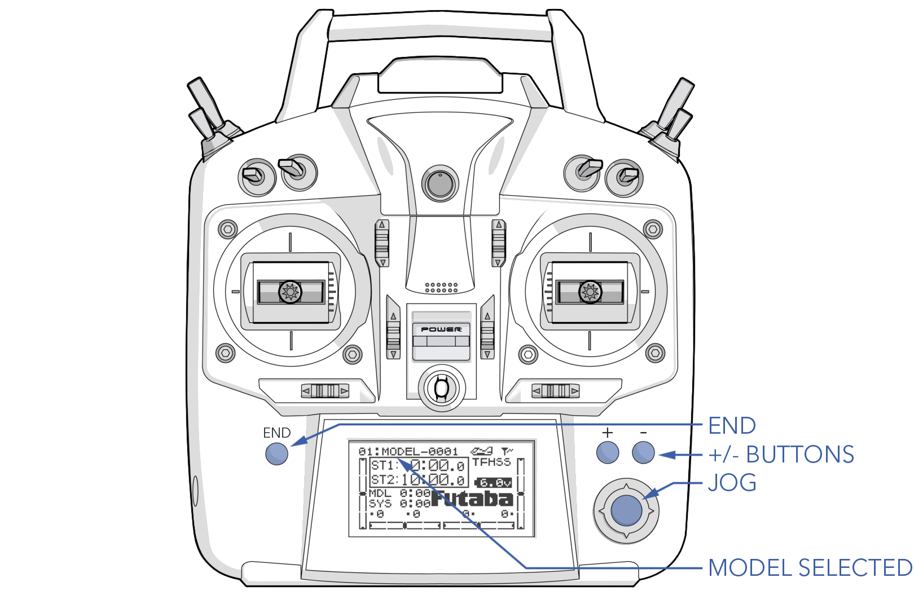
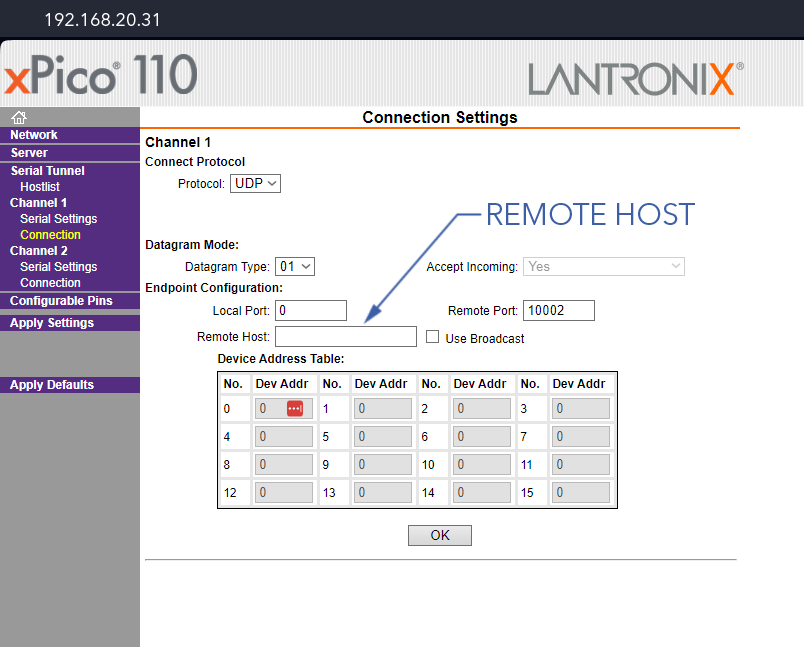
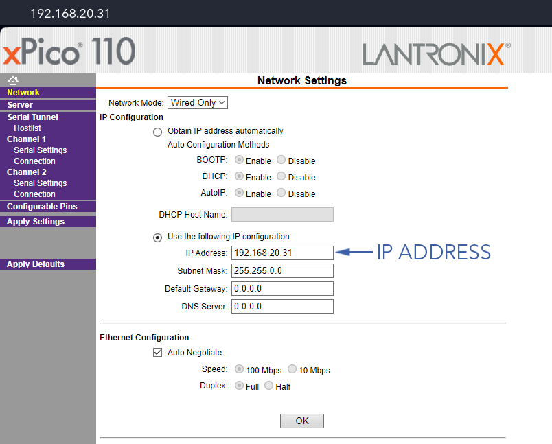
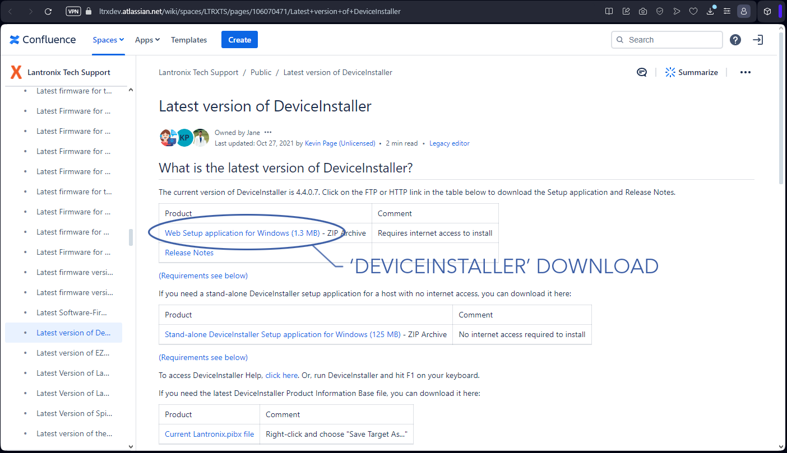
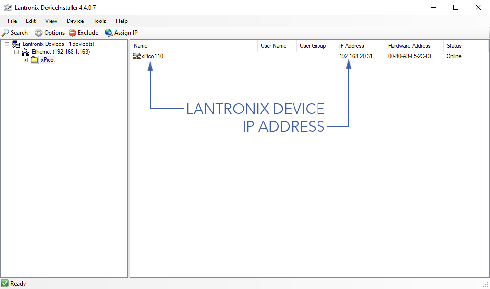

# Hand Controller

# Contents
- [Using the Same Controller for Multiple Aircraft](#using-the-same-controller-for-multiple-aircraft)
 - [Changing the Model](#changing-the-model)
 - [Changing the Remote Host](#changing-the-remote-host)
- [Other Lantronix Settings](#other-lantronix-settings)
 - [Changing the IP Address](#changing-the-ip-address)
 - [Restoring Settings](#restoring-settings)

# Using the Same Controller for Multiple Aircraft 

Using the hand controller with different aircraft requires changing the remote host and, if you are also using the same controller for different types of aircraft, the model selected on the controller. 

#### Changing the Model

Changing the model selected on the hand controller is required when you are using the same controller to fly different types of aircraft. Without selecting the correct model, the servo configuration, switch mapping, and throttle controls will not be correct.

1. Ethernet - Connect
1. Hand controller - On
1. Press and hold the + button
1. Highlight and select 'MDL-SEL' with the jog button
1. Under SELECT> scroll through the models using the +/- buttons
1. With the correct model highlighted, press and hold the jog button. The controller will display 'sure?'
1. Press the jog button again to confirm 
1. Press the END button twice to exit the menus
1. Verify the correct model is displayed on the main screen

#### Changing the Remote Host

The hand controller communicates with the aircraft via an IP radio using a Lantronix serial device server, which converts the controller's commands from serial to IP. Another Lantronix device in the avionics stack converts these IP commands back to serial for the autopilot. 

When using the same controller with different Sapphire aircraft, it is necessary to change the remote host. Each aircraft has a unique IP address assigned. The remote host IP address instructs the hand controller which device to communicate with. It is crucial to ensure that the remote host IP address matches the Lantronix IP address in the aircraft for proper communication.

Lantronix uses a web based GUI that is accessible when you are connected to the hand controller. Open a web browser and enter the IP address printed on the controller. When prompted for a username and password, just press Ok.

1. Hand Controller - Connect
1. Enter the IP address printed on the hand controller in a web browser
1. Go to `Channel 1 Connection` and enter the new aircraft's [primary IP address](appendix-ip.md#) as the remote host. 

1. Press `Ok` ⇨ `Apply Settings` (not defaults!)

Ignore any Lantronix error related the local host/port being set to 0.


# Other Lantronix Settings

This section refers only to the hand controller. Refer to [Avionics Maintenance](maint-avionics.md#lantronix-settings) when configuring the aircraft Lantronix.

#### Changing the IP Address

1. Hand Controller - Connect
1. Enter the IP address printed on the hand controller in a web browser
1. Go to `Network` ⇨ `Use the following IP configuration` and enter the new IP Address

1. Press `Ok` ⇨ `Apply Settings` (not defaults!)

#### Restoring Settings

Use the following steps to revert back to the original Lantronix settings after accidentally clicking 'Apply Defaults' or misconfiguring the Lantronix. Unfortunately reverting back to defaults also changes the device IP address, so you will need to find the new address using the Lantronix DeviceInstaller.

1. Visit the [Lantronix Website](https://www.lantronix.com/products/deviceinstaller/) to download and install DeviceInstaller

1. Open Lantronix DeviceInstaller 
1. Connect to the hand controller over ethernet
1. In DeviceInstaller, go to `Device` ⇨ `Search`. The Lantronix model will show up as 'xPico110' with its IP address next to it.

1. In a web browser, enter the IP address found in DeviceInstaller to open the Lantronix settings page. From here, enter the original settings found below:
1. Press `Apply Settings` (not defaults!)
