# FPS Maintenance

The Sapphire FPS consists of a line replaceable unit (LRU) two stroke internal combustion engine that includes all electronics, fuel pump, electronic fuel injection (EFI) system, ignition, starter, alternator, vibration mount, and propeller. The engine is a self-contained unit that can be swapped out entirely in minutes if needed for maintenance. 

The FPS should be inspected before each flight during the [Preflight Inspection](preflight-checklist.md#aircraft---inspect). Additional maintenance procedures are performed according to the [Maintenance Schedule](maint-schedule.md) or as needed. The FPS also has an additional maintenance schedule specifically for engine components.

# Contents

* [Engine Maintenance Schedule](maint-fps.md#engine-maintenance-schedule)
* [FPS Hardware](maint-fps.md#fps-hardware)
* [Spark Plug Inspection](maint-fps.md#spark-plug-inspection)
* [Spark Plug Replacement](maint-fps.md#spark-plug-replacement)
* [Air Filter Inspection](maint-fps.md#air-filter-inspection)
* [Air Filter Replacement](maint-fps.md#air-filter-replacement)
* [Fuel Filter Replacement](maint-fps.md#fuel-filter-replacement)
* [FPS Propeller Inspection](maint-fps.md#fps-propeller-inspection)
* [FPS Propeller Replacement](maint-fps.md#fps-propeller-replacement)
* [Engine Replacement](maint-fps.md#engine-replacement)
* [Engine Troubleshooting](maint-fps.md#troubleshooting)
* [Engine Performance Graphs](maint-fps.md#performance-graphs)
* [Fuel Bladder Replacement](maint-fps.md#fuel-bladder-replacement)
* [Updating ECU Parameters or Firmware](maint-fps.md#updating-ecu-parameters-or-firmware)

# Engine Maintenance Schedule

Each engine requires an additional maintenance schedule for subcomponents every 50, 100, and 300 hours. After 300 hours, the engine must be removed and sent to the OEM for overhaul to replace the engine core, harnesses, injector, throttle servo and more. Items like the ECU and fuel pump can go multiple overhaul cycles before replacement is recommended. The maintenance schedule for a specific engine is reset after an overhaul. 

|Item|Preflight|50 Hours|100 Hours|300 Hours|
|-|-|-|-|-|
|Engine Oil Pre-Mix|✓||||
|Spark Plug Check/Adjust||✓|||
|Spark Plug Replace|||✓||
|Air Filter Check/Clean||✓|||
|Air Filter Replace|||✓||
|Fuel Filter||✓|||
|OEM Maintenance||||✓|

# FPS Hardware

|Item|Fastener|QTY|Torque|Threadlocker|
|-|-|-|-|
|Spark Plug|NGK CM-6|1*|90 in/lbs (10 Nm)|n/a|
|Prop Bolts|M5 x 70 SHCS|6|65 in/lbs (7.3 Nm)|n/a|
|Spinner Cone Bolt|M5 x 100 SHCS|1|30 in/lbs (3.4 Nm)|Blue Loctite 242|
|Muffler Bolts|M5 x 20 SHCS|2*|60 in/lbs (6.8 Nm)|n/a|
|Muffler Support Bracket|M4 x 8 SHCS|1*|hand-tight|n/a|
|Throttle Body Bolts|HFE0807|2|30 in-lb (3.4 Nm)|Blue Loctite 242|
|Cylinder Bolts|M5 x 13|4*|70 in/lbs (8 Nm)|Blue Loctite 243|
|Crank Case Bolts|M5 x 20|4|70 in/lbs (8 Nm)|Blue Loctite 243|
|Air Filter Locknuts|MFE0384|2|10 in/lbs (1.1 Nm)|n/a|
|Engine Latch Bolts|M5 x 20 flat head|2|30 in/lbs (3.4 Nm)|Blue Loctite 242|
|Fuel Bladder Spar Bracket|M3 x 10 SHCS|2|hand-tight|Blue Loctite 242|
|Fuel Sensor|M4 x 8 button|2|hand-tight|Blue Loctite 242|

*Per Cylinder


Do not over tighten the throttle body mounting bolts. Over tightening can distort and damage the injected molded reed valve parts, rubber gaskets, and throttle body.


# Spark Plug Inspection

Tools needed: socket wrench, flathead screwdriver, 9/16" or 14 mm spark plug socket, 90 in/lbs torque wrench.

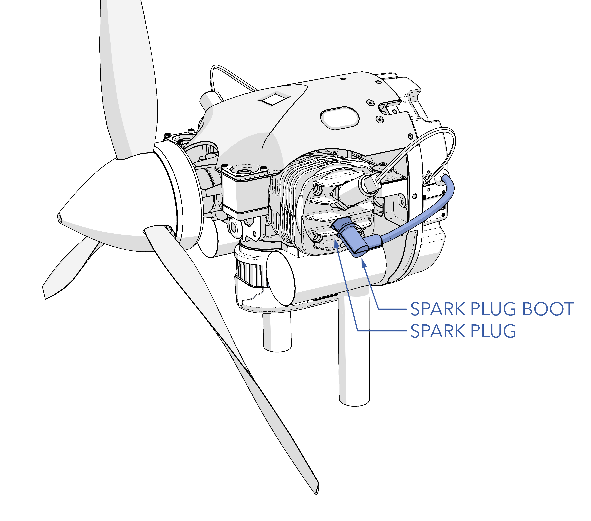

1. Ensure the aircraft is powered off, all batteries are disconnected, and the engine is cool.
1. Unscrew the hose clamp around the spark plug boot.
1. Disconnect the spark plug boot from the spark plug.
1. Remove the spark plug.
1. Inspect the spark plug and insulator for damage and wear. The insulator should not be cracked. A normal spark plug will have brown or grayish-tan deposits on the side electrode. Burned plugs, or those with carbon fouling or oily residue, indicate a problem with the fuel/air mixture or fuel/oil mixture. Worn electrodes will appear eroded. Use the original spark plug if the condition is good or replace it with a new one.
1. Ensure the spark plug gap is between 0.018 to 0.020 inch (0.38 to 0.5mm). 
1. Install the spark plug.
1. Torque the spark plug to 90 in/lbs.
1. Reconnect the spark plug boot.
1. Reinstall the hose clamp around the spark plug boot.

# Spark Plug Replacement

Tools needed: socket wrench, flathead screwdriver, 9/16" or 14 mm spark plug socket, 90 in/lbs torque wrench.

1. Ensure the aircraft is powered off, all batteries are disconnected, and the engine is cool.
1. Unscrew the hose clamp around the spark plug boot.
1. Disconnect the spark plug boot from the spark plug
1. Remove and discard the old spark plug.
1. Ensure the new spark plug gap is between 0.018 to 0.020 inch (0.38 to 0.5mm). 
1. Install the new spark plug. 
1. Torque the spark plug to 90 in/lbs.
1. Reconnect the spark plug boot.
1. Reinstall the hose clamp around the spark plug boot.

# Air Filter Inspection

The air filter installation is critical for protecting the throttle body from FOD and dust that may jam components. Ensure the air filter is installed at all times.

# Air Filter Replacement

Only use OEM air filter PN HFE0384.

Tools needed: 10 in/lbs torque wrench.

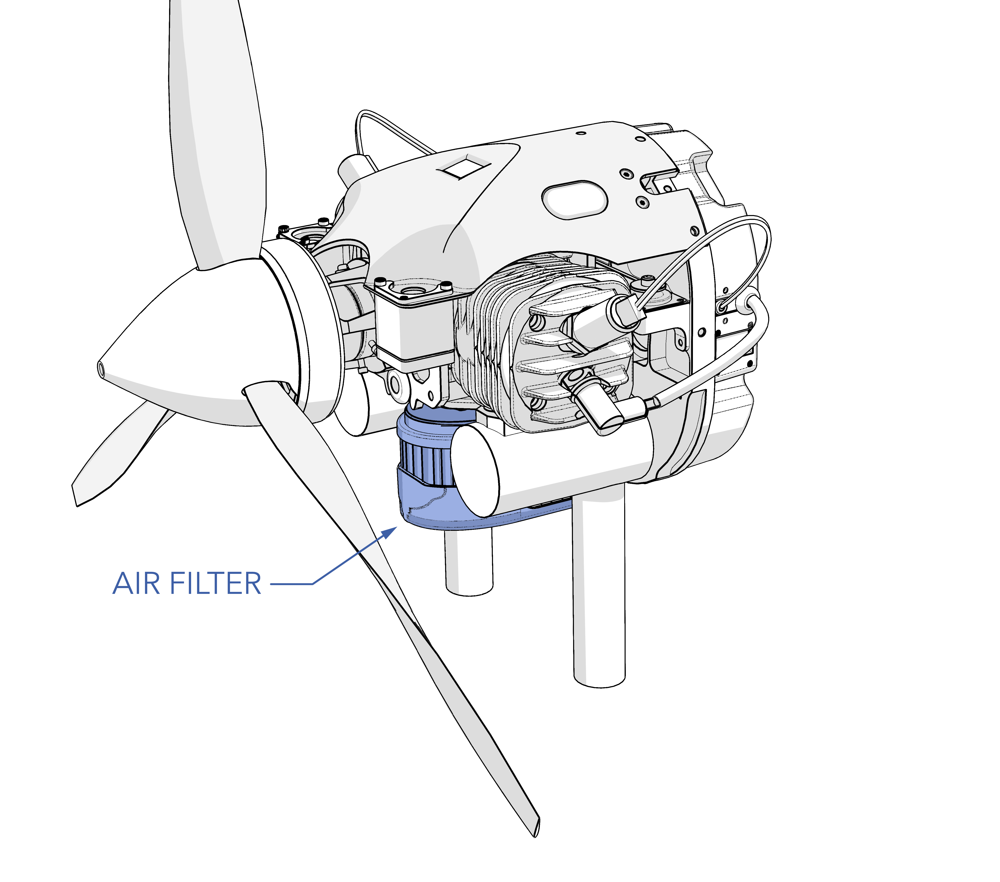

1. Ensure the aircraft is powered off, all batteries are disconnected, and the engine is cool.
1. Unscrewing the locknuts 
1. Pull the filter off the throttle body. 
1. Install the new filter. 
1. Secure the filter with the locknuts and torque to 10 in/lbs. 
1. Do not over-tighten the locknuts. Follow torque

# Fuel Filter Replacement

The aircraft has two fuel filters. One is in the bladder and needs no service, while the second is a 10 micron white filter at the back of the engine. When replacing the 10 micron fuel filter, ensure the push-to-connect fitting is fully seated at the seal. Also, check that the tube end is cut cleanly without any rough edges that might harm the O-ring seal or hinder sealing.

Tools needed: 3 mm hex driver, 30 in/lbs torque wrench, torque stripe.

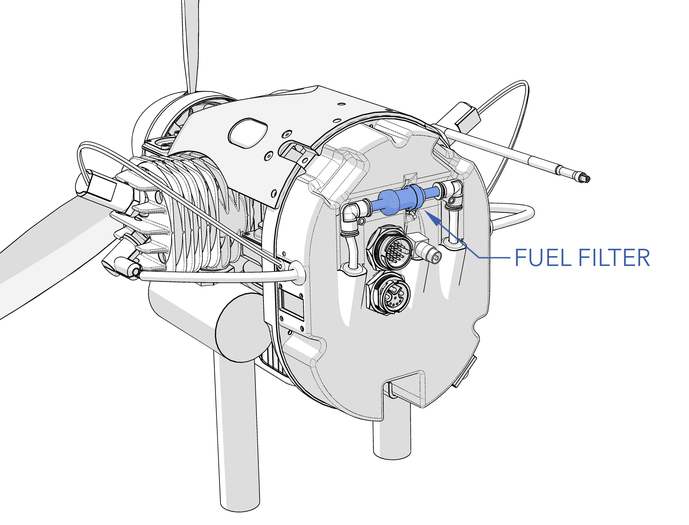

#### Removal

1. [Remove the Engine](maint-fps.md#engine-replacement) according to the Engine Replacement Section.
1. The filter resides between the fuel pump and the engine. Note the flow direction of the filter.
1. Disconnect the filter clip.
1. Disconnect the fuel filter lines from the push-to-connect elbow fittings. 
1. Remove and discard the old filter. 

#### Installation

1. Install the new filter into the push-to-connect fittings. Ensure the flow direction is correct.
1. Secure the filter with the clip.
1. Pivot the engine back and latch it against the airframe. Verify that there are no sharp edges that the wire harness can chafe on and that the fuel line cannot kink when the engine is installed.
1. Secure the latches with the mounting screws and torque to 30 in/lbs.
1. Apply torque stripe between the mounting screws and latches. 

	
Gasoline is an extremely flammable liquid and vapor. Causes skin irritation. May cause drowsiness or dizziness.


# FPS Propeller Inspection

The FPS propeller needs to be visually inspected before each flight during the [Aircraft Inspection](preflight-checklist.md#aircraft---inspect). The FPS propeller spins at high speed, near the ground, making it vulnerable to damage from gravel and foreign object debris (FOD). Additionally, it accumulates an oily residue from engine exhaust.

Inspect the propeller for nicks, chips, scratches, frays, cracks, delamination, and other damage. Minor scratches to the blade surface and minor leading edge pitting are acceptable. However, gouges or nicks on the leading edge nicks, frayed or chipped blade tips, cracks, and delamination are unacceptable levels of damage that require a replacement propeller.

Ensure the propeller is securely attached to the shaft by observing the safety wire under the spinner cone.

Replace according to the [Maintenance Schedule](maint-schedule.md) or if damaged.

# FPS Propeller Replacement

The FPS uses a 23 x 10 carbon 3-blade propeller.

Tools needed: 4 mm hex driver, 30-65 in/lbs torque wrench, safety wire, safety wire pliers, wire snips.

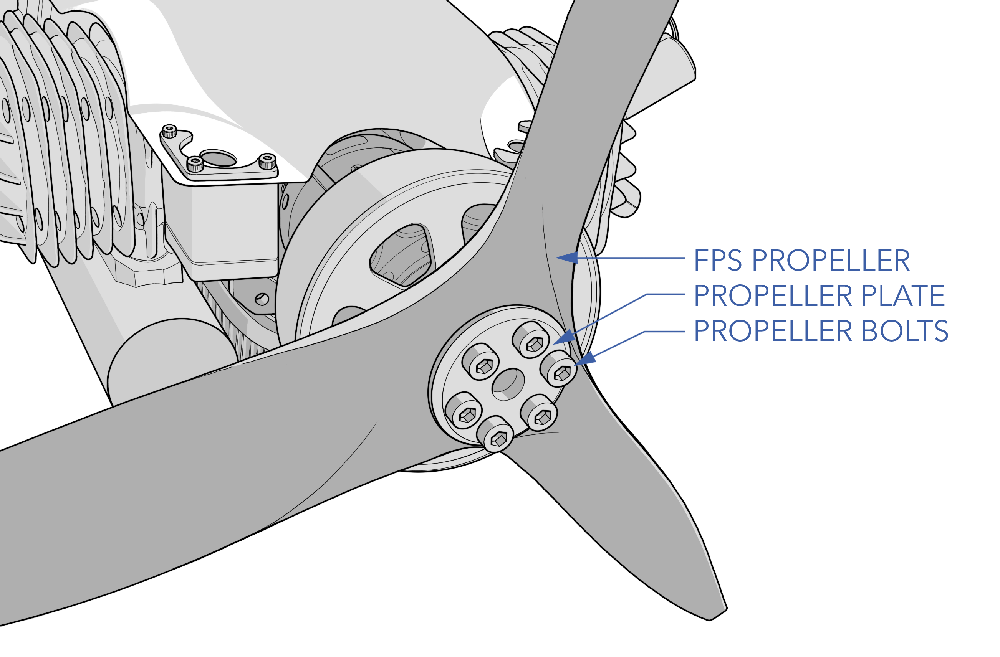

#### Removal

1. Ensure the aircraft is powered off, all batteries are disconnected, and the engine is cool.
1. Note the propeller orientation and direction before removal.
1. Unscrew the spinner cone bolt and remove the spinner.
1. Cut and remove the safety wire securing the propeller bolts.
1. Remove the propeller bolts and propeller plate.
1. Remove and discard the old propeller.
1. Inspect the engine shaft hub thread and propeller bolts for damage. Replace any bolts that are bent.

#### Installation

1. Insert the new propeller onto the propeller hub. Ensure the propeller is not mounted backwards. 
1. Align the mounting holes on the propeller with the hub.
1. Reinstall the plate and prop bolts. Gradually hand-tighten each bolt using a star pattern before torquing to 65 in/lbs.
1. Safety wire the propeller bolts. All six bolts can be wired together or in adjacent pairs.
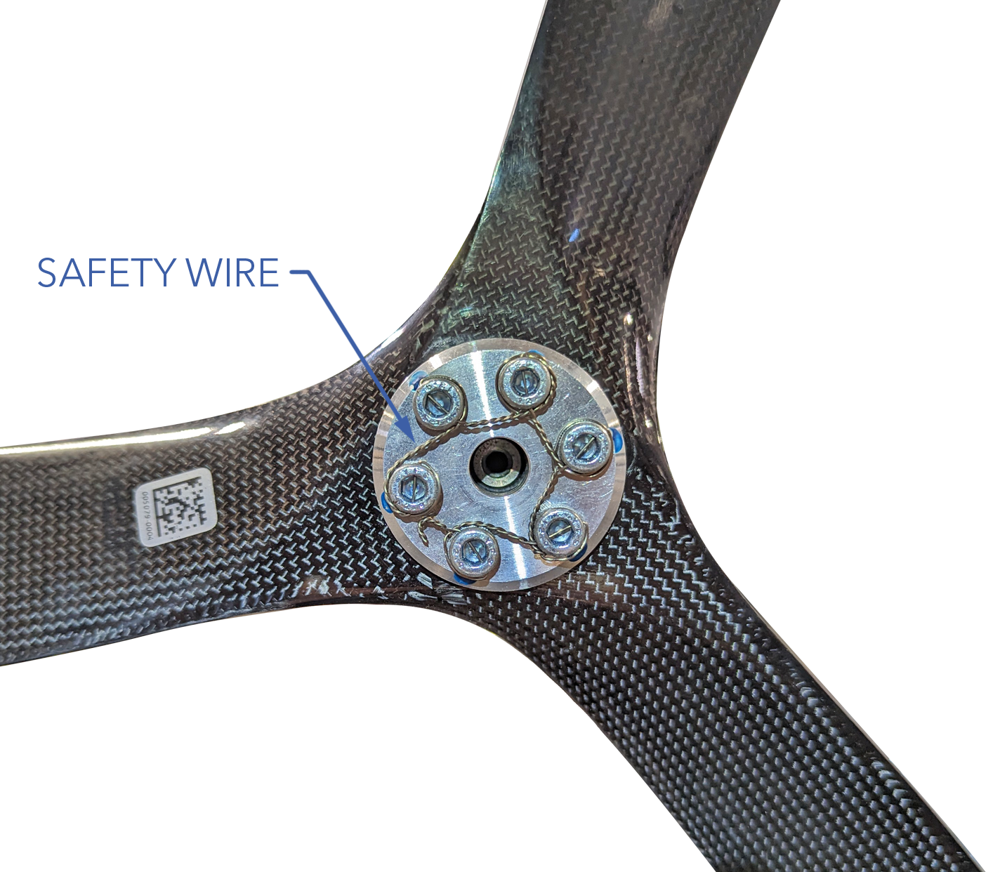
1. Install and center the spinner cone over the propeller. 
1. Install the spinner cone bolt with Blue Loctite 242 and torque to 30 in/lbs.

# Engine Replacement

The engine is a line replaceable unit (LRU) that can be swapped out entirely in minutes.

Tools needed: 3 mm hex driver, 30 in/lbs torque wrench, torque stripe.

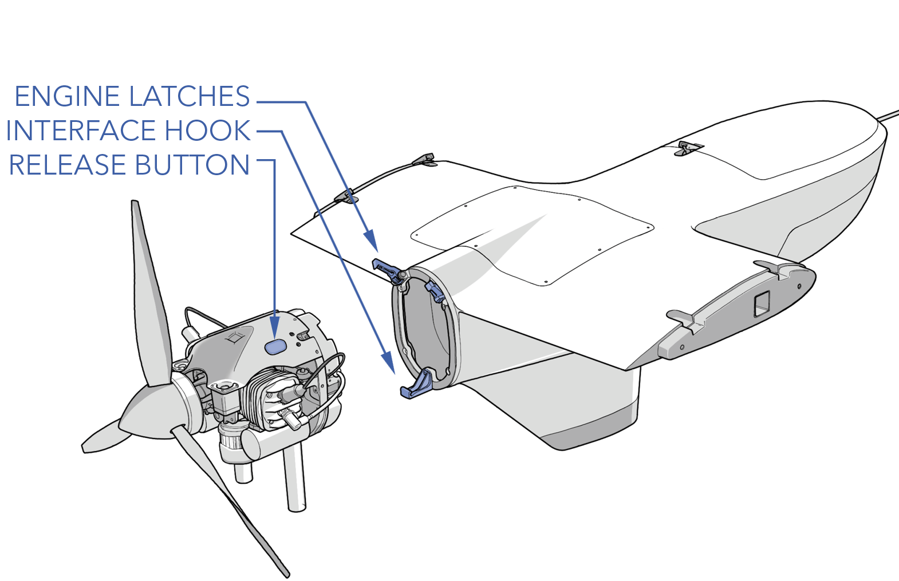

#### Removal 

1. Ensure the aircraft is powered off, all batteries are disconnected, and the engine is cool.
1. Remove the two screws securing the engine to the mounting latches.
1. Press the two latch release buttons to lift the latches up. 
1. While supporting the engine, pitot the engine forward on its catch pin.
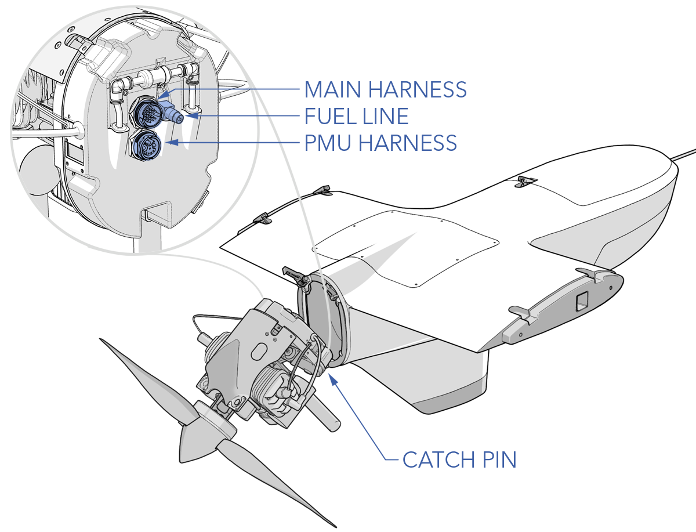
1. Disconnect the main harness, the PMU harness, and the fuel connector from the back of the engine.
1. Lift and remove the engine.

#### Installation

1. Attach the engine to the airframe using the catch pin on the bottom side of the engine and the interface hook on the engine mount.
1. While supporting the engine, pitot the engine forward on its catch pin and reconnect the main harness, the PMU harness, and the fuel connector.
1. Pivot the engine back and latch it against the airframe. Verify that there are no sharp edges that the wire harness can chafe on and that the fuel line cannot kink when the engine is installed.
1. Secure the latches with the mounting screws and torque to 30 in/lbs.
1. Apply torque stripe between the mounting screws and latches. 

# Troubleshooting

#### Engine does not start. No spark.

|Fault|Potential Cause|Corrective Action|
|-|-|-|
|Power|Power is not 12V or does not have enough current capacity when engine is cranking|Diagnose power supply. Verify main harness is fully seated.|
|Enable|Enable signal not referencing system ground|Tie autopilot ground to engine system ground|
|Enable|Enable signal is not 5V|Change enable voltage to 5V|
|Enable|Throttle position below 5%|Increase throttle position above 5%|
|Spark Plug|Gap not correct|Adjust gap|
|Spark Plug|Wet plugs|Remove plugs and let cylinder and plugs dry|
|Spark Plug|Carbon deposit on electrodes|Replace plug|
|Spark Plug|Cracked insulator|Replace plug|
|Spark Plug|Burned electrodes|Replace plug|
|Igntiion|Ignition cap corroded or worn through plating where it contact spark plug|Return to OEM for repair|
|Igntiion|Ignition coil failure|Return to OEM for repair|
|Igntiion|Ignition power|Return to OEM for repair|

#### Miss-firing but not starting. Spark is working.

|Fault|Potential Cause|Corrective Action|
|-|-|-|
|Start Rotation Direction Wrong|Engine is turning the wrong rotation|Disconnect two of the three-phase alternator wires and reconnect.
|Fuel Pressure|Air in fuel lines|Verify fuel tank level. Verify fuel line connections and prime.|
|Fuel Pressure|Over pressure|Verify fuel tank is vented and nothing is pressing on the fuel inlet tube|
|Fuel Pressure|Kink in fuel line|Remove any kinks|
|Enable|Enable signal not referencing system ground|Tie autopilot ground to engine system ground|
|Enable|Enable signal is not 5V|Change enable voltage to 5V|
|Enable|Throttle position below 5%|Increase throttle position above 5%|
|Spark Plug|Gap not correct|Adjust gap|
|Spark Plug|Wet plugs|Remove plugs and let cylinder and plugs dry|
|Spark Plug|Carbon deposit on electrodes|Replace plug|
|Spark Plug|Cracked insulator|Replace plug|
|Spark Plug|Burned electrodes|Replace plug|
|No Fuel|Flood clear enabled|Reduce throttle position below 35%|

#### Lack of power and/or unstable running.

|Fault|Potential Cause|Corrective Action|
|-|-|-|
|Engine runs well but power is low|Various causes|See engine performance graphs|
|Engine quits at full throttle|Ignition coil failure|Return to OEM for repair|
|Engine quits at full throttle|Crank sensor fault|Return to OEM for repair|
|Fuel Pressure|Air in fuel lines|Verify fuel tank level. Verify fuel line connections and prime.|
|Fuel Pressure|Over pressure|Verify fuel tank is vented and nothing is pressing on the fuel inlet tube|
|Fuel Pressure|Kink in fuel line|Remove any kinks|
|Enable|Enable signal not referencing system ground|Tie autopilot ground to engine system ground|
|Enable|Enable signal is not 5V|Change enable voltage to 5V|
|Spark Plug|Gap not correct|Adjust gap|
|Spark Plug|Wet plugs|Remove plugs and let cylinder and plugs dry|
|Spark Plug|Carbon deposit on electrodes|Replace plug|
|Spark Plug|Cracked insulator|Replace plug|
|Spark Plug|Burned electrodes|Replace plug|
|Stuck Butterfly Valve|Servo failure or linkage jam|Return to OEM for repair|
|Fuel|Water in fuel. Ethanol blends can accumulate water at bottom of tank|Flush fuel|

# Performance Graphs

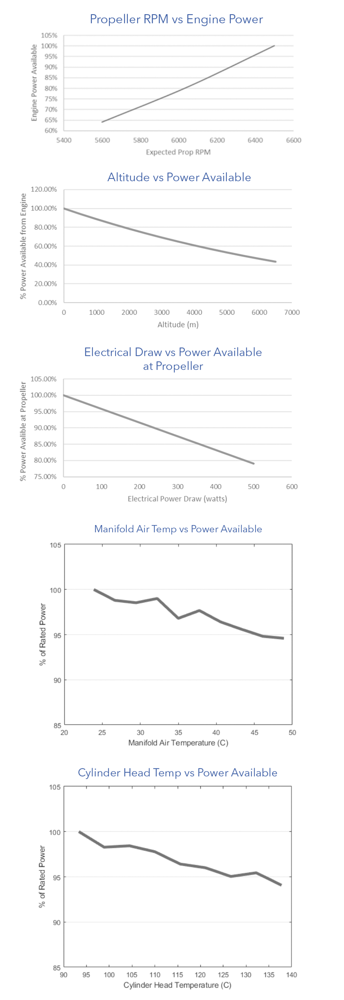

# Fuel Bladder Replacement

#### Removal

1. Ensure the aircraft is powered off and all batteries are disconnected.
1. [Defuel](fueling.md#defueling) the aircraft.
1. Remove the tertiary payload hatch by removing the eight mounting screws. Locate the fuel bladder beneath the hatch, under the wing spar.

1. Disconnect the fuel sensor cable from the spar board port label 'FUEL'.
1. Disconnect the Lidar and ECU cables from the spar board ports labeled 'LIDAR' and 'ECU' respectively. This will give more clearance when removing the fuel bladder and reduce the chance of straining those cables when removing the fuel bladder.
1. Disconnect the three fuel lines from the push-to-connect fuel fittings located on the fuel bulkhead. Note the order before disconnecting.
1. Remove the two fuel sensor mounting screws and carefully extract the fuel sensor probe from within the bladder.
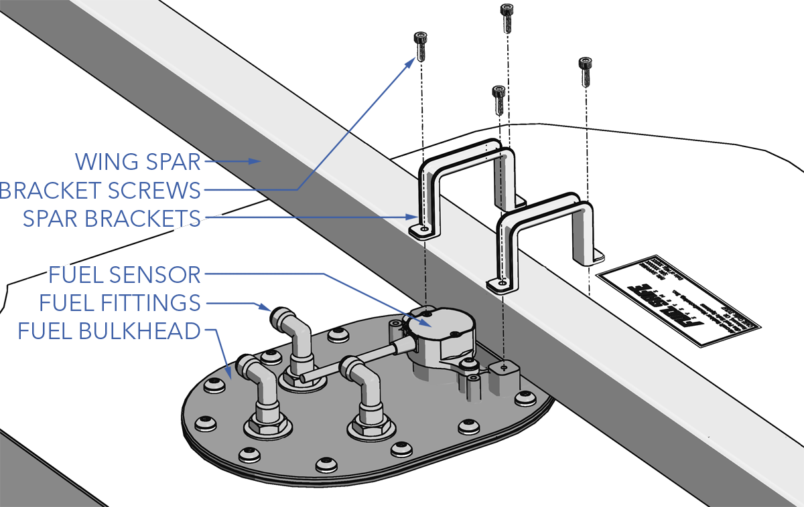
1. Remove the four screws securing the spar brackets to the fuel bulkhead.
1. Gently squeeze the fuel bladder and slide it backwards from under the wing spar, then pull it out through the hatch opening. 

	
Do not scrape the fuel bladder on any sharp edges to avoid puncture.


#### Installation

1. Ensure the aircraft is powered off and all batteries are disconnected.
1. Gently squeeze the fuel bladder and slide it through the hatch opening and under the wing spar. Then, run your hand between the bladder and fuselage, especially along the dorsal fin, ensuring it conforms smoothly without any crumpled or folded areas.
	
The fuel sensor must be removed from the bladder prior to installation.

1. Using a borescope, verify that the clunk is positioned at the bottom of the bladder.
	
If the clunk is not positioned at the bottom of the bladder, the aircraft will experience reduced utilization of onboard fuel, resulting in fuel exhaustion.

1. Secure the spar brackets to the fuel bulkhead using the four mounting screws with Blue Loctite 242.
1. Carefully insert the fuel sensor probe within the bladder and secure it using the two mounting screws with Blue Loctite 242.
1. Insert the three fuel lines into the push-to-connect fuel fittings located on the fuel bulkhead. Ensure the fuel lines are completely seated. The fittings are labeled must be as follows: red to F (Fill), blue to P (Pickup), black to V (Vent).
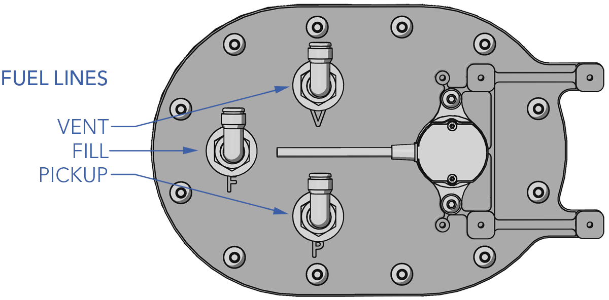
	
Failure to properly insert a fuel line into a push-to-connect fitting will result in a leak and may draw air bubbles into the fuel system. This may reduce flight time and cause the engine to sputter or quit.

1. Connect the Lidar and ECU cables to the spar board ports labeled 'LIDAR' and 'ECU' respectively. Ensure the connectors are properly seated.
1. Connect the fuel sensor cable to the spar board port label 'FUEL'.
1. Install the tertiary payload hatch using the eight mounting screws.

#### Fuel Line Routing

# Updating ECU Parameters or Firmware

1. Download and install [TunerStudio MS](https://https://www.tunerstudio.com/index.php/downloads).
1. Remove the tertiary payload hatch. 

1. Connect the avionics battery. Do not connect the VPS batteries.
1. Power on the aircraft by flipping the main power switch on.
1. Located the spar board underneath the payload hatch. Connect to the ECU port using the FTDI to 3-pin GH cable provided in the [Took Kit](maint-tool.md#tool-kit).
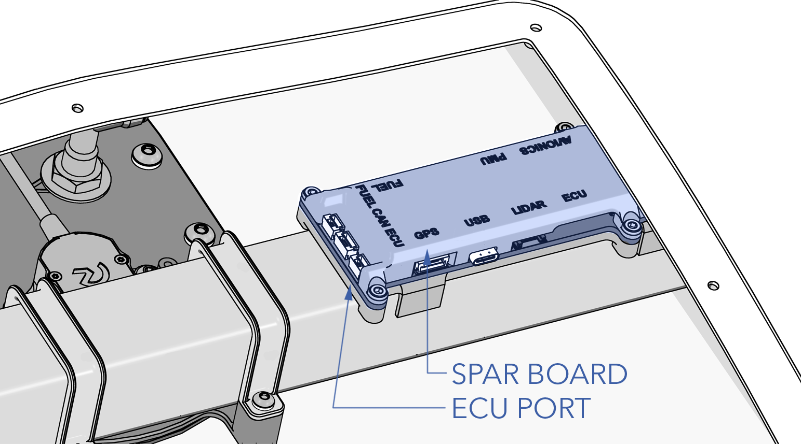 
1. Launch TunerStudio and select `Create New Project`. Enter the aircraft tail number as the project name.

1. Next to 'Firmware' ⇨ `Detect` to search for the ECU Port.
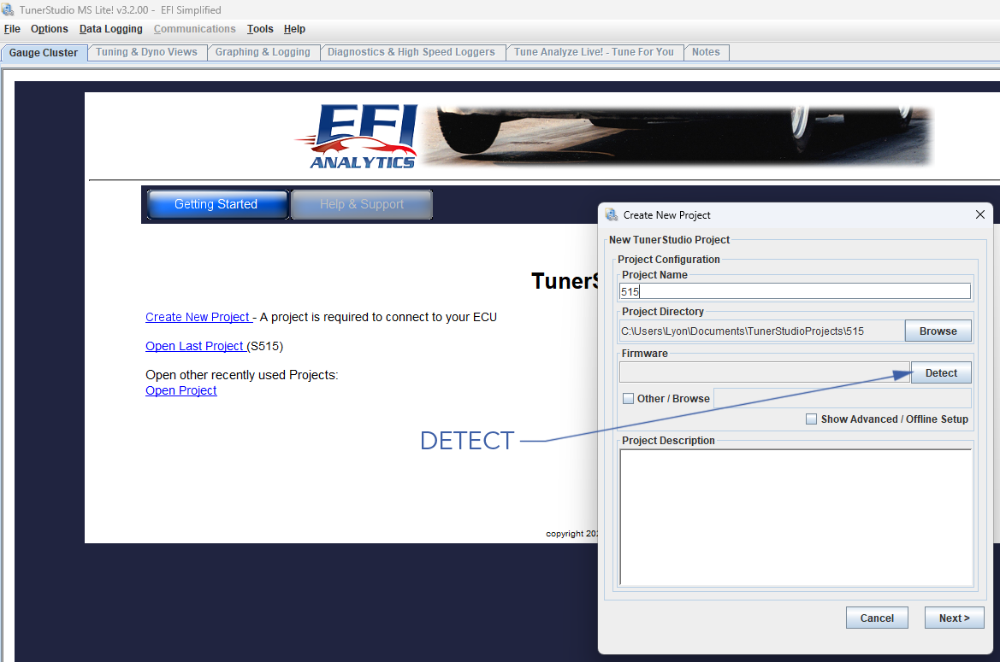
1. A window will display 'Device Search Complete! Controllers found:1' ⇨ `Accept`
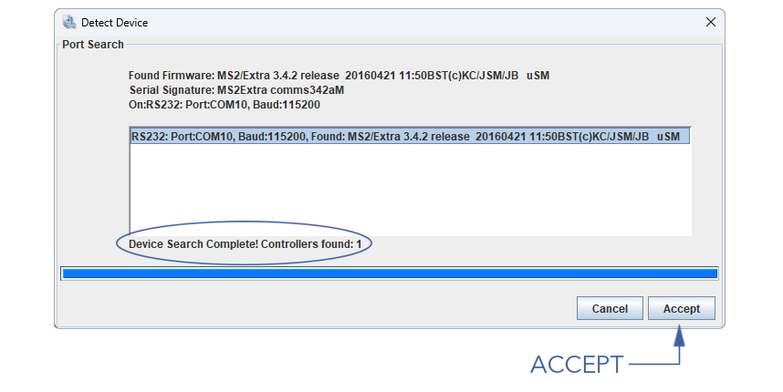
1. Skip the remaining windows by pressing `Next` ⇨ `Next` ⇨ `Finish`
1. Before loading new parameters or firmware, save the existing parameters by going to `File` ⇨ `Save Tune`
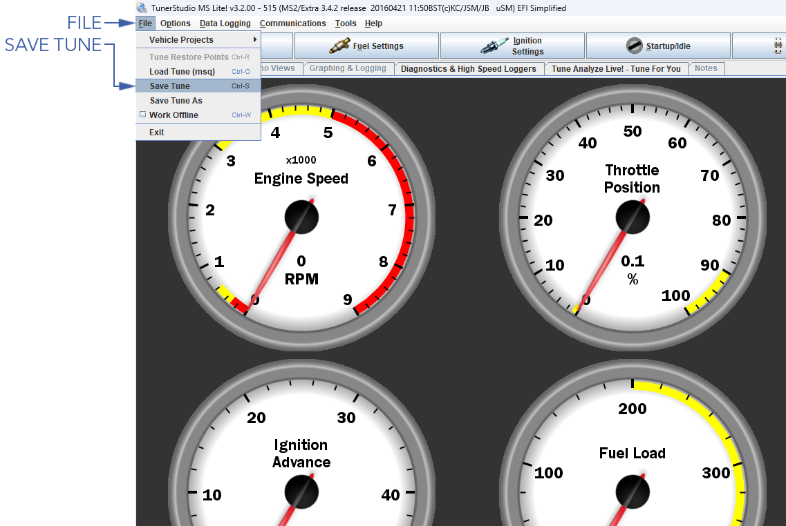
1. To load a new parameter file, go to `File` ⇨ `Load Tune`
1. To update ECU firmware, go to `Tools` ⇨ `Update/Install Firmware`