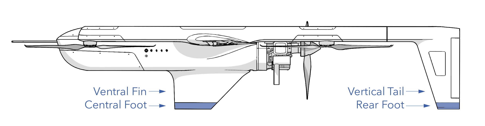
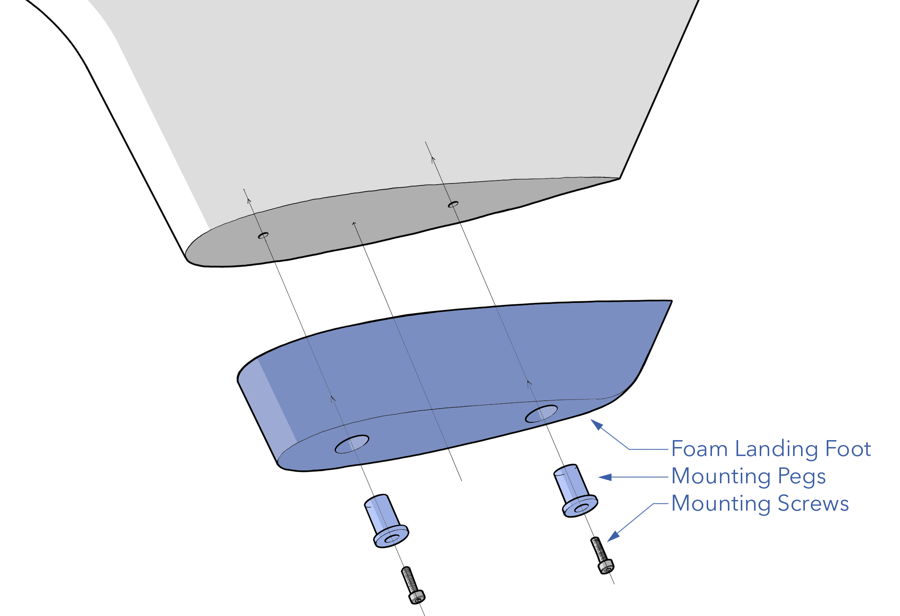
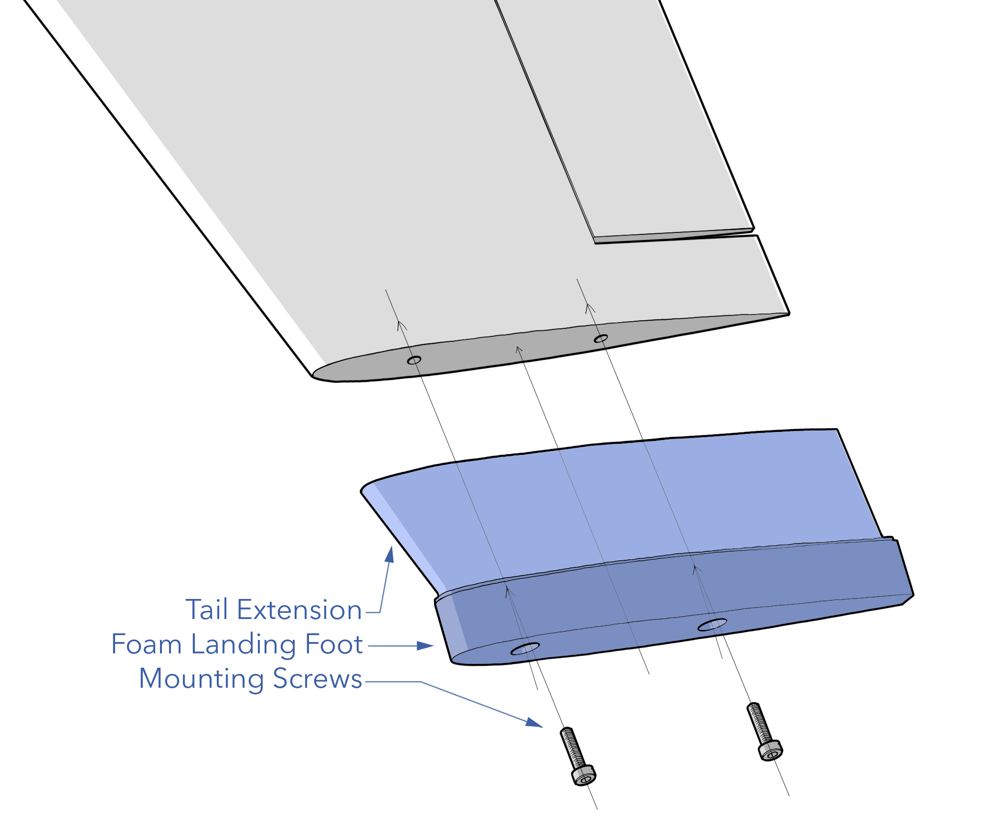

# Landing Gear

Sapphire does not have traditional landing gear but instead uses three points of contact between the airframe and the ground. At each point of contact, there is a replaceable foam foot that protects the composite shell of the airframe.  

The landing gear should be inspected before each flight during the [Preflight Inspection](preflight-checklist.md#aircraft---inspect). Additional maintenance procedures are performed according to the [Maintenance Schedule](maint-schedule.md) or as needed.

# Contents

- [Landing Gear Hardware](#landing-gear-hardware)
- [Inspecting Landing Gear](#inspecting-landing-gear)
- [Replacing Central Landing Gear](#replacing-central-landing-gear)
- [Replacing Rear Landing Gear](#replacing-rear-landing-gear)

# Landing Gear Hardware 

|Item|Fastener|Quantity|Torque|Threadlocker|
|----|---------------|
|Central Foot|M4 x 10 SHCS|2|hand-tight|n/a|
|Rear Foot|M4 x 14 SHCS|2|hand-tight|n/a|

# Inspecting Landing Gear

The landing feet need to be visually inspected before each flight during the [Aircraft Inspection](preflight-checklist.md#aircraft---inspect). Make sure each foot is securely attached to the airframe. The central foot is secured to the bottom of the ventral fin with two mounting screws and E6000 glue. The rear feet are permanently attached to the tail extensions and then fastened to the tip of each vertical tail with two mounting screws. 

Ensure the foam is mostly intact without significant tears or abrasions and check for any debris lodged in the foam. If the foam starts peeling, use more E6000 or medium CA glue to reattach it. If the foot is missing more than 25% of its original shape, it must be replaced. 

Replace according to the [Maintenance Schedule](maint-schedule.md) or if damaged.

# Replacing Central Landing Gear

Tools needed: 3.0 mm hex driver, x-acto blade, E6000 glue.

1. Unscrew the mounting screws.
1. Remove and discard the damaged or old landing foot. You may have to peel or cut it from the ventral fin to break the glue. Do no cut or gouge the airframe when doing so. 
1. Remove any glue residue stuck to the airframe.
1. Apply a bead of E6000 glue around the top perimeter of the replacement foam foot.
1. Align the shape of the foot with the shape of the ventral fin.
1. Press the foot firmly against the ventral fin, ensuring the glue is in contact with the airframe.
1. Install the mounting screws into the foot pegs and hand tighten. Take care to not get glue on the screw threads when installing.
1. Wipe away excess glue that seeps out after tightening.

# Replacing Rear Landing Gear

Tools needed: 3.0 mm hex driver.

The same process applies to both the left and right side.

 

1. Unscrew the mounting screws and set aside.
1. Remove and discard the damaged or old landing foot.
1. Match the replacement foot to the original. Ensure you have the correct left or right side.
1. Align the shape of the foot with the shape of the vertical tail.
1. Install the mounting screws into the foot and hand tighten.