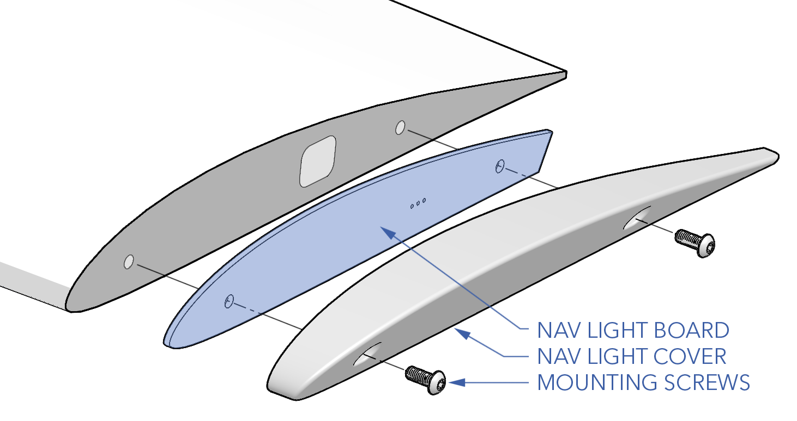

# Nav Lights

The navigation (nav) light board is located on each wing tip. Each side has a nav light, strobe, and IR strobe. The lights are a source of illumination on the aircraft, meant to give information about its position and heading. The nav lights are conventionally color-coded, with green on the right side of the aircraft and red on the left.

The nav lights and strobes can be toggled on the ground or while flying. To do so, go to `Equipment` ⇨ `Nav Lights` and/or `IR strobe` in Swift GCS on the right hand side.

In addition, each nav light board has an onboard compass

# Contents

- [Nav Light Hardware](maint-navlights.md#nav-light-hardware)
- [Replacing a Nav Light](maint-navlights.md#)
- [Updating Parameters](maint-navlights.md#updating-parameters)
- [Updating Firmware](maint-navlights.md#updating-firmware)

# Nav Light Hardware

|Item|Fastener|Quantity|Torque|Threadlocker|
|----|---------------|
|Nav Light Cover|M3 x 14 button|2|hand-tight|n/a|

# Replacing a Nav Light

#### Removal

1. Ensure the aircraft is powered off and all batteries are disconnected.
1. Unscrew the mounting screws securing the nav light cover to the wing tip.
1. Disconnect the connector on the backside of the nav light board. Take care not to pull the wire out too far before disconnecting.
1. Temporarily secure the nav light connector to the outside of the wing tip with masking tape.

#### Installation

1. Place the nav light board inside the nav light cover.
1. Reconnect the nav light board.
1. Secure the nav light assembly to the wing tip using the two mounting screws. Align the nav light cover's profile with the wing tip using the adjustment slots before fully tightening the screws.

# Updating Parameters

Refer to [Updating CAN Node Parameters](maint-can.md#updating-can-node-parameters).

# Updating Firmware

Refer to [Updating CAN Node Firmware](maint-can.md#updating-can-node-firmware).
