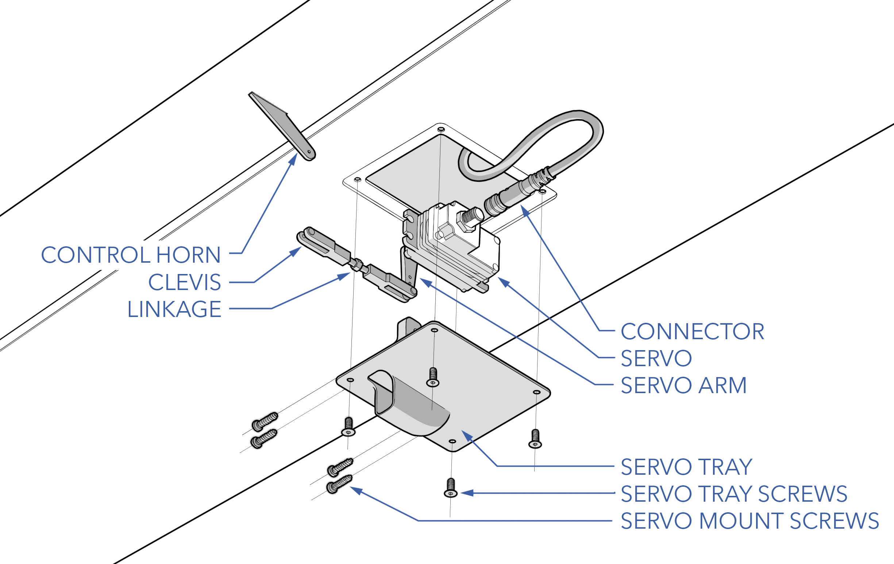

# Servo Maintenance

Servos should be inspected before each flight during the [Preflight Inspection](preflight-checklist.md#aircraft---inspect). Additional maintenance procedures are performed according to the [Maintenance Schedule](maint-schedule.md) or as needed. 

# Contents

* [Servo Hardware](maint-servo.md#servo-hardware)
* [Inspecting a Servo](maint-servo.md#inspecting-a-servo)
* [Replacing a Servo](maint-servo.md#replacing-a-servo)
* [Validating a Servo](maint-servo.md#servo-validation-checklist)
* [Updating Firmware](maint-servo.md#updating-firmware)

# Servo Hardware

|Item|Fastener|QTY|Torque|Threadlocker|
|-|-|-|-|
|Servo Tray|M3 x 8 flat head|4|hand-tight|n/a|
|Servo Mount|M2.5 x 12 thread former|4|hand-tight|n/a|
|Clevis Lock|Safety Lock Kwik-Link|1|n/a|n/a|

# Inspecting a Servo

Ensure the servo mounting plates are securely mounted. Check servo linkages and verify that the clevis pin is still locked. Gently moved each control surface through its full range of motion. There should be no binding, excessive play, or unusual sounds coming from both the control surface or servo gear train. If a servo skips, binds, or jams, it must be replaced.

# Replacing a Servo

Replacement servos are calibrated such they should be drop-in replacements. After replacement, the control surface deflection should be very close to the original and require little to no manual adjustment. Consequently, each servo is calibrated differently for a specific control surface (left/right aileron, left/right elevator, left/right rudder). You can only use a replacement servo for its intended location. Do not unscrew and remount the servo arm at any time during installation. Doing so will void the servo calibration.


Tools needed: T9 torx driver, flathead screwdriver, 2 mm hex driver, pliers.


#### Removal

1. Ensure the aircraft is powered off and all batteries are disconnected.
1. Unlock the clevis pin and disconnect it from the surface control horn.
1. Unscrew the servo tray screws to detach the servo from the aircraft.
1. Disconnect the servo connector on the bottom of the servo. Take care not to pull the servo wire out too far before disconnecting. 
1. Temporarily secure the servo connector to the outside of the aircraft with masking tape.
1. Remove the thread-forming servo screws.
1. Detach the servo from the tray.
1. Unlock the clevis pin and disconnect it from the servo arm. You may need to use a flathead screwdriver to spread open the clevis. Remember which hole in the servo arm the clevis was attached to. Do not change the linkage length by spinning the clevis during or after removing.  

#### Installation

1. Ensure you have the correct replacement servo. 
1. Connect the clevis to the replacement servo arm and lock the clevis pin. Use the exact mounting hole as the original servo.
1. Pass the linkage through the servo arm opening. Secure the servo to the tray with the thread-forming screws. Care must be taken when restarting thread-forming screws to avoid cross threading.
1. Reconnect the servo connector.
1. Remount the servo tray to the aircraft using the servo tray screws. Ensure the tray is in the correct orientation - with the servo arm, linkage, and control horn aligned.
1. Reattach the clevis to the control horn and lock the clevis pin.
1. Validate the servo installation using the servo validation checklist below.


Do not cross-thread or over tighten thread forming screws, the plastic threads on the servo plate can be damaged or stripped entirely.



Do not use threadlocker on plastic parts.


# Servo Validation Checklist

Use the following checklist after replacing servos to validate the servo trim and deflection.

1. Launch Swift GCS
1. In the GCS navigate to the `Checklist Tab` ⇨ `Checklist` ⇨ `Servo Maintenance` ⇨ `Swap Checklist`
1. IP Radio - On (or connect with ethernet)
1. Avionics Battery - Connect 
1. Aircraft Power - On
1. Autopilot - Connect
1. Aircraft - Disarm
1. CAN_D1_UC_OPTION - 1
1. CAN_D2_UC_OPTION - 1
1. Autopilot - Reboot
1. Mode - Manual
1. Control Surfaces - Enable
1. Trim - Check
1. Control Surfaces - Check
1. Mode - FBW
1. Control Surfaces - Check


Changing the servo linkage length will affect control surface trim and deflection. 


# Updating Firmware

Refer to [Updating CAN Node Firmware](maint-can.md#updating-can-node-firmware).

