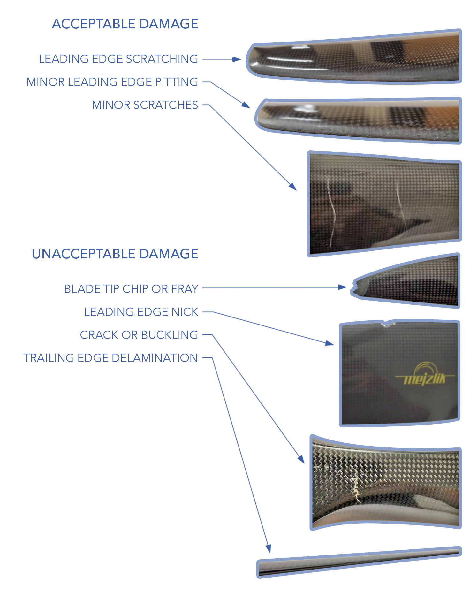
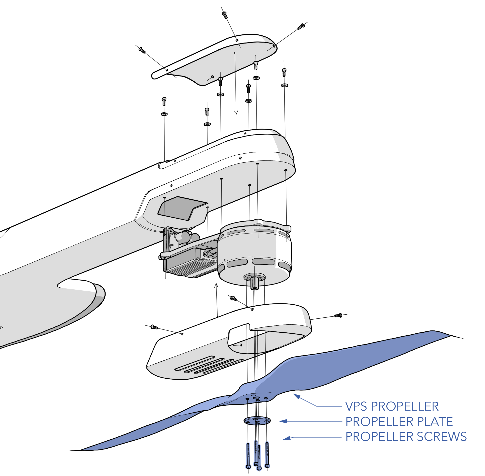
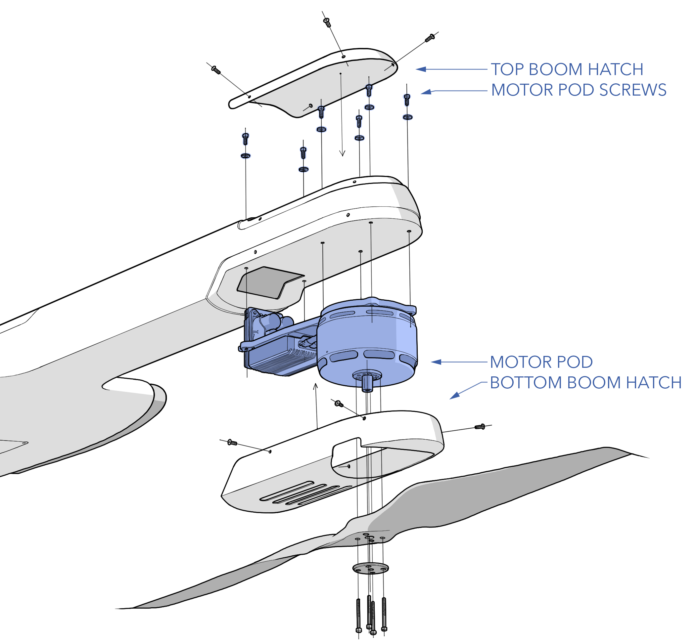
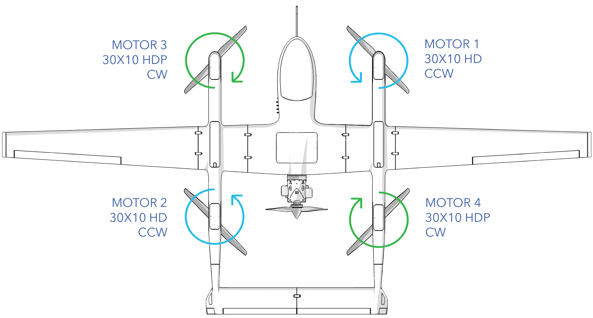
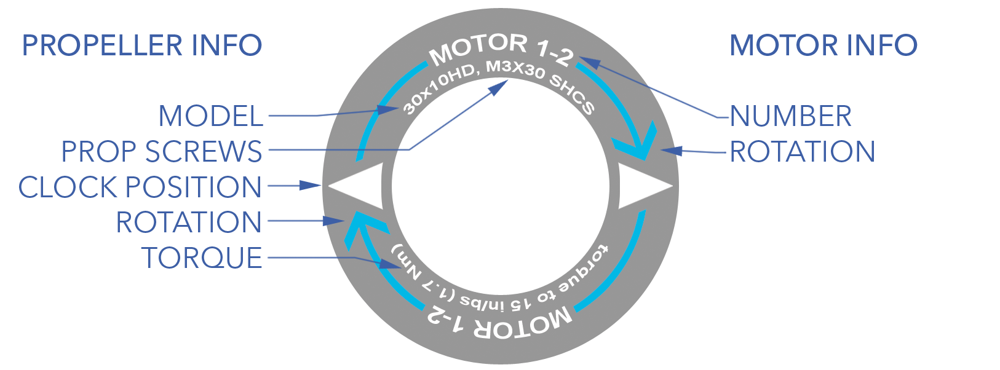

# VPS Maintenance

The vertical propulsion system (VPS) is comprised of the four motors, propellers, and electronic speed controller (ESC) used during vertical flight. Each motor, ESC, and propeller is integrated as a single replaceable module called a motor pod. 

The VPS should be inspected before each flight during the [Preflight Inspection](preflight-checklist.md#aircraft---inspect). Additional maintenance procedures are performed according to the [Maintenance Schedule](maint-schedule.md) or as needed. 

# Contents

* [VPS Hardware](maint-vps.md#vps-hardware)
* [Inspecting a VPS Propeller](maint-vps.md#inspecting-a-vps-propeller)
* [Replacing a VPS Propeller](maint-vps.md#replacing-a-vps-propeller)
* [Inspecting a VPS Pod](maint-vps.md#inspecting-a-vps-pod)
* [Replacing a VPS Pod](maint-vps.md#replacing-a-vps-pod)
* [Propeller and Motor Orientation](maint-vps.md#propeller-and-motor-orientation)
* [Downloading and Clearing ESC Logs](maint-vps.md#downloading-and-clearing-esc-logs)
* [Updating ESC Firmware](maint-vps.md#updating-esc-firmware)
* [Installing STM Bootloader Driver](maint-vps.md#installing-stm-bootloader-driver)

# VPS Hardware

|Item|Fastener|Quantity|Torque|Threadlocker|
|----|---------------|
|Motor Pod Screw|M4 x 8 SHCS|6|25 in/lbs (2.8 Nm)|Loctite 242|
|Motor Pod Washer|M4 washer|6|n/a|n/a|
|Top Motor Hatch|M3 x 8 button head|4|hand-tight|n/a|
|Bottom Motor Hatch|M3 x 8 button head|4|hand-tight|n/a|
|Propeller|M3 x 30 SHCS|4|15 in/lbs (1.7 Nm)|Loctite 242|
|D-Sub Connector|4-40 x 3/16 SHCS|2|hand-tight|Loctite 242|

# Inspecting a VPS Propeller

Each of the four VPS propellers need to be visually inspected before each flight during the [Aircraft Inspection](preflight-checklist.md#aircraft---inspect). The VPS propellers rotate at high speed, relatively close to the ground, and are susceptible to damage from gravel and other FOD. 

Inspect the propeller for nicks, chips, scratches, frays, cracks, delamination, and other damage. Minor scratches to the blade surface and minor leading edge pitting are acceptable. However, gouges or nicks on the leading edge nicks, frayed or chipped blade tips, cracks, and delamination are unacceptable levels of damage that require a replacement propeller.

Ensure each propeller is securely attached to the motor by observing that unbroken torque stripe is present on the propeller screws.

Replace according to the [Maintenance Schedule](maint-schedule.md) or if damaged.

# Replacing a VPS Propeller

The VPS propellers are either clockwise or counter clockwise rotation. The propellers have a label on them that indicates the rotation direction. Note the propeller orientation and direction before removal and find a matching replacement one. Refer to [Propeller Orientation](maint-vps.md#propeller-and-motor-orientation) to select the correct propeller.

Tools needed: 2.5 mm hex driver, 2.0 mm hex driver, Loctite 242, 15 in/lbs torque wrench.

#### Removal

1. Ensure the aircraft is powered off and all batteries are disconnected.
1. Remove the boom from the aircraft if assembled.
1. Lay the boom on a table with the propellers facing upward. Ensure any antenna mounted to the boom is not resting on anything.
1. Note the propeller orientation and direction before removal.
1. Unscrew the propeller screws (M3 x 30 SHCS) holding the propeller to the motor. Be careful not to strip the screws as thread locker was previously applied.
1. Remove and discard the damaged propeller.
1. Remove any old torque stripe from the plate and screw heads.
1. The motor shaft should stay retained on the motor. If not, set it aside.

#### Installation

1. Inspect the propeller mounting threads in the motor for damage.
1. If not already installed, insert the motor shaft into the motor. The larger diameter of the shaft goes into the motor; the smaller diameter should protrude from the motor.
1. Match the replacement propeller to the motor, which should be identical to the original propeller. The motors are labeled either 30 x 10 HD or 30 x 10 HDP. See [Propeller Orientation](maint-vps.md#propeller-and-motor-orientation).
1. Install VPS propeller onto the motor, inserting the motor shaft through the propeller hub. Ensure the spin direction of the propeller is correct for the motor, and that the propeller is not mounted backwards. The logo printed on the propeller should face the top of the aircraft.
1. Align the mounting holes on the propeller with the motor. While doing so, the propeller must also be aligned with the "clock position" shown on top of the motor. If the propeller is not aligned with the clock position, it will be perpendicular to the boom rather than parallel during forward flight.
1. Reinstall the plate and screws. Use Loctite 242. Gradually hand-tighten each screw using a cross pattern before torquing to 15 in/lbs. 
1. Apply torque stripe between propeller screw heads and the plate.
1. Validate the propeller mounting and spin direction during the [VPS Motor Test](preflight-checklist.md#vps-motors---test) preflight check.

# Inspecting a VPS Pod

Each of the four VPS pods need to be visually inspected before each flight during the [Aircraft Inspection](preflight-checklist.md#aircraft---inspect). The VPS motors can be vulnerable to FOD when operating from an unimproved surface. Ferrous dirt is particularly problematic as it can adhere to the motor's magnets, potentially causing grinding or complete seizure. To check each motor, manually rotate it while listening and feeling for any signs of grinding, clicking, or irregular movement. A well-functioning motor should rotate smoothly, with the only noticeable sensation being the typical cogging of the motor magnets. If the motor grinds or seizes, it must be cleaned or replaced. 

Since ferrous dirt is attracted to magnets, it can be tricky to remove. First, try a combination of compressed air and vacuuming. Blow air directly through the motor from the top by aiming at the magnets and stator while holding a vacuum directly next to the motor. If the dust cannot be removed with compressed air/vacuum, and it caused grinding or irregular movement, the entire motor pod must be replaced.

Replace according to the [Maintenance Schedule](maint-schedule.md) or if damaged.

# Replacing a VPS Pod

Just like the VPS propellers, the motor pods are configured as either clockwise or counter clockwise rotation. The motors are labeled with both the motor number and the direction of rotation.

Tools needed: 3 mm hex driver with ball-end, 2.5 mm hex driver, 2.0 mm hex driver, 3/32 inch hex driver, Loctite 242, 25 in/lbs torque wrench.

#### Removal 

1. Ensure the aircraft is powered off and all batteries are disconnected.
1. Remove the boom from the aircraft if assembled.
1. Remove the VPS propeller. See [Replacing A VPS Propeller](maint-vps.md#replacing-a-vps-propeller)
1. Place the boom on a table, with the motors facing down and resting on foam pads.
1. Remove the top and bottom boom hatch by unscrewing the hatch screws hatch.
1. Note the motor spin direction and number before removal.
1. From the top hatch opening, locate the six motor pod screws that secure the motor pod to the boom. Ensure the motor pod is supported from below before unscrewing these screws. 
1. Unscrew the motor pod screws. Use a ball-end driver to loosen the screws at an angle.
1. Lower the motor pod from the boom without straining the wiring harness. Never let the motor pod hang from the wiring harness.
1. Remove the D-sub connector screws.
1. Disconnect the D-sub connector.
1. Remove any old torque stripe motor pod screws and inside the boom.

#### Installation

1. Verify the replacement motor number is correct. See [Motor Orientation](maint-vps.md#propeller-and-motor-orientation).
1. Ensure the replacement ESC firmware is correct. A newer version of firmware may be available since the pod was purchased. See [Updating ESC Firmware](maint-vps.md#updating-esc-firmware).
1. Support the weight of the motor pod and connect the D-sub connector without straining the wiring harness. Never let the motor pod hang from the wiring harness.
1. Secure the D-sub connector screws with a drop of Loctite 242 on each screw. Tighten them until they are finger-tight.
1. Feed the wiring harness up and into the boom and press the motor pod flat against the bottom of the boom.
1. With the pod supported, install the motor pod screws and washers. Use a ball-end driver to tighten the screws at an angle. Use Loctite 242. Gradually tighten each screw in a zigzag pattern and torque to 25 in/lbs. 

Verify that the motor pod mounting screws do not protrude past the threads and touch motor. Ensure the washer is installed.

1. Apply torque stripe to the motor pod screws.
1. Reinstall the top and bottom boom hatches, tighten the screws until they are finger-tight. Do not apply thread locker.
1. [Reinstall the propeller](maint-vps.md#replacing-a-vps-propeller)
1. Validate the motor spin direction and propeller clocking during the [VPS Motor Test](preflight-checklist.md#vps-motors---test) preflight check.

# Propeller and Motor Orientation

Propellers and motor pods must be installed as shown below (top view).

|Propeller|Direction|Motor|Orientation Tips|
|-|-|-|
|30 x 10 HD|Clockwise|1 & 2|Propeller logo faces up|
|30 x 10 HDP|Counter Clockwise|3 & 4|Propeller logo faces up|

#### Motor Pod Label

The top of each motor is labeled to indicate the motor number, direction of rotation, propeller model, propeller mounting hardware and torque spec, and the propeller clock position. The number on the motor indicates its physical mounting position on the aircraft. When viewing from behind and above the aircraft, motor 1 is the front right position, motor 2 is the back left, motor 3 is the front left, and motor 4 is the back right. Motors 1 and 2 spin counter-clockwise while motors 3 and 4 spin clockwise. As such, motors are marked as either 1-2 or 3-4 and are interchangeable between the two positions. The color of the spin direction arrow on the physical motor matches the image above. 


Incorrectly installing a propeller on backward or using the wrong propeller or motor pod will result in severe vibrations and ineffective thrust for takeoff. This can damage the VPS and aircraft. In the case of a backward propeller, it can even result in the aircraft tipping over during takeoff.


# Downloading and Clearing ESC Logs

If you require a log for analysis, you should download and save the logs soon after the flight to remember which log it is. The ESC does not do "circular logging" and, once its memory is full, will no longer store logs until old file are deleted. As such, the ESC logs must be cleared after 20 flights. This is an essential step and ensures that there is room for flight date to be collected. Note, the ESC only logs during vertical flight.

Tools needed: micro USB cable, Windows computer with APD Configurator.

1. Ensure the aircraft is powered off and all batteries are disconnected.
1. Download and install [APD Configurator](https://docs.powerdrives.net/downloads/configurator-releases).
1. Open APD Configurator.
1. Remove the bottom boom hatch by unscrewing the hatch screws.
1. Plug the USB cable into the computer and the opposing micro-USB side into the ESC.
1. In APD Configurator, select the correct COM port and then connect.
1. Once successfully connected to the ESC, the dialogue box will say "port opened" and display the unique ESC serial number.
1. Go to the `Logging Tab` ⇨ `Get Logs` ⇨ `Save Logs`.
1. After saving, clear the old logs from the ESC. Wait for the progress bar to finish.
1. Disconnect

# Updating ESC Firmware

ESC firmware and/or settings may need to be updated for improvements, feature changes, or bug fixes. All four ESCs on the aircraft should have the same firmware and thus be updated at the same time. Firmware and settings files will be provided by SpektreWorks. 

Tools needed: micro USB cable, Windows computer with APD Configurator and STM driver.

1. Ensure the aircraft is powered off and all batteries are disconnected.
1. Download and install [APD Configurator](https://docs.powerdrives.net/downloads/configurator-releases).
1. Remove the bottom boom hatch by unscrewing the hatch screws.
1. Plug the USB cable into your computer and the ESC.
1. Open APD Configurator ⇨ `COM port` ⇨ `Connect`. Press Ok on any prompts.
1. Once successfully connected to the ESC, the dialogue box will say "port opened" and display the unique ESC serial number and firmware build date.
1. Navigate to the `Advanced Tab` ⇨ `Save Settings to File` to save a copy of the ESC settings before updating the firmware.
1. Find the `Motor Drive Tab` and note the spin direction (normal or reverse). 
1. Find the `Limits Tab` and note the "Under Voltage Limit" 
1. Go to the `Firmware Tab` ⇨ `Browse` ⇨ `Flash`. Firmware files end in .dfu
1. Press Ok on any prompts. The APD Configurator will disconnect and a command prompt should open. The firmware is flashed after the command prompt closes. If you are unable to flash firmware, you may need to install the STM bootloader driver that the ESC uses. See [How to Update the STM Bootloader Driver](maint-vps.md#installing-stm-bootloader-driver) below.
1. Unplug and re-plug the ESC USB cable.
1. Reconnect over APD configurator.
1. Verify the new firmware version and build date in the dialogue box. 
1. Go to the `Advanced Tab` ⇨ `Load Settings from File` to select the file that you saved earlier, then press `Save to ESC`. Config files end in .cfg
1. Navigate to the `Motor Drive Tab` and confirm the spin direction matches the original setting. If the value changed back after a firmware update, adjust it to match the original setting and click `Save`.
1. Navigate to the `Limits Tab` and confirm that the "under voltage limit" matches the original setting. If the value changed back after a firmware update, adjust it to match the original setting and click `Save`.
1. Disconnect.


Do not unplug the USB cable from the ESC while the firmware is updating. Doing so will brick the ESC. Wait for the firmware update to complete.


# Installing STM Bootloader Driver

If you cannot successfully update the ESC, you may need to update the STM bootlader driver that the ESC requires for flashing firmware. The following is a Windows 10 walkthrough but may work for newer versions as well.

1. Download and install [STSW-STM32080 DfuSeDemo](https://www.st.com/en/development-tools/stsw-stm32080.html).
1. Connect to the ESC over APD Configurator and try to update the firmware.
1. APD Configurator will close and a black command prompt will open with an error code, leave this open.
1. On your computer open `Device Manager` ⇨ `Universal Serial Bus Devices` ⇨ `STM Bootloader`.
1. Right click on `STM Bootloader` ⇨ `Properties` ⇨ `Driver Tab` ⇨ `Update Driver`.
1. Select `Browse my computer for drivers` ⇨ `Let me pick from a list of available drivers on my computer`.
1. Choose `Have Disk` ⇨ `Browse`.
1. Navigate to C:\Program Files (x86)\STMicroelectronics\Software\DfuSe v3.0.6\Bin\Driver\Win10
1. Select STtube.inf and click `Next`. Windows should now successfully install the updated driver. 
1. Unplug and re-plug the USB cable into the ESC.
1. You should now be able to reconnect over APD Configurator and flash firmware. You may need to restart your computer after Windows installs the driver.