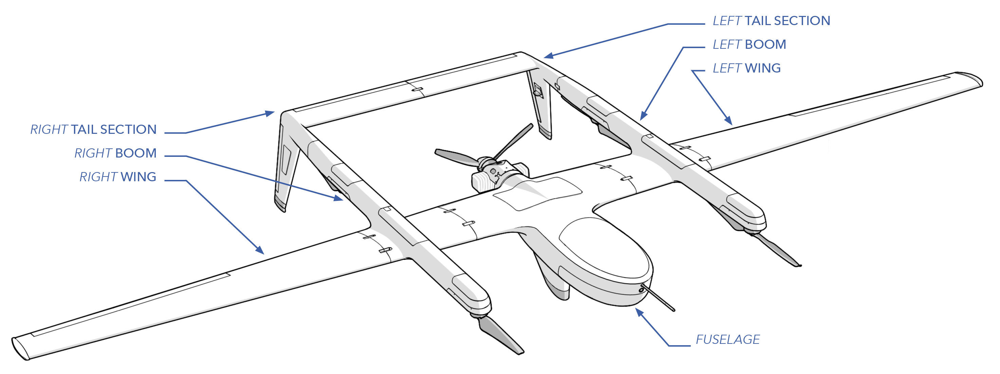
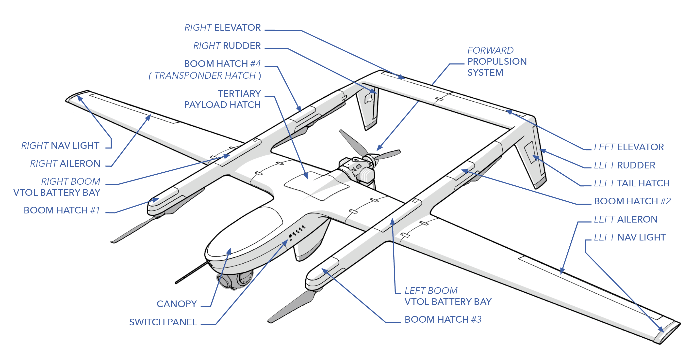
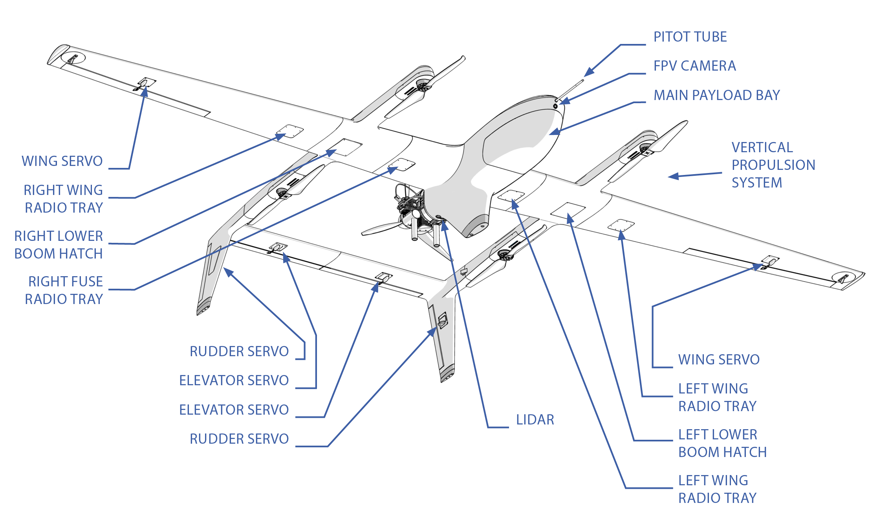
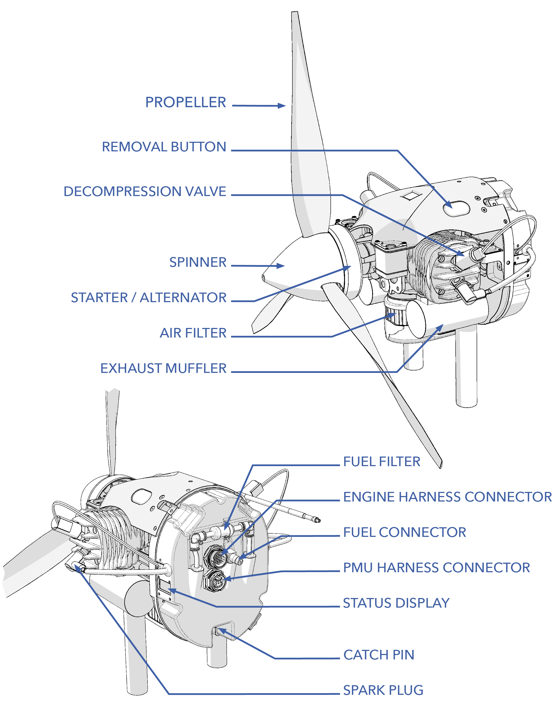
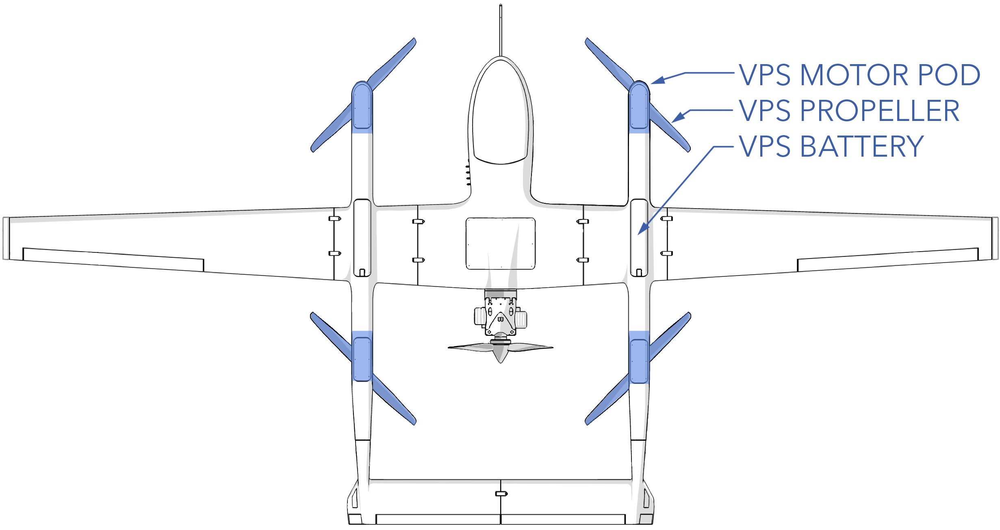

# Aircraft Overview

Sapphire is a fully autonomous unmanned aerial system (UAS) designed and produced by SpektreWorks Inc. of Phoenix, Arizona, USA. Sapphire has electric motors for vertical flight and an internal combustion engine for forward flight. This hybrid propulsion system enables vertical takeoff and landing (VTOL), providing the flexibility of a quadcopter while still achieving the range and speed of a fixed wing aircraft.

Sapphire requires a minimum of two people to operate, but three is ideal. The crew typically consists of the operator, safety pilot, and ground personnel. The operator and ground personnel are essential while the safety pilot is optional. The safety pilot can double as the ground crew, and vice versa, if qualified.

During takeoff and landing, the Vertical Propulsion System (VPS) controls the ascent/descent rate and stability of the aircraft. Desired rates and limits are maintained by Sapphire's four VPS motors. These motors also provide stability during the transition from vertical flight to forward flight and vice versa during landing. Sapphire can takeoff and land inside a 20x20 foot (6x6 meter) landing zone with no additional ground equipment or infrastructure. Furthermore, the VPS can activate in flight to recover the aircraft from abnormal flight conditions or to land immediately in case of an emergency.

Multiple dedicated payload bays and a 20 lb (9 kg) payload capacity allow to aircraft to perform various tasks such as ISR, mapping, communications relay, signals intelligence (SIGINT), and research.

The airframe is manufactured using lightweight carbon fiber and composite materials to achieve an optimal strength to weight ratio. The airframe and subcomponents have been tested successfully to withstand stress witnessed in normal flight conditions while retaining an ample safety margin. The main components of the airframe consist of the fuselage, booms, wings, and tails. 

* **Fuselage:** The Sapphire fuselage is the main body of the airframe and contains the majority of electronics, including the autopilot, primary/secondary payload, and primary radio. The fuel bladder sits within the fuselage, and the engine is attached to the rear of the fuselage.

* **Wings:** The wings consists of a left and a right half. The wings provide lift for the aircraft when in forward flight. Each contain servo actuators for moving the ailerons, which control how the aircraft banks in flight. The wings also contain auxiliary payload mounts which are often used for additional radios.

* **Booms:** There is a left and right boom. Each boom contain two VPS motors, a VPS battery and charging circuit, and two auxiliary payload bays. An optional aircraft transponder can also be fitted to a boom. 

* **Tail:** There is a left and right tail section, each consisting of the vertical and horizontal tail. Each half contains servo actuators for moving the rudder and elevator, which controls how the aircraft climbs and descends, and turns in flight.

* **Switch Panel:** The switch panel consists of three switches on the side of the fuselage for turning on aircraft power, VPS, and FPS during the preflight.

* **Canopy:** A quick-detachable canopy for accessing the payload and electronics within the fuselage.

* **Boom Hatch:** Hatches above each VPS motor. Removed for maintenance or for mounting an auxiliary payload.

* **VPS Battery Bay:** Location of the VPS battery, one in each boom. Provides power to the electric VPS motors.

* **Aileron:** An aileron is a hinged flight control surface used to roll the aircraft in flight.

* **Navigation Light:** Nav lights are located on each wingtip and provide a source of illumination on the aircraft meant to aid with position and heading. Red lights are used on the left side of the aircraft while green is used on the right side. Both sides contain a strobe and infrared light in addition.

* **Tertiary Payload:** Space above the fuel bladder that could be used for mounting an additional payload.

* **Rudder:** The rudder is a hinged flight control surface used to yaw the aircraft in flight.

* **Elevator:** The elevator is a hinged flight control surface used to climb and descend the aircraft in flight.

* **Forward Propulsion System (FPS):** The FPS uses a two-stroke engine to generate thrust and power during forward flight.

* **Vertical Propulsion System (VPS):** The VPS uses electric motors to generate thrust for vertical flight during takeoff and landing.

* **C2:** Communication and control (C2) antennas. Used to communicate with the aircraft in flight and view payload data such as video. The location of the antennas on the aircraft can vary depending on the radio configuration.

* **FPV Camera:** The first person view (FPV) camera is a forward looking camera mounted at the nose of the aircraft. This gives the operator additional situational awareness by providing a birds-eye view of the aircraft.

* **Pitot Tube:** The pitot tube is a metal probe that extends beyond the nose of the aircraft. The pitot tube, combined with the airspeed sensor within the avionics, provides the aircraft with airspeed and wind information. 

* **Radio Trays:** Auxiliary payload locations which are often used for mounting additional radios.

* **Servo:** A servo is an electric actuator that moves a flight control surface. Sapphire has six servos in total, two for the left/right ailerons, two for the left/right elevators, and two for the left/right rudders.  

* **Wing Servo:** Servos for moving the ailerons.

* **Rudder Servo:** Servos for moving the rudders.

* **Elevator Servo:** Servos for moving the elevators.

* **LIDAR:** The LIDAR rangefinder, which stands for light detection and ranging, measures the distance between the aircraft and the ground during landing.

#### Aircraft Specs

|Parameter |Specification|
|----|---------------|
|Empty Weight|86 lbs / 39 kg|
|Max Gross Takeoff Weight (MGTOW)| 130 lbs / 58.9 kg|
|Fuel Capacity by Volume|~5 gal / 18.9 L|
|Fuel Capacity by Weight|~30 lbs / 13.6 kg|
|[Payload Capacity](payloads.md)| 20 lbs / 9 kg|
|Construction|Carbon fiber/composite|
|Wingspan|16.5 ft / 5.0 m|
|Length|7.9 ft / 2.4 m|
|Height|1.7 ft / 0.5 m|
|Endurance|12 hours|
|Cruise Airspeed|50 kts / 25.7 m/s|
|Takeoff and Landing|VTOL|

# Forward Propulsion System (FPS)

The Sapphire FPS consists of a line replaceable unit (LRU) two-stroke internal combustion engine that includes all electronics, fuel pump, electronic fuel injection (EFI) system, ignition, starter, alternator, vibration mount, and propeller. The engine is a self-contained unit and can be swapped out entirely in minutes if needed for maintenance. The engine is outfitted with a starter/alternator and is capable of midair restarting. The alternator produces power proportionately to the engine RPM and feeds three phase VAC into a power management unit (PMU). The PMU recharges batteries in flight and provides power for the avionics and payloads. 

Fuel for the FPS is held in a five gallon bladder located within the fuselage. The bladder is equipped with anti-slosh foam and an internal fuel level sensor.

In forward flight, the Sapphire FPS and servos control the stability and navigation of the aircraft by varying position of the control surfaces and thrust of the engine. Under normal circumstances, the VPS is not active during forward flight, and the propellers are locked in place along each boom. 

* **Removal Button:** Used when removing the FPS from the fuselage.

* **Decompression Valve:** The decompression valves releases some of the compression from the engine during the starting procedure, making the engine easier to turn over.

* **Propeller:** Generates thrust when spinning to propel the aircraft forward.

* **Starter/Alternator:** The starter is used to turn over the engine so as to initiate the engine's operation under its own power. The alternator generates power for the PMU when the engine is running.

* **Air Filter:** The air filter keeps dirt and debris from entering the engine.

* **Exhaust Muffler:** The exhaust muffler dampens engine noise.

* **Fuel Filter:** The fuel filter screens dirt from the fuel, keeping them from entering the engine and causing damage.

* **Engine Harness Connector:** Connects the engine to the fuselage electronics. 

* **Fuel Connector:** Connects the engine to the fuel bladder.

* **PMU Harness Connector:** Connects the engine to the PMU within the fuselage.

* **Status Display:** Displays information such as engine hours, RPM, fault codes, and status.

* **Lower Engine Mount:** Part of the engine mounting interface.

* **Spark Plug:** Ignites the fuel-air mixture within the engine.

#### Engine Specs 

|Parameter |Specification|
|----|---------------|
|Engine|Two-stroke|
|Displacement|6.1 cubic inch / 100 cc|
|Continuous Power|7.3 hp / 5.5kW @ 7,000 RPM|
|Standard RPM Range|2,500 - 7,000 RPM|
|Generator RPM Range|3,500 - 7,000 RPM|
|Manifold Air Temp|0 - 120°F / -18 - 49°C|
|Max CHT|270°F / 130°C| 
|Fuel Type|91 - 93 octane, C10|
|Fuel Consumption|2.5 lbs / 1.13 kg per hour| 
|Propeller|23x10|

# Vertical Propulsion System (VPS)

The vertical propulsion system (VPS) is comprised of four electric motors, each spinning a VPS propeller, to generate thrust for takeoff and landing. The motors are powered by a pair of lithium polymer batteries, one in each boom. Each VPS motor is controlled by an electronic speed controller (ESC) that controls the motor RPM as required for stability and navigation while the aircraft is in vertical flight or transitioning to forward flight. Once the aircraft has transitioned from vertical to forward flight, the VPS propellers self-align with the booms to reduce drag during the duration of the flight. The batteries are recharged by the PMU when the engine is running. In typical flight conditions, the VPS batteries can be fully recharged after about two hours of flight. During recovery, the VPS motors will spin back up and transition the aircraft from forward flight to vertical flight and ultimately land.

Sapphire has both a forward assist and a weathervane mode during takeoff and landing. Both attempt to reduce strain on the VPS motors in windy conditions. Weathervaning will try to point the nose of the aircraft into the wind, thus gaining lift from the wings. Forward assist uses the FPS thrust to oppose the wind, preventing the aircraft from drifting backwards.

* **Motor Pod:** Each VPS motor, ESC, and propeller is integrated as a single replaceable module called a motor pod. 

* **VPS Battery Bay:** Location of the VPS battery, one in each boom. The batteries are connected in parallel within the aircraft.

* **VPS Motor:** Brushless electric motor.  

* **VPS Propeller:** Generates thrust when spinning to propel the aircraft upward.

#### VPS Specs

|Parameter |Specification|
|----|---------------|
|Motor|Brushless outrunner|
|Motor Power|6000W|
|Motor Thrust|~24 kgf|
|Max Hover Time|90 seconds|
|VPS Battery|2x 6000 mAh 14S LiPo in parallel|
|VPS Battery Voltage|48-58.8VDC (14S)|
|VPS Charger|600mA / 34W per boom|
|VPS Propeller|30x10|
|Forward Assist Altitude|above 3 ft AGL / 1 m|