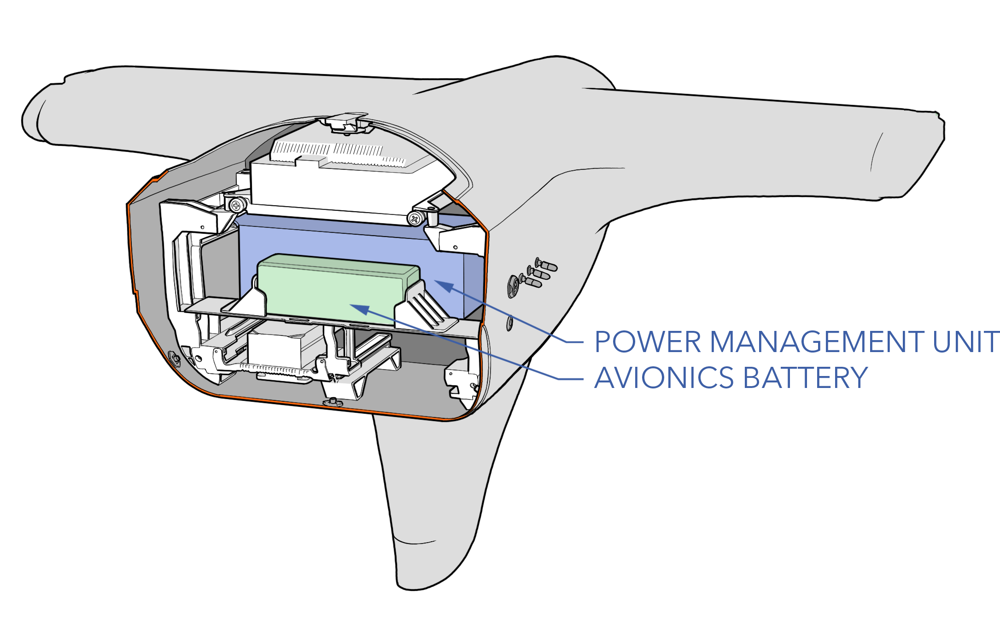

# Avionics Overview

Avionics refers to the electronic systems used on the Sapphire UAS. The major components are the avionics stack, avionics battery, power management unit (PMU), IP radio, and transponder.

# Avionics Stack

The Sapphire avionics stack is a highly integrated module that provides power conditioning, signal routing, and network management throughout the entire aircraft. The avionics is comprised of the autopilot, onboard computer, redundant power supplies, gigabit switch, GPS receiver, and air data system all integrated within one swappable module.

#### Switch

The gigabit switch allow the radios, cameras, and payloads to communicate throughout the vehicle and be broadcasted out on a high-bandwidth IP data link. 

#### Onboard Computer

An onboard computer is used to route MAVLink messages, generate cursor-on-target (CoT) messages, and run user provided software.

#### Autopilot

The autopilot performs autonomous navigation and provides aircraft stabilization when flying in optional autopilot assisted flight modes. The autopilot itself is a suite of sensors that measure flight metrics and make changes in flight as needed. All flight data is recorded onboard as an autopilot log and all information sent over the radio link is saved as a telemetry log.  

The autopilot runs ArduPlane firmware. ArduPilot combines the functionality of both a fixed-wing and quadcopter flight controller and blends the two together for a seamless transition between vertical and forward flight. 

#### GPS

The aircraft uses a multi-constellation, multi-band Global Navigation Satellite System (GNSS) receiver and an active antenna used for determining aircraft position, altitude, and geo-referencing. The receiver is capable of tracking all GNSS constellations, supporting current and future signals. The receiver also features AIM+ technology, an advanced on-board interference mitigation technology. It can suppress a wide variety of interference, from simple continuous narrowband signals to complex wideband and pulsed jammers.

#### Avionics Specs

|Parameter |Specification|
|----|---------------|
|Onboard Computer|Gateworks GW5100 800MHz dual core ARM® Cortex™-A9|
|Operating System|Linux|
|Networking|Miltech 8 port network switch|
|Autopilot Hardware|Cube|
|Autopilot Firmware|ArduPlane|
|Autopilot Sensors|GPS, 3x IMU, 3x mag, 2x baro, airspeed|
|Telemetry Protocol|MAVLink|
|GPS|Septentrio X5 Mosaic|
|GPS Constellation|GPS, GLONASS, Galileo, BeiDou, SBAS, QZSS|
|GPS Frequency|L1/L2/L5|
|GPS RTK & PPK|Yes|
|Anti-Spoofing/Jamming|AIM+, OSNMA (optional)|

# Power Management Unit (PMU)

The avionics battery powers the aircraft when the engine is not running. When the engine is running, the main source of power for the aircraft is the PMU. The PMU uses AC voltage from the alternator and converts it to regulated DC voltages. These voltages are then passed through or further regulated within the avionics stack for the autopilot, radios, payloads, actuators, and subsystems. The PMU also recharges the avionics and VPS batteries while the engine is running. If the engine quits, the PMU will seamlessly switch over to using the avionics battery to power critical components, avionics, and actuators while attempting to restart the engine in-flight. Non-critical payloads should be powered down by the operator in the event of an engine out to conserve battery. 

#### PMU Specs

|Parameter |Specification|
|----|---------------|
|Avionics Battery|7S 3,250 mAh LiPo|
|Starter/Alternator|320-1200W depending on RPM|
|Main Output|28 VDC at 12.5A (350W)|
|Secondary Output|12 VDC at 9A (108W)|
|Tertiary Output|7.4 VDC at 8A (42W)|
|Max Output|500W|
|Shore Power Input|24-32VDC|

# Air IP Radio

The standard aircraft configuration utilizes an internet protocol (IP) radio for control, telemetry, video, payload data, and the hand controller. The radio range is variable based on a number of environmental and operational factors and equipment selection. The aircraft uses omnidirectional blade antennas. Secondary radios can be accommodated in dedicated locations within the wings, booms, and payload bays.

#### IP Radio Specs

|Parameter |Specification|
|----|---------------|
|Air Radio|Silvus 4200|
|Encryption|DES Standard, AES/GCM 128/256 Optional (FIPS 140-2), Suite B|
|Data Rate|up to 100 Mbps|
|MIMO|2x2|
|Power|10W (configurable)|
|Latency|~7ms|
|Frequency|L-Band, S-Band, other bands available|
|Air Antennas|Omni|

# Transponder

The transponder radio provides aircraft identification and position data to air traffic controllers (ATC) and other aircraft. The intent is to reduce the incidence of mid-air collision between aircraft and to warn pilots of the presence of other transponder-equipped aircraft which may present a threat.

The transponder can be mounted in either the wing or boom depending on the aircraft configuration.

#### Transponder Specs

|Parameter |Specification|
|----|---------------|
|Transponder|Sagetech MXS|
|Certification|FAA TSO|
|Mode|A, C, S|
|Frequency|1090MHz ADS-B In/Out|