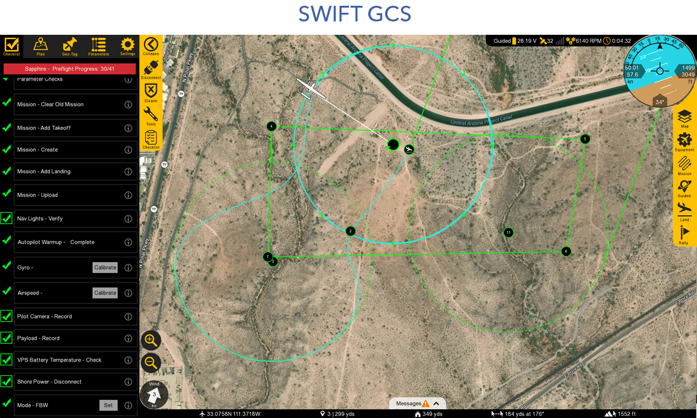
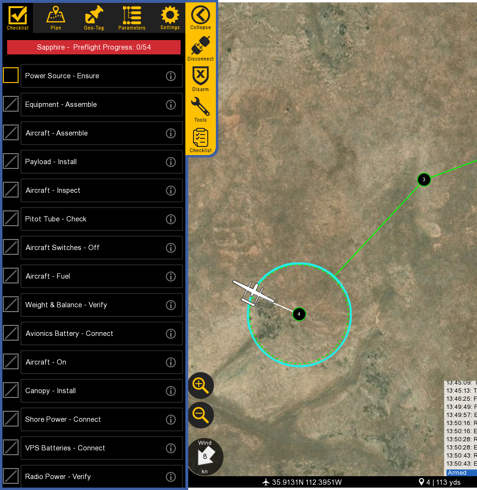
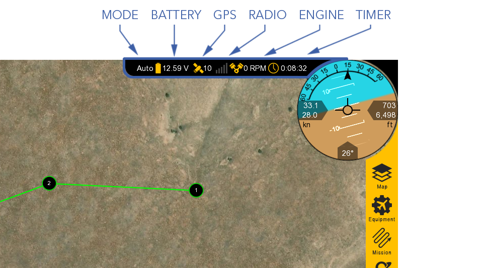
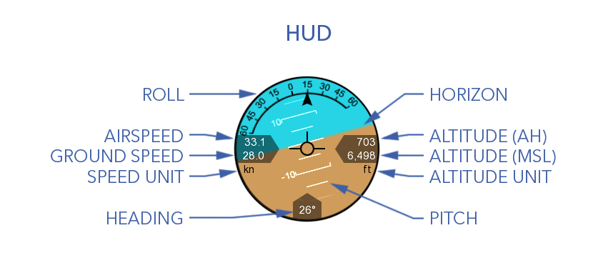
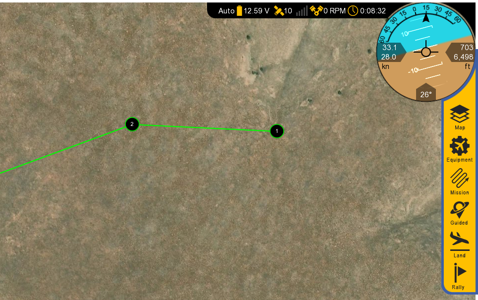
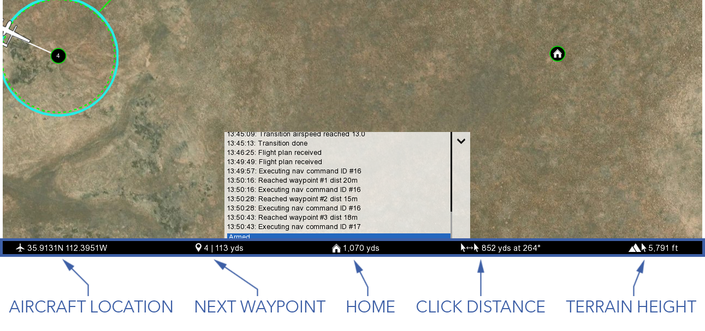
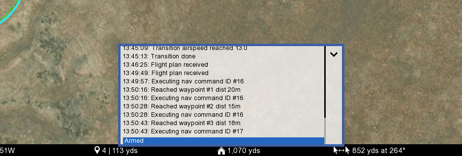
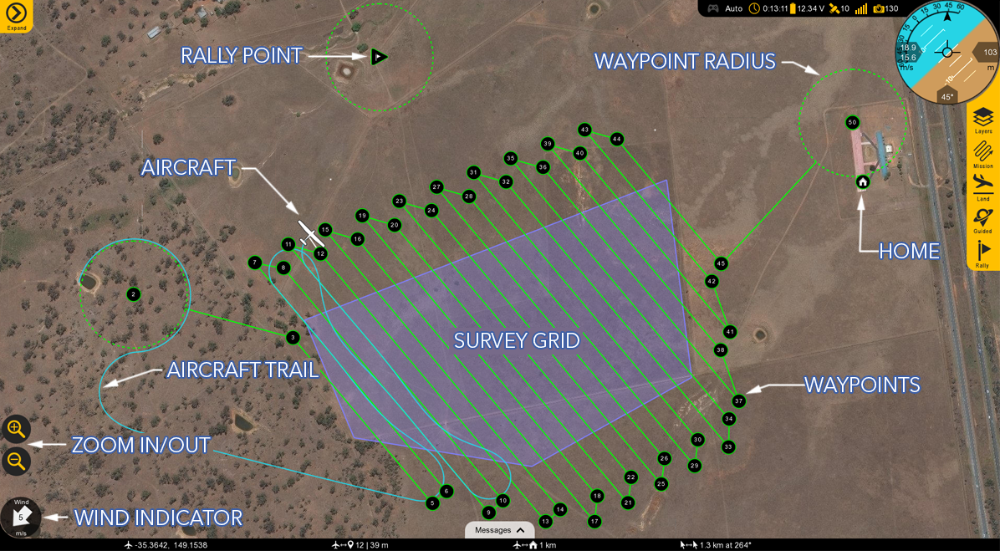

# Swift GCS Overview

Swift Ground Control Station (GCS) is the primary software for interfacing with the aircraft. It facilitates mission planning by allowing users to define waypoints and parameters, conducts pre-flight checks, and provides real-time telemetry data during flight. The GCS enables remote control of the aircraft and payload and supports numerous flight modes.

# Contents

- [GCS Layout](#gcs-layout)
 - [Tabs](#tabs)
 - [Top Status Bar](#top-status-bar)
 - [HUD](#hud)
 - [Bottom Status Bar](#bottom-status-bar)
 - [Message Panel](#message-panel)
 - [Map](#map)
- [GCS Updates](#gcs-updates)

# GCS Layout

The layout of the GCS is comprised of six distinct sections: tabs, top status bar, the heads-up-display (HUD), bottom status bar, message panel, and the map.

# Tabs

There are five tabs in Swift GCS: Checklist, Plan, Geo-Tag, Parameters, and Settings

Each tab has unique menu buttons that change depending on which tab you are on. The very top button is used to collapse or expand the entire tab menu, which is useful to increase the overall map area when flying.

- Checklist: Used to perform a preflight on the aircraft prior to every takeoff.
- Plan: Used to add waypoints, survey grids, actions, or rally points to your mission. The Plan tab is utilized during the preflight process but can also be used to modify a mission in flight. The tab designed allows important aircraft information such as the HUD and map to remain visible to the operator while planning.
- Geo-Tag: Used to geo-reference images for non-PPK/RTK mapping applications.
- Parameters: Used to modify and update parameters on the autopilot. Parameters are only to be changed if instructed to do so by SpektreWorks support.
- Settings: Used to configure GCS and aircraft settings, failsafes, calibrations, etc.

# Top Status Bar

Displays important aircraft information.

- Mode: Displays the current flight mode.
- Battery: Displays the main battery voltage. Click on the icon to expand this menu.
 - Avionics battery voltage
 - VPS average voltage and total current across both VPS batteries
 - VPS left battery voltage, current draw, and temperature
 - VPS right battery voltage, current draw, and temperature
 - 28V PMU line
 - 12V PMU line
 - 7.4V PMU line
- GPS: Displays the GPS satellite count. Click on the icon to expand this menu.
 - Fix Type
 - HDOP (Horizontal dilution of precision)
 - VDOP (Vertical dilution of precision)
 - Horizontal accuracy
 - Vertical accuracy
 - Velocity accuracy
 - IMU temperature
- Radio: Displays the telemetry radio’s signal strength. Click on the icon to expand this menu.
 - Packets received
 - Data rate
 - Last heartbeat
 - RSSI
 - Noise
 - RX errors
 - Protocol 
 - Latency
- Engine: Displays the engine RPM. Click on the icon to expand this menu.
 - Cylinder head temperature (CHT)
 - Throttle %
 - Manifold intake temperature (MAT)
 - Fuel flow
 - Fuel (Lbs)
 - VPS RPM and ESC temperature
- Timer: Displays the current flight in Hours:Minutes:Seconds. The timer automatically starts on takeoff and stops when the aircraft lands and disarms. The aircraft must be restarted (turned off and on) to reset the timer.

# HUD

The Heads-Up Display (HUD) displays aircraft information and attitude against a horizon line.

- Roll: The aircraft’s roll in degrees (bank angle).
- Pitch: The aircraft’s pitch in degrees.
- Heading: The aircraft’s magnetic heading.
- Horizon: The aircraft’s attitude is shown against an artificial horizon.
- [Altitude above home (AH)](preflight-planning.md#altitude-reference)
- [Altitude above mean sea level (MSL)](preflight-planning.md#altitude-reference)
- Airspeed: The speed of the aircraft relative to the air through which it is flying through. Airspeed is not affected by wind and should remain relatively constant in straight and level flight. Climbs or descents may have an affect.
- Ground speed: The speed of the aircraft relative to the ground. Ground speed is affected by wind.

# In-Flight Controls

 
- Map: Configures how the map is displayed
  - Auto pan on/off
  - Displays [terrain and aircraft clearance](preflight-planning.md#terrain)
  - Toggle waypoint labels
  - Display geofence
  - Show ADS-B vehicles: Displays other aircraft equipped with an active ADS-B Out transponder.
  - Clear aircraft trail
  - Add KML overlays
- Equipment: Toggle nav lights, strobe, and payload power.
- Mission: Waypoint navigation controls while flying in auto.
 - Change the flight mode to [Auto](flying-modes.md#auto)
 - Restart the mission
 - Select a specific waypoint
 - Change the cruising speed. 

The target airspeed feature can be used regardless of the flight mode, but changing modes will revert the speed back to default.

- Land: Select land to proceed to your planned landing pattern or to execute an emergency landing. Pressing emergency land will change the mode to [QLand](flying-modes.md#qland).
- Guided: Changes the flight mode to [Guided](flying-modes.md#guided). If already in Guided, this will open the guided control panel.
- Rally: Changes the flight mode to [Rally](flying-modes.md#rally).

# Bottom Status Bar

Displays aircraft location and waypoint information.

- Aircraft Location: Current aircraft location coordinates.
- Next Waypoint: Displays the next waypoint number in your mission and the distance to that waypoint from the aircraft.
- Home: Shows the distance from the aircraft to home. If your GCS device has GPS, this can be toggled to show the distance from the aircraft to your location instead.
- Click Distance: Shows the distance between your last two mouse clicks or taps. This is a quick and useful tool for planning purposes such as determining distances.
- Terrain Height: Shows the terrain elevation (MSL) at your last mouse click or tap.

# Message Panel

The message panel displays warnings, cautions, and notifications from the GCS and autopilot. A new warning will automatically expand the message panel if it was collapsed.

# Map

The map displays the location of the aircraft and [waypoints](preflight-planning.md#mission-items) over satellite imagery and terrain. 

There are two sources of map imagery: MapBox and Esri, and one source of terrain data: SRTM.

- Wind Indicator: Displays the wind velocity and direction.
- Zoom in/Out: Zooms the map area in or out. You can also use the mouse scroll wheel or ‘pinch-zoom’ on touchscreen devices.
- Aircraft: Displays the aircraft location and heading.
- Aircraft Trail: Shows the history of the aircraft’s flight path.
- Rally Point: Shows the location of your planned Rally points.
- Waypoints: Displays the location of your planned waypoints.
- Waypoint Radius: A dashed line will appear around certain waypoints that have a radius such as a loiter.
- Home: Displays the home location where the aircraft took off from.
- Survey Grid: A sequence of waypoints in a grid pattern generated from a drawn or imported polygon (KML) for aerial mapping.

# GCS Updates

GCS updates are periodically released to add new features or improve performance. The GCS will check for updates on startup and prompt you if one is available. An abbreviated list of what changed in the update is available in the [changelog](http://swiftgcs.com/changelog.txt).

To manually check for an update, navigate to the `Settings Tab` ⇨ `GCS` ⇨ `Check for GCS Updates`.

