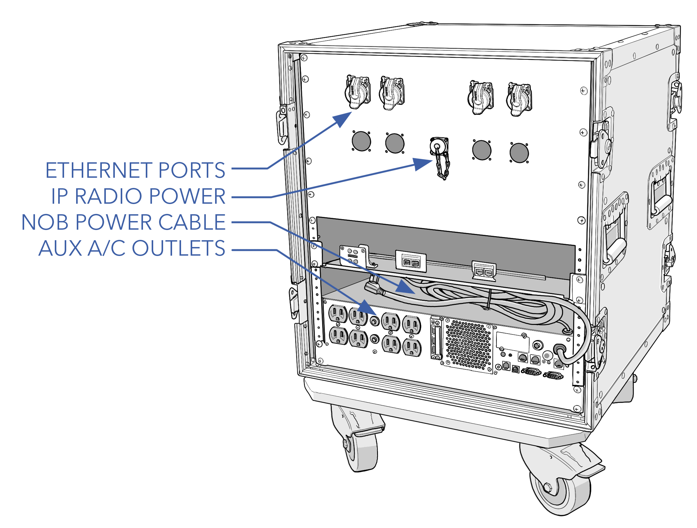
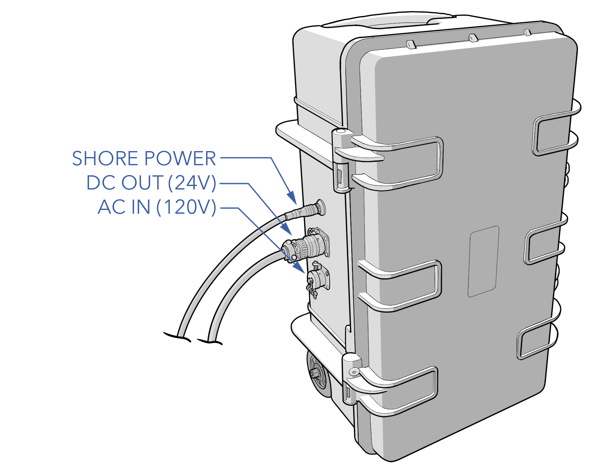
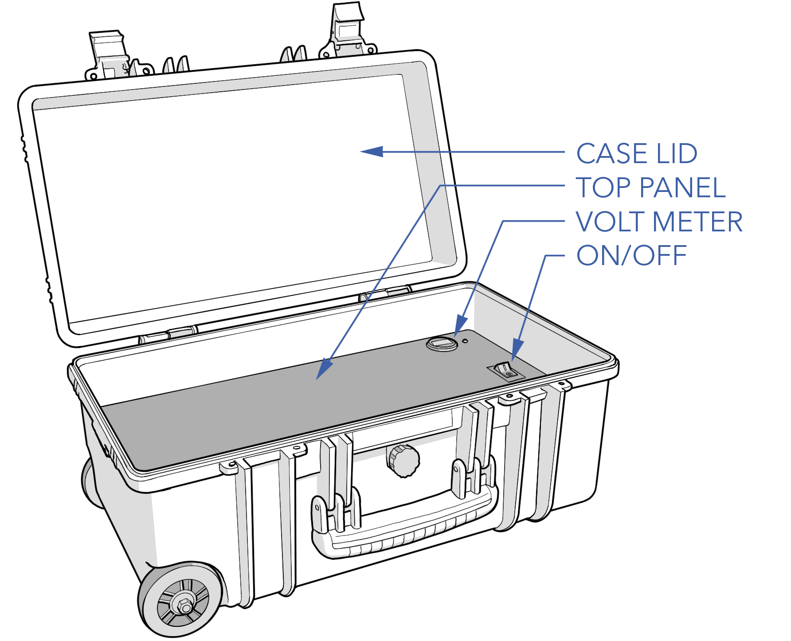
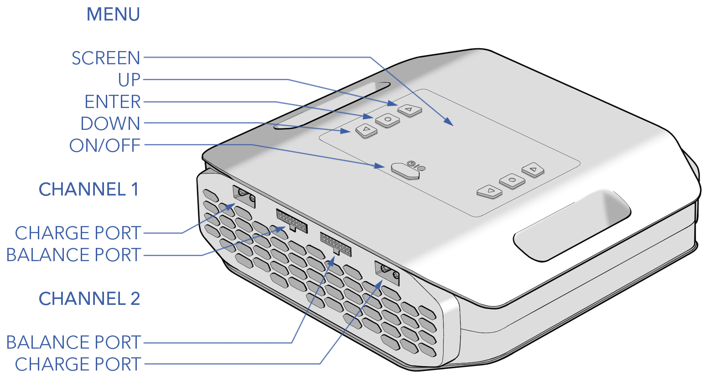

# Ground Support Equipment

The Sapphire ground support equipment includes the ground IP radio, network operations box (NOB), auxiliary power supply (APS), hand controller, fueler, and battery charger.


Note: The Sapphire may be delivered in various configurations that may omit or include additional equipment.


# Ground IP Radio

The standard aircraft configuration utilizes an IP radio for control, telemetry, video, payload data, and the hand controller. The ground radio uses omnidirectional antennas by default, but there are options for directional antennas and trackers. Ranges exceeding 100 miles are achievable. 

#### IP Radio Specs

|Parameter |Specification|
|----|---------------|
|Ground Radio|Silvus 4200 or 4400|
|Encryption|DES Standard, AES/GCM 128/256 Optional (FIPS 140-2), Suite B|
|Data Rate|up to 100 Mbps|
|MIMO|2x2 or 4x4|
|Power|10W (configurable)|
|Latency|~7ms|
|Frequency|L-Band, S-Band, other bands available|
|Antenna Options|Omni, Directional, Tracker|

# Network Operations Box (NOB)

The NOB is an active power over ethernet (PoE) managed switch and an uninterruptible power supply (UPS) integrated into a transportable server rack. The NOB is used to network and power the ground IP radio, hand controller, GCS, and RVT. The UPS will power the GCS computer, radio, and hand controller for approximately 45 minutes in the event of a mains power failure.

#### NOB Specs

|Parameter |Specification|
|----|---------------|
|POE|16 port switch (8 port PoE+ 8 port PoE++), 380W max|
|UPS Input|100-125VAC ± 5%|
|UPS Output|1500W|
|UPS Runtime|~45 minutes|

# Auxiliary Power Supply (APS)

The APS is a rechargeable battery pack that provides 24VDC for ground equipment and shore power to the aircraft.

#### APS Specs

|Parameter |Specification|
|----|---------------|
|Battery|2x 12V 18Ah lead acid in series|
|APS Output Voltage|24V|
|APS Input Voltage|120VAC or 220VAC (selected at time of purchase)|

# Hand Controller

The hand controller is used during the preflight to check aircraft functions. The safety pilot can also optionally fly the aircraft and change modes independent of the GCS operator. Flying with the hand controller can be useful for in-flight interventions or when the launch and recovery situation is challenging, but using the controller should strictly be reserved for the safety pilot and with limited use. 

The hand controller does not require a battery and instead uses power over ethernet (PoE).

#### Hand Controller Specs

|Parameter |Specification|
|----|---------------|
|Controller|Futaba T10J|
|Input Power|802.3af PoE|
|Protocol|IP based|

# Fueler 

The fueler is used to fuel and defuel the aircraft. The fueler connects to a quick disconnect port positioned on the side of the aircraft's fuselage. Powering the fueler's electric pump is the APS. A battery-powered scale is used to meter gasoline during fueling and defueling operations. See the [Fueling](fueling.md) section for detailed fueling and mixing instructions.

#### Fueler Specs

|Parameter |Specification|
|----|---------------|
|Capacity|5 gal / 18.9 L|
|Fuel|91 - 93 octane, C10|
|Pump Input Voltage|24VDC|


Gasoline is an extremely flammable liquid and vapor. Causes skin irritation. May cause drowsiness or dizziness. Store in approved containers.


# Battery Charger 

The dual-channel charger is used for both avionics and VPS batteries and supports custom battery profiles. See the [Battery Management](battery.md) section for detailed charging instructions.

#### Battery Charger Specs

|Parameter |Specification|
|----|---------------|
|Charger|ISDT X16|
|Channels|2|
|Input Voltage|100 - 240VAC|
|Supported Batteries|2-16S LiFe, LiPo|
|Charge Current|1 - 20A x2|
|Max Charge Power|800W x2 (110VAC), 1100W x2 (220VAC)|
|Discharge Power|50W x2|
|Rated Ambient|32 - 104°F / 0 - 40°C| 
|Transport Case|SKB iSeries 2015-7|
