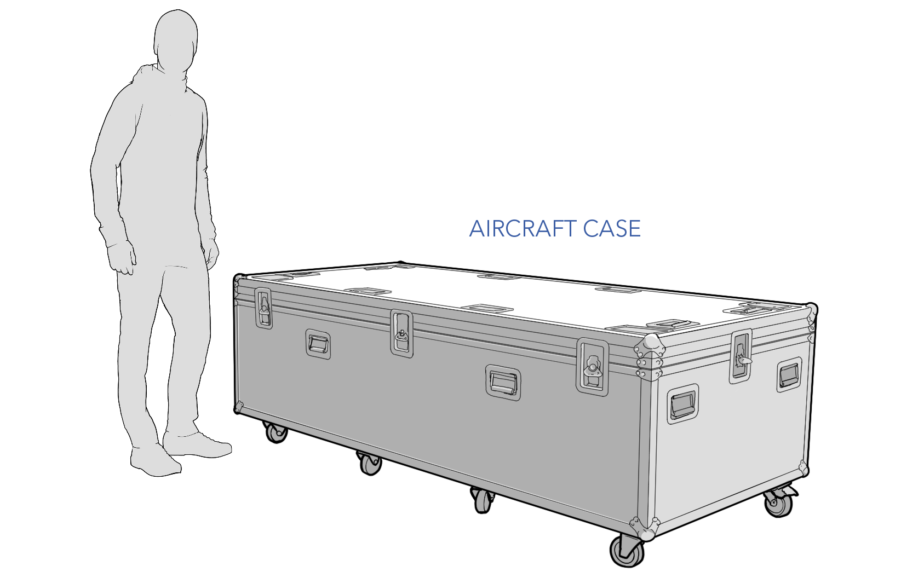
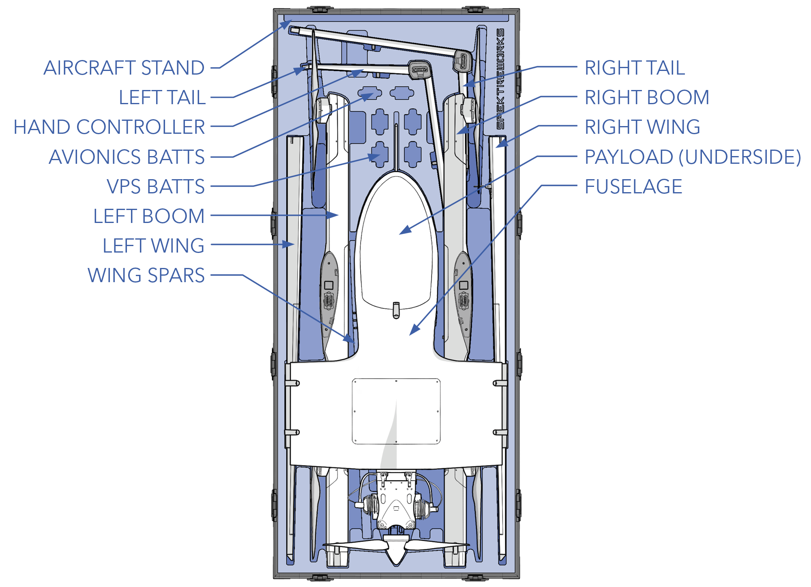

# Package Contents


Note: The Sapphire may be delivered in various configurations, based on customer requirements. Please disregard any sections or configurations that do not apply to your specific setup. Please verify your package contents upon delivery.
Contact <info@spektreworks.com> immediately if anything is missing.


# Aircraft Case

The aircraft is transported in one hard case, excluding ground support equipment. While the case protects the aircraft from most bumps and dings, care should be taken not to drop the case to avoid damaging the aircraft components inside. If possible, it is always preferred that the case remain upright on its castor wheels to maximize protection of the contents inside. 

# Aircraft Case Contents

* Fuselage
* Wing Spars
* Left Boom
* Left Wing
* Left Tail
* Right Boom
* Right Wing
* Right Tail
* VPS Batteries
* Avionics Batteries
* Hand Controller
* Aircraft Stand
* Payload (optional)

# Ground Equipment

* GCS device (optional)
* RVT device (optional)
* Ground radio
* Antenna tracker (optional)
* Battery Charger 
* Network Operations Box (NOB)
* Auxiliary Power Supply (APS)
* Fueler
* Scale

# Spares (Optional)

* FPS Engine 
* Air Filters
* Fuel Filters
* Spark Plugs
* Servos
* Landing Feet
* Aircraft Fasteners
* PMU
* VPS Motor Pods
* VPS Props
* FPS Props
* Pitot Tubes

# Case Dimensions

|Case|Dimensions|Empty Weight|Packed Weight|
|-|-|-|-|
|Aircraft Case|89 x 39 x 24 in / 226 x 99 x 61 cm|295 lbs / 134 kg|~405 lbs / 183.7 kg|
|Charger Case|22.4 x1 8 x 8.4 in / 57 x 45.7 x 21.3 cm|13.2 lbs / 6 kg||
|Network Ops Box|20.5 x 3.75 x 3.5 in / 52.1 x 67.9 x 72.4 cm|n/a|168.8 lbs / 76.6 kg|
|Aux Power Supply|22 x 14 x 9.8 in / 55.9 x 35.6 x 24.8 cm|n/a|41.1 lbs / 18.6 kg|
|Fueler|10 x 13 x 24 in / 25.4 x 33 x 61 cm|5.4 lbs / 2.4 kg|35.4 lbs / 16.1 kg|
|Spare Engine|16.5 x 16.5 x 12 in / 41.9 x 41.9 x 30.5 cm|n/a|12.2 lbs / 5.54 kg|
|Tracker Tripod|46 x 16 x 13 in / 116.8 x 40.6 x 33 cm|26.3 lbs / 11.9 kg||
|Tracker Dish|39 x 36 x 12 in / 99 x 91.4 x 30.5 cm|61.1 lbs / 27.7 kg||
|Tracker Pedestal|33.5 x 25 x 19.5 in / 85.1 x 63.5 x 49.5 cm|41 lbs / 18.6 kg|||
