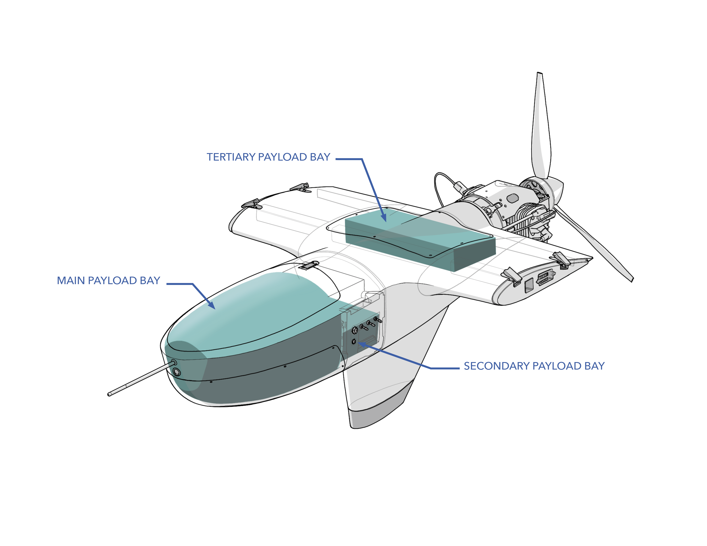
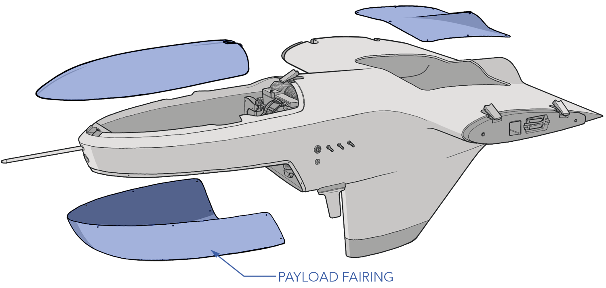
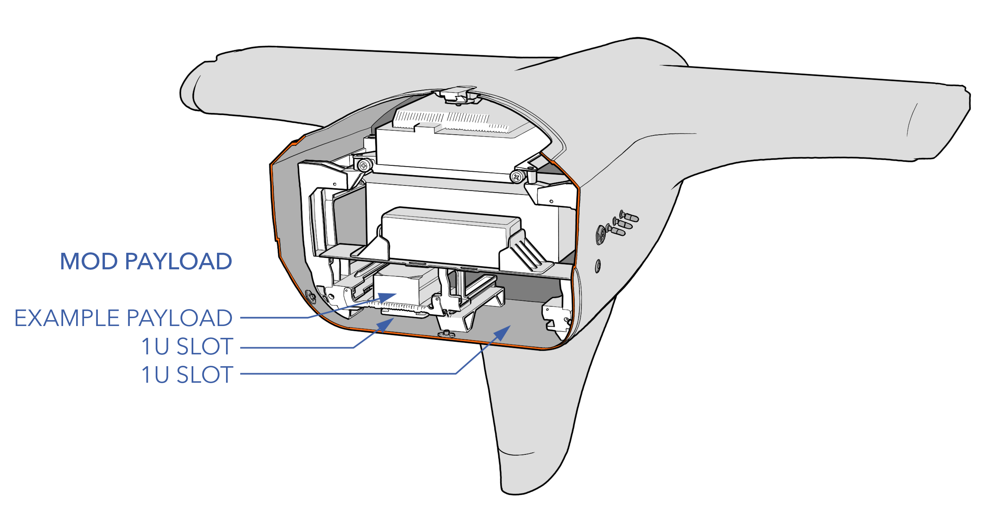

# Payloads

The Sapphire has a total payload capacity of 20 pounds, leaving many options for sensor and communications payload combinations to be integrated. There are three payload bays located within the fuselage and additional auxiliary bays are located in the booms and wings. Combined, Sapphire offers just over 3.76 cubic ft of payload space. 

An onboard computer is available to the user to run custom scripts and applications.

* **Main Payload:** The main payload is located at the front of the fuselage and features a removable payload fairing that can be modified based on payload requirements.

* **Secondary Payload:** The secondary payload bay is located below the avionics, just aft of the main payload bay. 

* **Tertiary Payload:** The tertiary payload bay is located above the fuel bladder and has an access hatch that can be replaced with an aerodynamic fairing if required for cooling or additional volume.

# Payloads Specs

|Parameter|Specification|
|----|---------------|
|Payload Capacity| 20 lbs / 9 kg|
|Payload Volume| 3.76 cubic ft / 28.3 L|
|Available Power|28V 200W (switchable)|
|Main Payload Connector|28V, 1x Gigabit Ethernet, TTL UART to GPS, GPS PPS, GPS Event Input, TLL/RS232 to Autopilot, 2x Autopilot GPIO|
|Secondary Payload Connector|28V, TTL\RS232 to Autopilot, 1x 10/100 Ethernet|
|Additional Ethernet|1x Gigabit Ethernet|
|Onboard Computer|800MHz dual core ARM® Cortex™-A9|
|Operating System|Headless Linux|
|MOD Payload|2 x 1U|


Payloads that require more than 200W may require a dedicated battery instead of using payload power from the PMU.


# Gimbal Payload

The aircraft typically carries a vibration-isolated EO/IR 2-axis gimbal for ISR missions. The gimbal is installed and removed through the payload fairing opening and attaches with four screws. Ballast weight can be added directly above the gimbal and fastened down with a bolt or stud. 

For Trillium specific payloads, please refer to the [HD80 Appendix](appendix-trillium.md) for more details.

# Payload Fairing

The lower section of the main payload is a removable payload fairing. The fairing can be removed for the installation and mounting of a payload or swapped out entirely to accommodate odd payload shapes, airflow requirements, or sensor cutouts. The fairing is removable by loosening the nine M4 x 8 button head screws.

# MOD Payload

The secondary bay has optional mounting rails to physically accommodate two 1U size MOD payloads.

