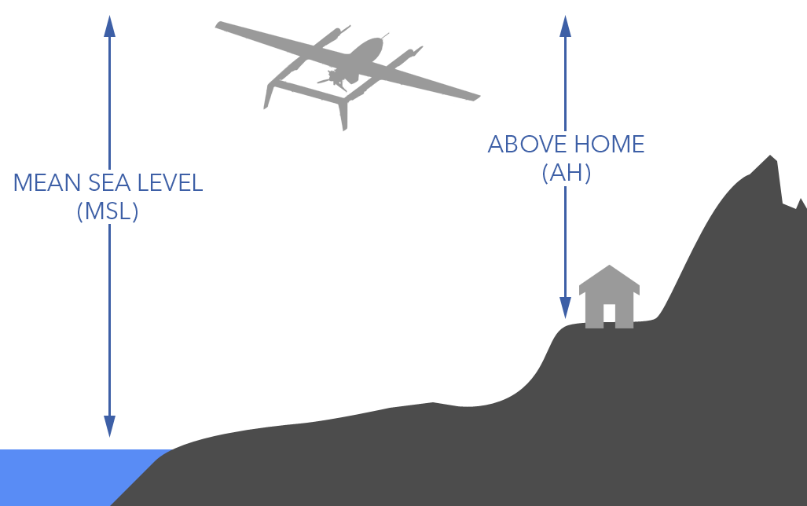
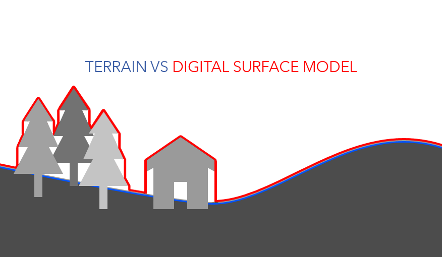
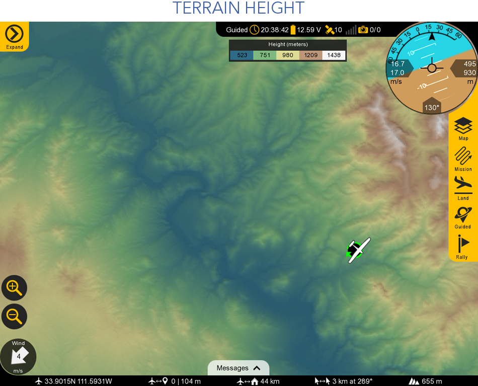
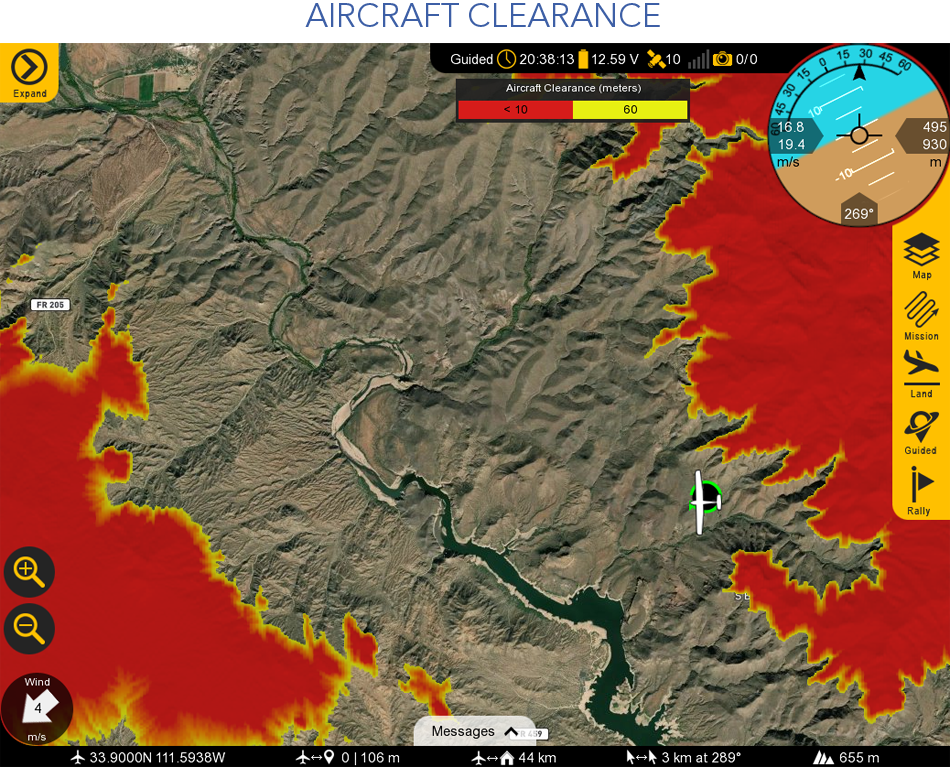
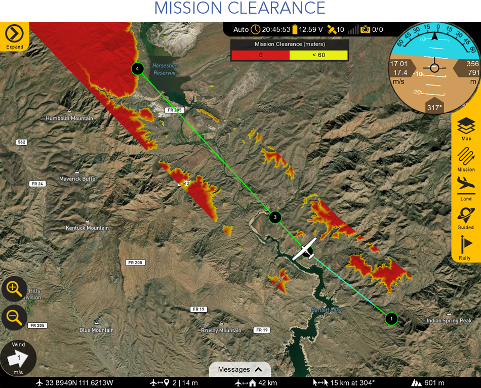
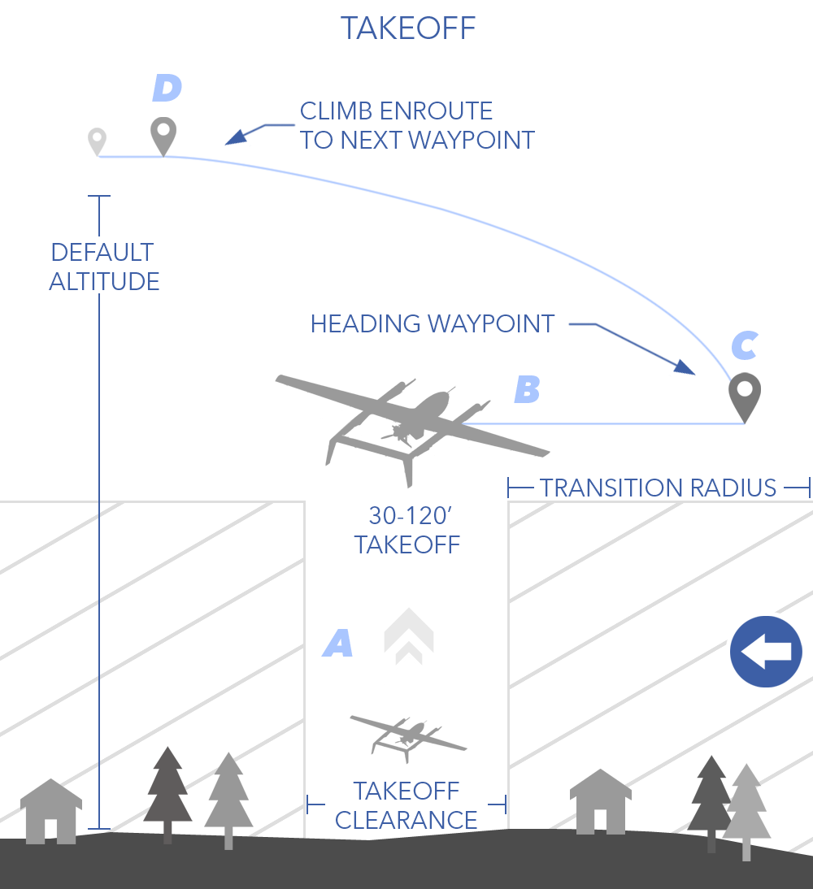
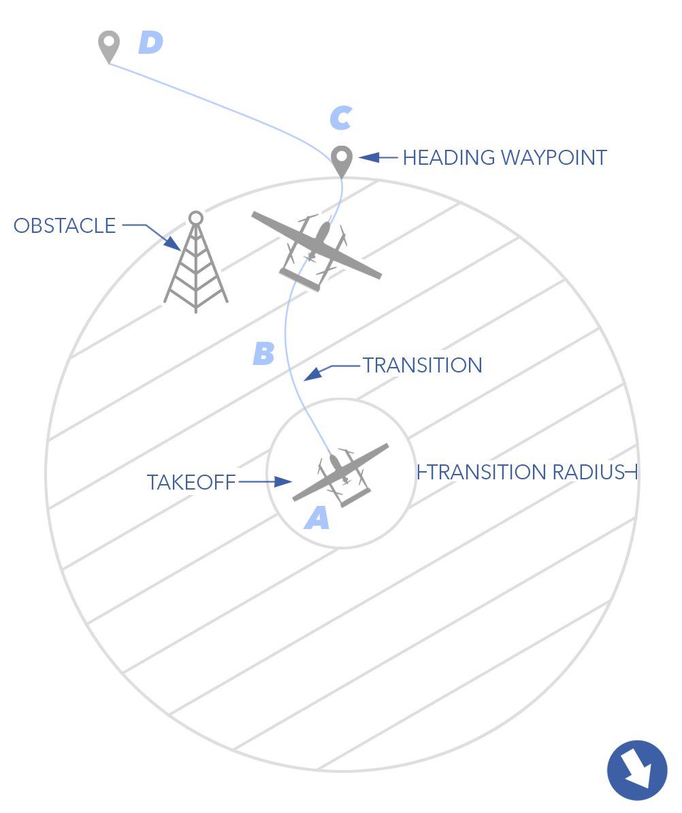
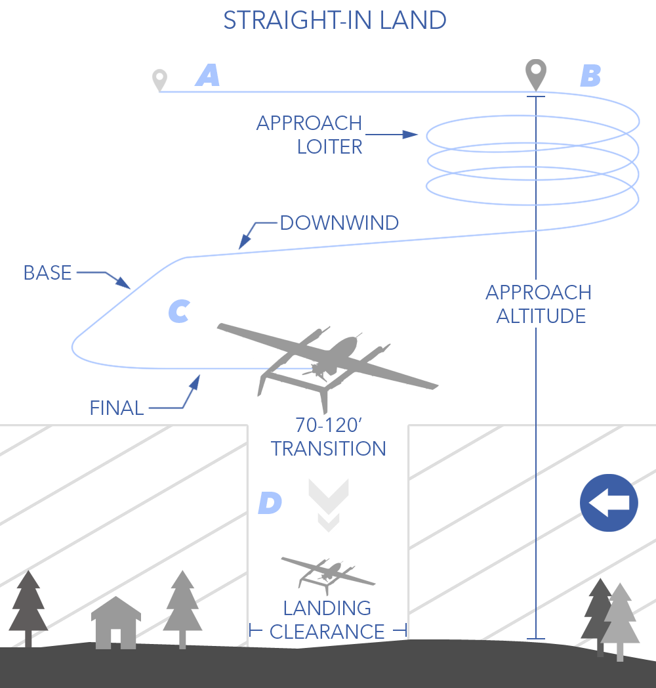
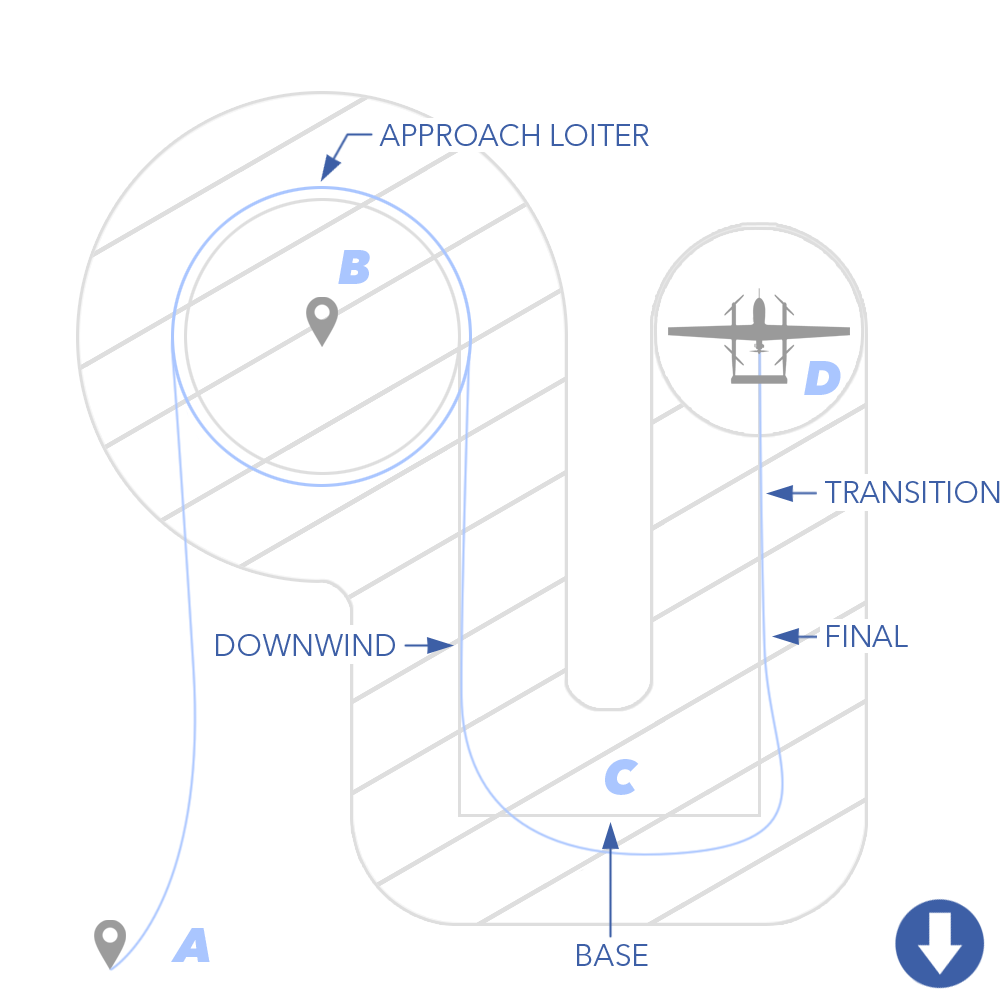

# Mission Planning

A mission must always be planned and uploaded to the aircraft before each flight. Planning a mission is done through Swift GCS on the Plan Tab. A mission is comprised of waypoints and commands. Those items will vary depending on the requirements of the flight. For the purpose of this manual, a waypoint must have a location associated with it, while a command does not. Both waypoints and commands are shown in the list of mission items. Each item in a mission can be modified or deleted by expanding it from the list of mission items.

Missions can be planned in advance, during the preflight, and even while the aircraft is flying. A mission made in advance can be saved and loaded for future flights or for recreating a flight.

# Contents

- [Default Altitude](#default-altitude)
  - [Altitude Reference](#altitude-reference)
- [Terrain](#terrain)
  - [Terrain Height](#terrain-height)
  - [Aircraft Clearance](#aircraft-clearance)
  - [Mission Clearance](#mission-clearance)
- [Mission Items](#mission-items)
  - [Waypoints](#waypoints)
  - [Rally Points](#rally-points)
  - [Uploading](#uploading)
  - [Downloading](#downloading)
  - [Modifying](#modifying)
  - [Clearing](#clearing)
  - [Saving & Loading](#saving-and-loading)
- [Takeoff](#takeoff)
- [Landing](#landing)
  - [Planning the Landing Location](#planning-the-landing-location)
  - [Landing Approach Options](#landing-approach-options)
   - [Pattern Landing](#pattern-landing)
- [Survey Grid](#survey-grid)

# Default Altitude

When planning a mission, you must first choose the height you want to fly at, also known as the default altitude. The default altitude applies to all waypoints, except for takeoff, which must be planned as an above home altitude. 

Individual waypoint altitude can be modified as needed. To modify a waypoint, first add it to the mission and then expand it from the list of waypoints. Changing the default altitude does not affect any waypoints that have already been planned; the change will only apply to new waypoints. Items that have already been planned must be individually edited or cleared.

#### Altitude Reference

When deciding on a default altitude altitude, you must also decide if you want to plan in Mean Sea Level (MSL) or Above Home (AH). MSL is defined as the height above the ocean, whereas AH is the height above your home location. Home is where the aircraft takes off from. Note, AH is not the same thing as Above Ground Level (AGL). 

The altitude reference applies to all items except for the takeoff and landing transition. The transition altitude must be planned is AH for increased situational awareness when flying so close to the ground.

# Terrain

Whether you plan in AH or MSL, neither altitude reference will make the aircraft follow terrain. Care must be taken when planning waypoints to avoid terrain by a safe margin. The GCS will attempt to warn you if a guided point is planned dangerously low, but ultimately this is the responsibility of the operator to understand their environment and plan accordingly. The use of terrain visualization modes in the GCS is one aid to help with planning and flying. There are three terrain visualization modes in the GCS: height, mission clearance, and aircraft clearance.

To turn on terrain, find the `Map Button` ⇨ `Terrain` located on the right hand side of the GCS.


The GCS terrain database uses SRTM tiles. SRTM stands for shuttle radar topography mission. The data was collected over 10 days in February 2000 and contains high resolution topographic data for most of the land surfaces between -56 and 60 degrees latitude. The radar captured both natural and artificial features of the environment, meaning that buildings dense vegetation that existed at the time of capture are included as part of the terrain. This is what is known as a digital surface model (DSM).

There are two different SRTM data sets in the GCS that differ in their grid spacing: SRTM1 and SRTM3. SRTM1 is a 1-arcsecond grid spacing (30 meter resolution) and is only available for the USA. SRTM3 has a lower resolution with a 3-arcsecond grid spacing (90 meter resolution) and is available for the entire planet between latitudes of -56 and 60. 

One of the disadvantages of SRTM is radar artifacts such a radar shadow. This means there can be voids or gaps in mountainous areas, where radar signals could not penetrate or return accurate data due to steep terrain or dense vegetation.


#### Terrain Height

This mode renders the terrain height. The scale and color shading are relative to what is displayed on the screen, adjusting as you pan the map or zoom in/out. 

#### Aircraft Clearance

This mode displays terrain relative to the aircraft's current flight altitude. Yellow indicates terrain just below the aircraft, while red signifies terrain that would impact the aircraft. The terrain shading updates in real-time as you climb or descend.

#### Mission Clearance

This mode displays terrain along the waypoint path. This mode is most useful when mission planning to facilitate terrain avoidance and ensure a safe altitude is flown. Yellow indicates terrain just below the aircraft, while red signifies terrain that would impact the aircraft. 


Pre-planning missions in MSL is possible when not connected to the aircraft, but when using an above-home reference, you must be connected.


# Mission Items

A mission is comprised of waypoints, rally points, and commands:

* Waypoint: A normal waypoint is a point in the sky that that the aircraft will navigate to and then proceed to the next waypoint.
* Takeoff: A takeoff is a command that climbs to a specified altitude and then transition to forward flight. Takeoffs to not have a location and are not displayed on the map. 
* Landing: A landing is a group of waypoints that create a landing pattern.  
* Loiter: A loiter is a point that the aircraft circles. The aircraft can loiter indefinitely, to an altitude, based on the number of rotations, or for a set time. 
* Jump: A jump is a command that points the aircraft at a specific waypoint or back to the start of the mission. This is typically used to create a looping pattern.
* Rally: A rally point is where the aircraft will fly to and circle under certain [failsafe scenarios](failsafes.md) such as lost link, or upon reaching the last waypoint in a mission if no landing is planned.
* Survey: A survey is a series of waypoints in a grid pattern that covers an area for the purpose mapping.

# Waypoints

All missions are created from the `Plan Tab`. When planning a new mission, all waypoints and rally points will be colored red until uploaded. 

Waypoints are flown in the order they are planned. In flight, individual waypoints can be selected out of sequence from the `Mission Button` ⇨ `Waypoint` ⇨ `Set`. You can also create a loop between specific waypoints using a jump command. 

# Rally Points

You can plan multiple rally points. Rally points are listed in order similar to waypoints, but they are not flown in any particular order. Instead, the aircraft will choose the closet rally point if certain failsafes activate, upon reaching the last waypoint in a mission if no landing is planned, or if the flight mode is changed to rally. It is recommended to plan rally points in a location that provides a good opportunity to regain link, such as near home, or in a location that is suitable for an emergency landing (unpopulated areas, open fields, etc.).

If no rally point was planned, the aircraft will fly home. The home location is where the aircraft took off from (technically where the aircraft was armed).

# Uploading

From the `Plan Tab` ⇨ `Upload` to send your mission to the autopilot. Once the autopilot receives the mission, the GCS will automatically read back each waypoint for confirmation. The waypoints turn green upon successful upload.

# Downloading

From the `Plan Tab` ⇨ `Download` to download a mission already on the autopilot. Downloading a mission already on the autopilot can be useful for a few reasons:

- When [Reconnecting in Flight](flying-reconnect.md) to visualize your waypoints.
- When flying the same mission again from the same location.

# Modifying
 
Missions can be modified and uploaded on the ground and during flight. If you modify a waypoint, such as its position or altitude, the entire mission will go red to indicate a that change has yet to be uploaded. You will only see the modified waypoints when are on the Plan Tab. If you swap tabs or collapse the side menu, you will see the mission that is currently on the aircraft (in green). Only after uploading the new mission will the waypoints appear green and be visible on all tabs.

Changing the default altitude does not affect any waypoints that have already been planned; the change will only apply to new waypoints. Items that have already been planned must be individually edited or cleared.

If you upload a new mission in flight, the aircraft will keep heading to its current waypoint. The new mission only affects upcoming waypoints or when the mission is restarted. For example, if you are flying to waypoint 4, and upload a new mission with 10 waypoints, the aircraft will continue to fly to the original waypoint 4 location and then travel to the new waypoint 5.

# Clearing

- To discard changes that you have made and view the existing mission, on the `Plan Tab` ⇨ `Clear WP` ⇨ `Discard Changes`. You can also download the mission back from the aircraft at anytime.
- To clear the list of waypoints and plan a new mission, on the `Plan Tab` ⇨ `Clear WP` ⇨ `Discard Changes`.
- To clear the existing mission on the aircraft, on the `Plan Tab` ⇨ `Clear WP` ⇨ `Clear Mission on the Aircraft`. Note, you will not be able to clear the mission while the aircraft is in auto. You will have to change the mode to guided, or similar, to delete a mission and upload a new one. 
- Right-click a waypoint to delete it or expand it from the list of waypoints and press the red X button


Never upload a mission in flight without a rally point or landing sequence. Without these, the aircraft will fly to its home location (takeoff location), upon reaching the last waypoint, and loiter at a default altitude of 328 feet (100 meters) above home, descending en route. Depending on the environment, this could cause the aircraft to collide with terrain.


# Saving and Loading

To save a mission, navigate to the `Plan Tab` ⇨ `File` `Open\Save`

# Takeoff

The aircraft performs a vertical takeoff, using a combination of VPS and FPS to transition to forward flight at a set transition altitude above the ground.

Sapphire has both a forward assist and a weathervane mode during takeoff and landing. Both attempt to reduce strain on the VPS motors in windy conditions. Weathervaning will try to point the nose of the aircraft into the wind, thus gaining lift from the wings. Forward assist uses the FPS thrust to oppose the wind, preventing the aircraft from drifting backwards.


A takeoff waypoint is not shown on the map because a takeoff is a command, but the takeoff heading waypoint will be shown. The actual takeoff occurs wherever the aircraft physically is when it is armed.


#### Takeoff Phases

**(A)** Climb: Immediately after arming the aircraft, the VPS propellers will spin and lift the aircraft vertically, climbing to the transition altitude. The default transition altitude is 70 feet (21 meters) above home. The aircraft will automatically weathervane and use forward assist to face the wind during this climb.


Sapphire has limited battery capacity for vertical flight. If the takeoff altitude is too high, the VPS battery may drain to a level that is insufficient for flight and ultimately cause the aircraft to crash. Restrict takeoff altitudes to 120 feet (30 meters) above home or less.



Takeoff altitudes can only be planned as above home (AH).


**(B)** Transition: Upon reaching the transition altitude, the aircraft will fly forward and transition to forward flight. The immediate direction of the transition is determined by the wind because the aircraft will be facing the wind when weathervaning. Due to this nature, a transition radius of 1,500 ft (460 m) in all directions should be assumed when evaluating obstacles and clearance. 

**(C)** Heading: As the aircraft transitions and gains airspeed, it starts navigating and climbing to the next waypoint. A takeoff heading waypoint is added to steer the aircraft away from obstacles that may be within transition radius. Place the takeoff heading waypoint 1,500 feet (300 meters) from home, in the direction you want to fly, and 20 ft (6 m) higher than the transition altitude. 


Plan the takeoff heading waypoint to minimize obstacle hazards and maximize headwinds.


**(D)** Mission: After reaching the heading waypoint, the aircraft proceeds to the remainder of the mission, climbing en route.

# Landing

The aircraft performs a vertical landing, using a combination of VPS and FPS to transition from forward flight at a set transition altitude above the ground.

Similar to a takeoff, the aircraft will use forward assist and weathervane to reduce strain on the VPS motors in windy conditions.


Sapphire has limited battery capacity for vertical flight. If the landing altitude is too high, the VPS battery may drain to a level that is insufficient for flight and ultimately cause the aircraft to crash. Restrict landing altitudes to 120 feet (30 meters) AGL or less.



It is recommended to remain flying until the VPS batteries are fully charged to 58V prior to landing. However, voltage exceeding 57V is usually safe for an early landing if necessary.


# Planning the Landing Location

There are several ways to plan where the aircraft lands:

* Aircraft Position: This uses the aircraft’s current position on the ground. This is the preferred option because it leverages the accuracy of the GPS onboard the aircraft, and it gives you know physically where the aircraft will land. This option is only available during the preflight. The downside to this option is that the aircraft must physically be where you want to land at this point during the preflight, and typically only works for operations where you takeoff and land from the same location.
* GCS Location: This uses the location of your GCS computer with a built-in GPS. Be aware that the accuracy of a built-in GPS may be 20 feet (6 meters) or more.
* Map Location: With this method you select a location on the map. This is useful if you need to plan a landing at a location different than takeoff, or to change your landing location during the flight. Note that choosing a spot on the map is not the most accurate method and, depending on the quality and date of the map imagery, may not be indicative of the actual landing environment. Visually survey the chosen location before starting the landing procedure if possible.
* Home Position: This method can be used if you accidentally lose or corrupt your waypoints while flying and want to land where you took off from, known as home.

Regardless of how you choose your landing location, it must be located on relatively flat ground.

# Landing Approach Options

There is one available autonomous landing approach, the pattern landing. 

# Pattern Landing

With a pattern landing, the aircraft descends in an approach loiter before exiting the loiter and flying a traditional landing pattern. The aircraft will continue to descend throughout the pattern until reaching the transition altitude on final. Whether the pattern uses left hand or right hand turns, and the length of the legs, is configurable.  This lets you tailor your landing heading and pattern instead of it being automatically chosen based on the wind direction. 

#### Pattern Landing Phases

**(A)** Approach: The aircraft flies to an approach loiter from its previous waypoint. The altitude of this approach leg will be the same as your default altitude unless you have configured it differently. If the preceding waypoint had a higher altitude than the approach altitude, the aircraft will gradually descend while en route, utilizing the entire distance between the two waypoints for the descent. The same applies if the previous waypoint was lower. This behavior must be considered with regards to terrain and obstacle clearance.

 
Winds often shift over the duration of a flight. Check the landing pattern and adjust as needed before landing.


**(B)** Loiter: The aircraft will descend in the approach loiter down to the pattern altitude. The approach loiter can be clockwise or counterclockwise in direction; swapping the direction will swap what side of the pattern the loiter is on. 

**(C)** Pattern: Upon reaching the pattern altitude, the aircraft will exit the approach loiter and fly the pattern. The landing pattern is comprised of the downwind leg, base leg, and final leg. The first leg after exiting the approach loiter is the downwind leg. The downwind leg is flown parallel to the final leg, but in a direction opposite to the intended landing direction. Next is the base leg, perpendicular to and between downwind and final. The last leg heading towards the landing spot is called final. The aircraft will descend further on downwind and base, reaching the transition altitude on final. The entire length of the final leg is flown at the transition altitude.  

 
Unlike a takeoff, when planning the transition altitude for landing, you have the option to choose either AH or MSL altitude. This flexibility accommodates multiple landing patterns or situations where landing occurs at a different location from takeoff. However, exercise caution to ensure accurate planning by selecting the correct transition altitude with the appropriate altitude reference.


**(D)** Transition: On final the aircraft will transition to vertical flight and come to a stop directly over the landing spot before descending vertically to the ground. Although the landing heading is chosen manually, the aircraft will still weathervane and use forward assist during vertical flight.

 
Always plan the final leg of a pattern landing into the wind when possible. A landing with a strong crosswind components or tailwind will cause the aircraft to overshoot and may overwhelm VPS authority during transition. 


# Survey Grid

A survey can be created by drawing a polygon or from a KML/KMZ. Polygons that you create in the GCS can be saved for future use. The waypoints generated within the polygon are based on the desired heading, altitude, overlap, sidelap, lead-in, overshoot, and camera.

Reaching the start of a survey will trigger the camera to begin taking photos. The camera will continue to take photos until the last waypoint in the survey is reached. If you need to land before a survey is complete, the camera will continue taking photos until on the ground. 

Survey statistics are displayed within the mission item and contains information about your survey such as area, resolution, and estimate time to complete. 

