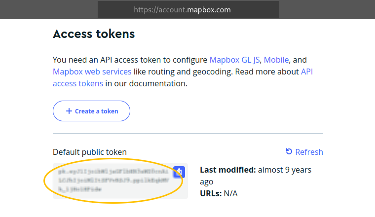
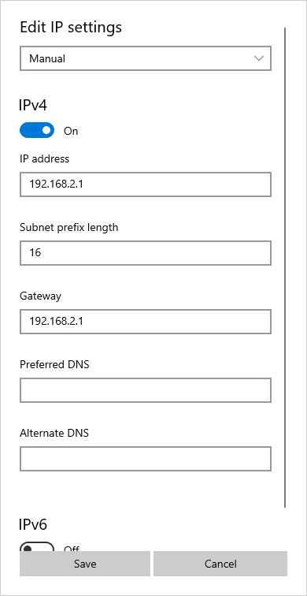

# Getting Started

Operating the aircraft requires essential software for both flight operations and maintenance. Additionally, slight adjustments to the network settings on the GCS computer are required.

# Contents

- [Swift GCS](#swift-gcs)
- [VLC Media Player](#vlc-media-player)
- [Skylink](#skylink) 
- [Networking](#networking)

# Swift GCS

Swift GCS is the ground control station software for mission planning and flying.

#### Requirements

Please consult the table below for the system requirements for running the GCS.

|                |Minimum                                 |Recommended                     |
|----------------|----------------------------------------|--------------------------------|
|Operating System|Microsoft Windows, Linux                |Microsoft Windows, Linux        |
|Processor       |x86, dual core, 1.5GHz or faster        |x86 quad core, 2.0 GHz or faster|
|Memory          |2 GB                                    |4 GB|  
|Storage         |1 GB                                    |100 GB for terrain and cached maps|
|Screen          |1024x720 or better                      |1280x720 or better              |
|Graphics Card   |OpenGL 2.1 with 256 MB or more of memory|OpenGL 3.3 with 2 GB of memory  |
|Software        |[Java 11 JRE](https://adoptium.net/temurin/archive/?version=11) or newer|[Java 11 JRE](https://adoptium.net/temurin/archive/?version=11) or newer|
|Connectivity    |1x USB port, 1x Ethernet|1x USB port, 1x Ethernet, integrated GPS|

#### Installation

1. The most recent version of the GCS can be downloaded below:
  * [Windows](http://swiftgcs.com/latest/swiftgcs-latest-windows.exe)
  * [Linux](http://swiftgcs.com/latest/swiftgcs-latest-linux.run)
  * [Linux x64](http://swiftgcs.com/latest/swiftgcs-latest-linux-x64.run)
1. Run the included installer after downloading.
  
  Driver installs are only needed on Windows and are only needed the first time the GCS is installed. They can be safely ignored on future updates.
  
1. Launch the newly installed GCS.
1. The GCS will prompt you for a [Mapbox](https://www.mapbox.com) token. If you do not already have a Mapbox token sign up for an account [here](https://www.mapbox.com/signup/). After signing up for Mapbox, you can find your access token on the [Accounts](https://www.mapbox.com/account/) page.
  
  
  Mapbox is used to provide map data to the GCS. The free tier of mapbox covers all normal use case of the GCS.
  
1. The GCS will then prompt you to select the units used when displaying information from the aircraft and while planning.
   Units can be changed at anytime, but will require a restart to have an effect.
1. You will then be prompted to select the aircraft type you are flying from the list. Select the `Sapphire` entry from the list.
1. The GCS will then prompt you for a license key, a license key will be emailed to you and will remain valid for all new releases of the GCS for one year from purchase. You must be connected to the internet to activate a license key.If you do not have, or cannot find your license key please contact info@spektreworks.com.
1. The GCS is now ready to be used. There are several things that you may wish to change however.

 * Touchscreen vs. Desktop: The GCS defaults to a touchscreen friendly mode. If you are using it on a desktop, or with a mouse you may wish to turn off the UI scaling. If so go to the `Settings Tab` ⇨ `GCS` and uncheck `Optimize for touchscreen`
 * Error Reporting: By default the GCS reports errors/crashes automatically which is used to help improve future versions. You can opt out of this behavior by selecting the Settings Tab, then select the GCS entry and uncheck Report anonymous usage and errors.
 * Units: Select which units you prefer for coordinates, height, distance, speed, area, and temperature in the `Settings Tab` ⇨ `GCS`. Changing units requires a Swift GCS restart.

# VLC Media Player

VLC is a free and open source cross-platform multimedia player and framework that plays most multimedia. VLC, or an equivalent RTSP video player, is required to view and record video from the pilot camera while flying. Visit the [VLC website](https://www.videolan.org) to download.

# SkyLink

SkyLink is Trillium’s user interface for gimbals which can be downloaded from [Trillium’s website](https://trilliumeng.com/integration-docs). The SkyLink application will install to C:\Program Files(x86)\Trillium\SkyLink\ and will create a directory C:\Trillium\ where recorded video, map imagery, and map elevation data are stored.

# Networking

The GCS computer requires a static internal IP address. To do so, you must manually edit the IP settings instead of using automatic DHCP.

1. On Windows, open `Settings` ⇨ `Network & Internet` ⇨ `Ethernet`
1. Under IP Settings, click `Edit`
1. Change 'Automatic DHCP' to 'Manual'
1. Turn on IPv4
1. Change the IP address to 192.168.2.X. Ensure the last octet does not conflict with the [default IP addresses](appendix-ip.md) reserved for the aircraft or ground equipment.
1. Change the subnet prefix to 16
1. Change the gateway to 192.168.2.1
1. Press `Save`

  

