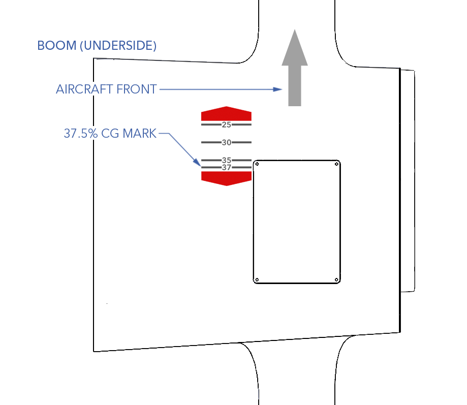
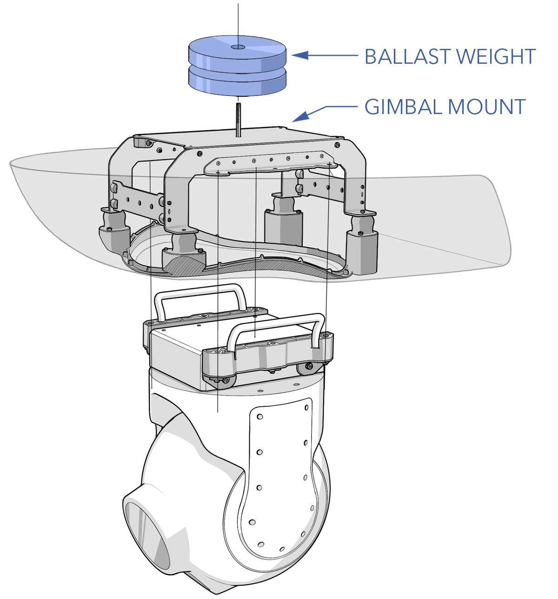
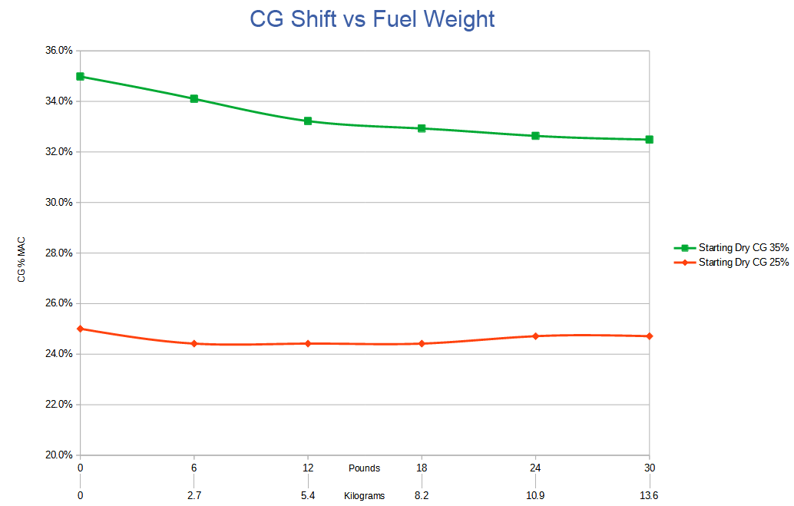

# Weight and Balance

The weight and balance of the aircraft is extremely important to aircraft safety and can have adverse affects on performance and handling characteristics. The aircraft must balance (forward and aft) within the center of gravity (CG) while not exceeding the max gross takeoff weight (MGTOW). The two biggest factors that affect weight and balance are fuel and payload. A full tank of fuel may require a reduction in payload capacity, while carrying a heavy payload may require reducing the amount of fuel onboard. 

#### Weight and Balance Specs

|Parameter|Specification|
|----|---------------|
|Empty Weight|86 lbs / 39 kg|
|Max Gross Takeoff Weight (MGTOW)|130 lbs / 60 kg|
|Payload Weight|20 lbs / 9 kg
|Fuel Weight|30 lbs / 13.6 kg|
|CG Range MAC|37.5% MAC|
|CG Marker|Underside of each boom, vinyl sticker|


The aircraft must balance within the CG range while not exceeding the MGTOW.


# CG Location

The CG location is near the center of the wing spar. The underside of each boom is marked with a CG sticker showing the acceptable range that the aircraft must balance within. 

# Ballast Weight

Modifying payloads or changing equipment will require balancing the aircraft. It is essential for any aircraft configuration to achieve proper balance within the CG range before flying. Ballast weight is often necessary to achieve this balance. Add the minimum required weight as far forward as practical. Always take the ballast weight into account when calculating fuel and payload capacity.


Keep ballast weight centered when mounting on vibration-dampened payloads. Off-center weight may cause loss of damping effectiveness or cause imbalance for gimbal motors.


# Checking Balance

1. Assemble the aircraft on flat ground
1. Install batteries, do not connect.
1. Ensure all payloads are secure and mounted in their final location. 
1. Place the aircraft on a balancing stand or lift the aircraft from below using two people.

When lifting the aircraft from below, only press against the CG markers.
 
1. Observe which way the aircraft leans, nose heavy vs tail heavy, and add ballast weight as needed.
1. The aircraft must balance at the marked CG indication of 37.5%.
1. Weigh the aircraft. This weight is known as the "dry weight." The difference between the dry weight and the MGTOW of 130 lbs (60 kg) is your remaining fuel capacity for that given aircraft configuration.

Never exceed the MGTOW for flight.


Place a scale under each landing foot and add the three weights together to find the aircraft's weight.


# CG Shift

It is normal for the center of gravity (CG) to shift with gas-powered aircraft. As the aircraft consumes fuel, it becomes lighter and the CG moves in flight. How the CG shifts depends on where the aircraft balances at its dry weight. 

