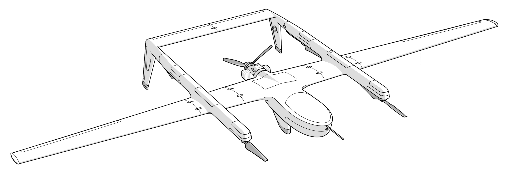

# Welcome

**SpektreWorks Proprietary Information and Export Notification** This document contains technical information that is proprietary in nature and is intended for use only by the customers and partners of SpektreWorks, Inc. Technical data in this document may also fall under specific export control laws. Information in this document should not be transferred to a foreign person without prior authorization from the appropriate government agencies.

# Scope
This manual applies to both the Cobalt CR and Sapphire UAS and contains a detailed system overview, aircraft assembly/disassembly procedures, operators' responsibilities, preflight procedures, maintenance, and system performance and limitations.

For the purpose of this manual, the name Cobalt CR and Sapphire are interchangeable when describing the aircraft or system.

# Safety
Varying levels of information and warnings are called out in this manual with the definitions as follows:


Hint - An operating procedure, practice, or condition, etc., which can be helpful to emphasize.



Note - An operating procedure, practice, or condition, etc., which is essential to emphasize.



Caution - An operating procedure, practice, or condition, etc., which if not strictly observed, may cause damage to the equipment or injury to personnel.



Warning - An operating procedure, practice, or condition, etc., which may result in personnel injury or death if not carefully observed or followed.


# Support and Documentation

For general support, please email info@spektreworks.com

This manual may be updated without notice to reflect the most recent changes to hardware, software, or flight procedures. The list of revisions can be viewed [here](revisions.md).